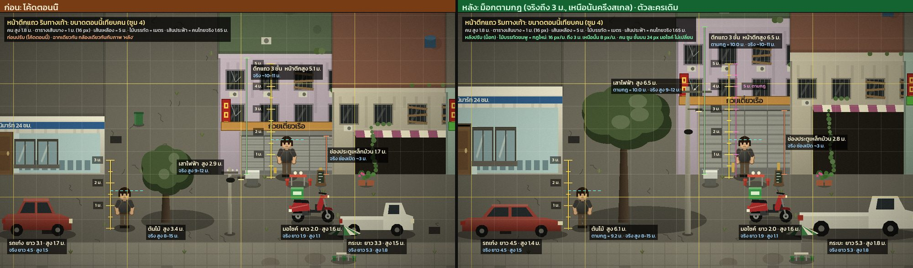
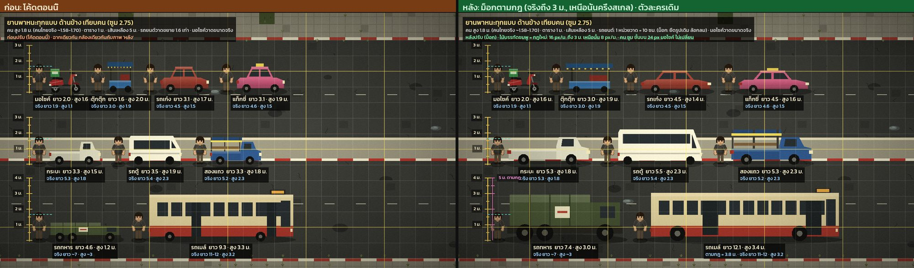
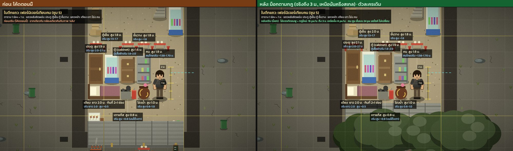
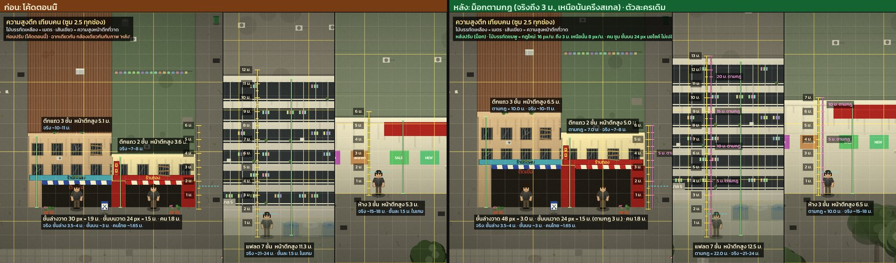
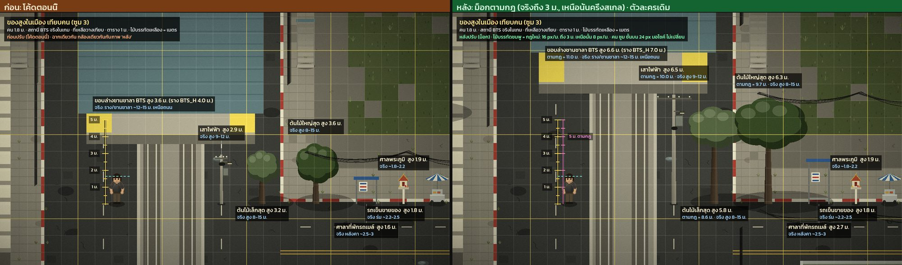
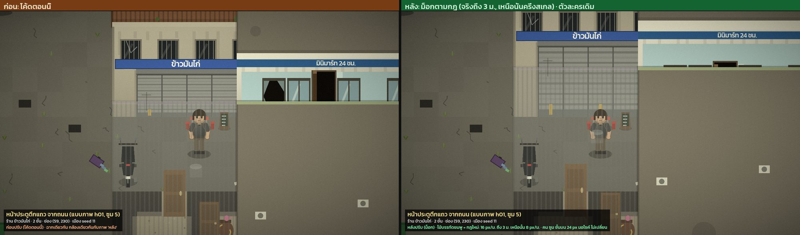
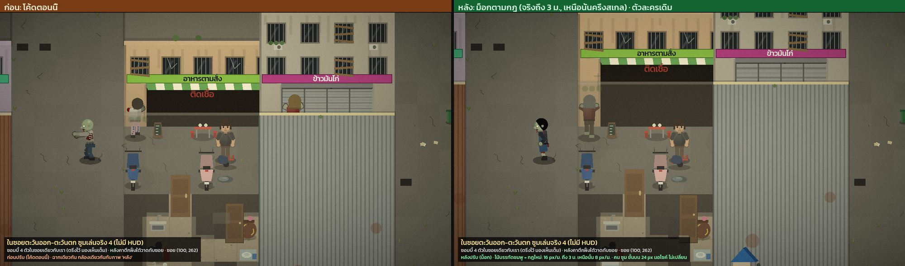
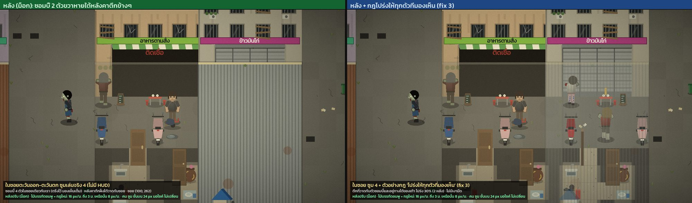
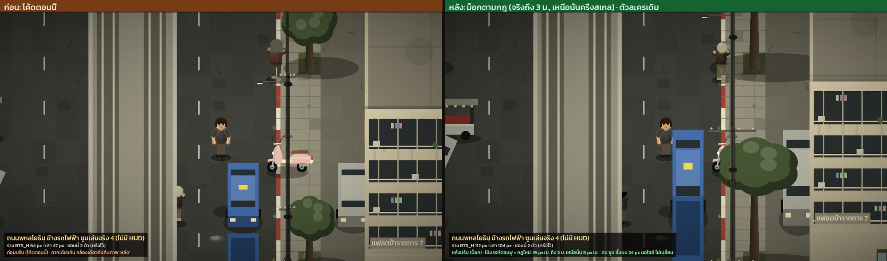

# รีวิวสัดส่วนวัตถุ (สมส่วนสมจริง)

> วันที่ 2026-09-28 · commit a0fb09c · สถานะ: ข้อเสนอ ยังไม่ได้ตัดสินใจ/ยังไม่ได้แก้ (ยังไม่มีการแก้โค้ดจริง ภาพ "หลังแก้" ทั้งหมดทำในสำเนาโปรเจกต์)
>
> เลขบรรทัดทุกที่ (`ไฟล์.gd:123`) อ้างอิง commit a0fb09c และอาจเลื่อนเมื่อโค้ดเปลี่ยน ถ้าหาไม่เจอให้ค้นด้วยชื่อค่าคงที่หรือชื่อฟังก์ชันที่เขียนกำกับไว้

กลับไปหน้ารวมรีวิว: [README.md](README.md) · รีวิวตัวละครแยกอยู่ที่ [4-character.md](4-character.md)

**หน่วยที่ใช้ทั้งเอกสาร**
- px = พิกเซลในโลกเกม (ก่อนซูม) · ซูมเล่นปกติ 4 คือ 1 px โลก = 4 px บนจอ
- 1 ช่อง (cell) = 16 px = 1 ม. บนพื้น
- ค่า y ติดลบ = สูงขึ้นบนจอ (เช่น `-29` คือ 29 px เหนือเท้า)
- "px/m" = จำนวนพิกเซลต่อความยาวจริง 1 เมตร · ตัวเทียบหลัก: พื้น/กริด 16 px/m และคนทั้งตัว 17.6 px/m (29 px ÷ 1.65 ม.)

---

## สรุปสั้น

- **คนไม่ใช่ตัวปัญหา:** คนสูง 29 px ≈ 1.8 ม. ที่กริด 16 px/m เกินจริงแค่ ~10% จึงใช้คนเป็น "ไม้บรรทัด" ได้เลย
- **ปัญหาหลักคือมีมาตราส่วนแนวตั้งหลายแบบพร้อมกัน** แต่ละตระกูลมีตัวคูณของตัวเอง: `GROUND_H 30` / `FLOOR_H 24`, `DOOR_STRETCH 2.0`, `WINDOW_STRETCH 1.8`, `TALL` ของเฟอร์นิเจอร์, `VEHICLE_SCALE 1.6`, `TreeProp.SCALE 1.4`, `BTS_H 64`, เสาไฟ 47 px, คอนโด 11 px/ชั้น
- **ผลที่ตาเห็น:** ชั้นล่าง (30 px) สูงเท่าคน · ช่องประตูม้วน (27 px) เตี้ยกว่าหัวคน 2 px · ประตู (30 px) เหลือเหนือหัว 1 px · รถยนต์ยาวแค่ 53-77% ของจริง · เสา ต้นไม้ BTS สูงแค่ราว 2 คน · ของทุกชิ้นที่วางบนพื้นถูกบีบเป็นกล่อง 7×7 px
- **ต้นเหตุเชิงระบบ:** หลังคาในมุมกล้องนี้บังพื้นข้างหลังตึกเท่ากับความสูงตึก h px พอดี ซอย 48 px ถูกหลังคาตึกแถวปัจจุบัน (58/82 px) บังหมดอยู่แล้ว ตึกจึงถูกทำให้เตี้ย แล้วของแต่ละตระกูลก็ถูกยืดแยกกันไปแก้ขัด
- **ข้อเสนอที่ผู้ตัดสินเลือก: "ไม้บรรทัดเดียว สองความชัน"** ขนาดจริง 16 px/m จนถึงความสูง 3 ม. ส่วนที่สูงเกิน 3 ม. ใช้ 8 px/m · ตึกแถว 3 ชั้นสูงขึ้นจาก 82 เป็น 104 px (หลังคายื่นเพิ่มแค่ 1.4 ช่อง)
- **ต้องมาคู่กับ "ตึกโปร่งเมื่อทับตัวละครที่เรามองเห็น" (fix 3)** ภาพ mock พิสูจน์แล้วว่าถ้าเพิ่มความสูงโดยไม่มีข้อนี้ ซอยจะแย่ลง (ซอมบี้ถูกซ่อน 1 → 2 ตัวจาก 4 ตัว)
- **ทุกอย่างเป็นงานวาดใหม่ ไม่ต้อง bump GEN** เมืองและเซฟเดิมอยู่ได้ ส่วนของที่ต้องเปลี่ยนขนาดช่อง (โซฟา 2 ช่อง ซอย 5 ช่อง ฯลฯ) รวมไว้รอบ GEN เดียวทีหลัง (fix 12)
- **ตัวละครหัวโต (หัว 1:3.4 ขา 0.35 ของความสูง) เป็นสัญญาณ "ของเล่น" ที่ใหญ่ที่สุดที่เหลืออยู่** ผู้ตัดสินแยกให้ผู้ใช้ตัดสินเอง (fix 11, ดู 4-character.md)
- **เริ่มจากงานเล็กที่คุ้ม:** ของบนพื้นขนาดจริง (S, ผลกระทบ 4) และความสูงเฟอร์นิเจอร์ (S, 4) · **งานที่ผลกระทบสูงสุด:** ชั้นล่าง ประตู ประตูม้วน (M, 10)

## วิธีตรวจ

- เอเจนต์ 4 ตัววัดขนาดจากโค้ดทีละวัตถุ แบ่งเป็น 4 ตระกูล (คนและของในมือ · ตึกและโครงสร้างริมถนน · เฟอร์นิเจอร์ · รถและถนน) รวม 156 แถว ทุกแถวมี file:line
- ถ่าย "ภาพเรียงเทียบคน" 5 ภาพจากคลาสจริงของเกม (สคริปต์ชั่วคราว `scale_lineups.gd` seed เมือง 11) แล้ววัดพิกเซลจริงนอกจอ ตัวเลขตรงกับที่คำนวณจากโค้ด
- ผู้ออกแบบ 3 คนเสนอกฎคนละแบบ (A/B/C) → ผู้ตัดสิน 1 คนเลือก ผสม และตัดทิ้ง
- ทำ mock ในสำเนาโปรเจกต์ (ไม่แตะ repo จริง `git status` สะอาด) เรนเดอร์ก่อน/หลังด้วยกล้องและ seed เดียวกัน ตัวเลขหลังแก้ตรงกับที่คาดทุกค่า
- **หมายเหตุเรื่อง "ผลตรวจค้าน":** รีวิวนี้ไม่มีผู้ตรวจค้านแยกรายข้อแบบรีวิวอื่น บทบาทนั้นคือ ภาพเรียง + ผู้ตัดสิน + mock ดังนั้นในแต่ละข้อ **keep** = ตัวเลขยืนยันแล้วและผู้ตัดสินรับไว้ตามที่ผู้วัดสรุป · **revise** = ผู้ตัดสินหรือ mock เปลี่ยนข้อสรุป ตัวเลขเป้าหมาย หรือวิธีแก้ · สถานะ roadmap: ทุกข้อเป็น **new** (ใน `ROADMAP.md` ยังไม่มีงานเรื่องสัดส่วน มีแค่ลิงก์มาที่รีวิวนี้) ยกเว้นที่เขียนกำกับไว้

## สิ่งที่ดีอยู่แล้ว (ควรเก็บไว้)

- **ความสูงคนใกล้ความจริง** 29 px ทุก build และทุกมุม (หน้า 29.0 ข้าง 28.8 หลัง 28.5 ต่างกันไม่เกิน 0.5 px หันตัวแล้วความสูงไม่กระโดด)
- **ซอมบี้สูงไม่เท่ากัน** (สุ่ม 0.92-1.08 เท่า = 1.67-1.96 ม.) สมจริงสำหรับฝูงคน
- **พื้น 1 ช่อง = 1 ม. ใช้ได้จริง:** ประตูกว้าง 14 px = 0.88 ม. · มอไซและเตียงยาวเท่าจริง · ตึกแถว 6-8 × 15 ช่อง · ห้องน้ำ 1×2 ช่อง ใกล้ของจริง (1.2-1.5 × 2 ม.)
- **มอไซทั้ง 13 รุ่นยาวใกล้จริง** (16.2-18.5 px/m) และขนาดล้อถูกเกือบทุกรุ่น (7.6-12.4 px)
- **รถเมล์ยาวใกล้จริงที่สุดในบรรดารถ** (77%) · ขอบกระจกรถเก๋งสูง 1.0 ม. ถูก · ป้ายหลังคาแท็กซี่ขนาดถูก · ความสูงตุ๊กตุ๊กถูก
- **ถนนใหญ่ 14 ช่องมีความกว้างเลนเท่าจริง** (3.5 ม. + 2.75 ม. ต่อฝั่ง) แค่จำนวนเลนครึ่งหนึ่ง ซึ่งตรงกับที่ย่านถูกย่อ 2.5 เท่า
- **ของที่เข้ากับความสูงคนแล้ว (คลาดไม่เกิน ~10%):** โอ่ง (0.45 vs 0.48 ของความสูงคน) · พนักโซฟา (0.52 vs 0.52) · ม้านั่งรอ · เก้าอี้ตัดผม (0.72 vs 0.70) · เก้าอี้ปรับเอน (0.62 vs 0.64) · อ่างสระผม (0.59 vs 0.64) · รถเข็นคนป่วย (0.55 vs 0.56) · หิ้งพระ (1.14 vs 1.21) · ตู้เย็นถ้านับเป็นตู้เย็นบ้าน 1.6 ม. (0.98 vs 0.97) · ความยาวเตียง (~15.5 px/m) · ศาลพระภูมิริมถนน (15.8 px/m สูงเท่าคนเหมือนของจริง) · ม้านั่งที่พักรถเมล์ (6-8 px) · ตู้กระจกร้านทองสามตัวเรียง = เคาน์เตอร์ 3 ม.
- **การแบ่งของในมือเป็น 2 สเกลถูกแล้ว:** ของสั้น (มีด ค้อน ปืนพก) ใช้สเกลมือเพื่อให้อ่านออก ของยาว (ไม้เบสบอล 16.1 px/m ลูกซอง 18 px/m) ใช้สเกลตัว
- **ระบบทำให้โปร่งที่มีอยู่แล้ว** (`main.gd:1296-1339` ตึกที่ทับตัวเรา ต้นไม้ BTS) เป็นฐานที่ดีสำหรับ fix 3 ไม่ต้องสร้างระบบใหม่
- **ภาพทั้งหมดเป็น MeshCanvas แบบคงที่** การขยายตึก/เสา/ต้นไม้เพิ่มแค่ overdraw ไม่เพิ่มงานวาดต่อเฟรมของตัวละคร

---

## ข้อค้นพบ ส่วนที่ 1: ตารางวัดขนาด (หัวใจของเอกสาร)

**วิธีอ่านตาราง**
- **ขนาดที่วาด px** = กว้าง × สูง (และความลึกบนพื้นถ้ามี) ตามที่โค้ดวาดจริง
- **เทียบเป็นเมตร (÷16)** = อ่านขนาดที่วาดบนไม้บรรทัดพื้น 16 px/m (เช่น คน 29 px = 1.81 ม.)
- **ของจริง** = ขนาดจริงโดยประมาณที่ผู้วัดใช้อ้างอิง (เป็นค่าประมาณ ไม่ใช่การวัด)
- **px/m แนวกว้าง / แนวสูง** = ขนาดที่วาด ÷ ขนาดจริง · ถ้าใกล้ 16-17.6 แปลว่าเข้ากับพื้นและคน ถ้าต่ำกว่ามากแปลว่าถูกบีบ ถ้าสูงกว่ามากแปลว่าถูกขยาย · "—" คือไม่มีมิตินั้น
- **หมายเหตุ** สรุปจากบันทึกของผู้วัด (ตัวเลขทั้งหมดมาจาก `raw/scale.json`) · "(ความเห็น)" คือความเห็นของผู้วัด ไม่ใช่ข้อเท็จจริง
- ลำดับแถวตรงกับ `raw/scale.json` → `measures[i].rows` ถ้าต้องการรายละเอียดภาษาอังกฤษเต็ม ๆ ให้เปิดดูแถวเดียวกัน

### ตาราง 1: คน ของในมือ ของที่สวมใส่ และของบนพื้น

| # | วัตถุ | ขนาดที่วาด px (กว้าง × สูง · ลึก) | เทียบเป็นเมตร (÷16) | ของจริง ม. (กว้าง × สูง · ลึก) | px/m (แนวกว้าง / แนวสูง) | ช่องที่กิน | หมายเหตุ | ที่มาในโค้ด |
|---|---|---|---|---|---|---|---|---|
| 1 | ผู้รอด รูปร่างกลาง (build 1.0) มุมหน้า ยืนนิ่ง | 11.6 × 29 | 0.72 × 1.81 | 0.42 × 1.65 · ลึก 0.25 | 27.6 / 17.6 | วงชน r=5 px = กว้าง 0.63 ช่อง (player.gd:8) | สูงถึงยอดผม 29.0 px (หัวล้าน 28.2) · ไหล่รวมแขน 11.6 px มือตอนยืน 13.6 px · 29/1.65 = 17.6 px/m ที่กริด 16 px/m = 1.81 ม. เกินแค่ ~10% · แต่ความกว้าง 27.6 px/m = 1.57 เท่าของสเกลความสูง · หายใจ/เดินขยับขึ้นลง 0.35-1.0 px | `rig.gd:216-225`, `rig.gd:413-416`, `look.gd:31-32`, `look.gd:626-646`, `look.gd:336-340` |
| 2 | ผู้รอด ผอม (build 0.9) มุมหน้า | 10.8 × 29 | 0.68 × 1.81 | 0.38 × 1.65 · ลึก 0.21 | 28.4 / 17.6 | วงชน r=5 px (เท่ากันทุก build) | build คูณแค่ความกว้าง ไม่แตะความสูง (29.0 ทุกแบบ) · ไหล่ 10.8 เสื้อ 7.92 px · ขา/สะโพกไม่เปลี่ยน (6.8/6.6 px) | `look.gd:16`, `rig.gd:55`, `rig.gd:416`, `look.gd:507` |
| 3 | ผู้รอด ท้วม (build 1.12) มุมหน้า | 12.56 × 29 | 0.79 × 1.81 | 0.48 × 1.65 · ลึก 0.3 | 26.2 / 17.6 | วงชน r=5 px | ไหล่ 12.56 เสื้อ 9.86 px สูงเท่าเดิม · สะโพก 6.6 และขา 6.8 px ไม่กว้างตาม = อกกว้างบนขาเล็กเท่าเดิม | `look.gd:16`, `rig.gd:55`, `rig.gd:416`, `look.gd:166`, `rig.gd:454` |
| 4 | ผู้รอด มุมข้าง | 6 × 28.8 | 0.38 × 1.8 | 0.24 × 1.65 · ลึก 0.24 | 25 / 17.5 | วงชน r=5 px | สูง 28.8 · ลำตัวลึก 6.0 px (25 px/m) · หัวด้านข้างกว้าง 9.5 px กว้างกว่าลำตัว 6 px (หัว ~50 px/m) | `look.gd:507`, `rig.gd:415`, `look.gd:677-696` |
| 5 | ผู้รอด มุมหลัง | 11.6 × 28.5 | 0.72 × 1.78 | 0.42 × 1.65 · ลึก 0.25 | 27.6 / 17.3 | วงชน r=5 px | สูง 28.5 · สามมุม (หน้า 29.0 ข้าง 28.8 หลัง 28.5) ต่างกันไม่เกิน 0.5 px หันตัวแล้วความสูงไม่กระโดด | `look.gd:664-675`, `rig.gd:416` |
| 6 | หัว (ผู้รอดและซอมบี้ทุกตัว) | 8.4 × 8.4 | 0.53 × 0.53 | 0.16 × 0.22 · ลึก 0.19 | 52.5 / 38.2 | ไม่มี | กระหม่อมถึงคาง 8.4 px (มีผม 9.2) = 0.30 ของความสูง = หัว 1:3.4 (ผู้ใหญ่จริง 1:7.5) · หัววาด ~38 px/m เทียบทั้งตัว 17.6 และขา 11.7 = ใหญ่ 2.2 เท่า · ที่ซูม 4 ตา 0.6 px = 2.4 px บนจอ จึงทำหัวโตเพื่อให้อ่านออก | `look.gd:32`, `look.gd:626-627`, `look.gd:646`, `look.gd:655-656` |
| 7 | ลำตัว/เสื้อ (ไหล่ถึงเข็มขัด) | 8.8 × 9.8 | 0.55 × 0.61 | 0.32 × 0.42 · ลึก 0.24 | 27.5 / 23.3 | ไม่มี | -20 ถึง -10.2 = 9.8 px กว้าง 8.8 · ข้อไหล่ที่ 0.64 H (จริง 0.82) · ไม่มีคอ: คาง -19.8 ชนคอเสื้อ -20 · ลำตัวสัดส่วนพอดี หัวกินความสูงที่ขาเสียไป | `look.gd:505-517`, `rig.gd:415-416` |
| 8 | ขา (ข้อสะโพกถึงพื้นรองเท้า) | 2.8 × 10 | 0.17 × 0.62 | 0.16 × 0.86 · ลึก 0.16 | 17.5 / 11.6 | ไม่มี | ข้อสะโพก 10 px = 0.345 H (จริง 0.52) · เป้า 0.31 H (จริง 0.45-0.47) · เข่า 0.20 H (จริง 0.285) · ขาวาด ~11.7 px/m ≈ 2/3 ของสัดส่วนจริง | `rig.gd:216`, `rig.gd:221-222`, `rig.gd:457-461`, `look.gd:166`, `look.gd:336-340` |
| 9 | แขน (ไหล่ถึงมือ) | 3.6 × 8.6 | 0.23 × 0.54 | 0.1 × 0.62 · ลึก 0.1 | 36 / 13.9 | ไม่มี | แขน 8.6 px = 0.30 H (จริง 0.376) ≈ 80% ของจริง · มือห้อยที่ 0.38 H (จริง 0.44) · ต้นแขนหนา 3.6 px = 36 px/m | `rig.gd:223-225`, `rig.gd:531-534`, `look.gd:458-478` |
| 10 | มือ/กำปั้น | 4.2 × 4.2 | 0.26 × 0.26 | 0.09 × 0.09 · ลึก 0.05 | 46.7 / 46.7 | ไม่มี | กำปั้น 4.2 px = 47 px/m สเกลเดียวกับหัวที่ขยาย · ของสั้นในมือ (มีด ฯลฯ) วาดตามสเกลนี้ | `look.gd:464, 476`, `rig.gd:492-493` |
| 11 | รอยเท้าบนพื้น: เงาใต้ตัวและวงชน | 15 × 0 · ลึก 5.7 | 0.94 × 0 · ลึก 0.36 | 0.45 × 0 · ลึก 0.3 | 33.3 / — | วงชน r=5 px = กว้าง 0.63 ช่อง | เงาวงรี 15 × 5.7 px (0.94 ม. ที่ 16 px/m) · วงชน 10 px (0.63 ม.) · ประตู 16 px เหลือที่ให้วงชน 6 px แต่ตัวที่วาด (11.6-13.6) กินความกว้างประตู 73-85% (จริง ~50-55%) | `look.gd:155-157`, `player.gd:8`, `zombie.gd:5` |
| 12 | ผู้รอดย่อง (ย่อตัว) | 11.6 × 26 | 0.72 × 1.62 | 0.42 × 1.2 · ลึก 0.5 | 27.6 / 21.7 | วงชน r=5 px | ย่องลดแค่ลำตัวบน 3 px ขายังเหยียดตรง: 26 px = 1.63 ม. ที่ 16 px/m (ย่องจริง ~1.1-1.3 ม.) | `player.gd:1137`, `rig.gd:174`, `rig.gd:427-454` |
| 13 | คนนั่งบนมอไซแบบ Wave | 11.6 × 34 | 0.72 × 2.12 | 0.42 × 1.58 · ลึก 0.6 | 27.6 / 21.5 | ไม่มี (ใช้ของรถ) | สะโพกบนเบาะ -15.5 ยกลำตัวบน 5.5 px ยอดหัว ~34 px: นั่งรถสูงกว่ายืน (29) 17% · จริงนั่งมอไซหัวสูงพอ ๆ กับยืน (~1.58 ม.) · ขา 10.4 px < สะโพกบนเบาะ 15.5 px เท้าแตะพื้นไม่ได้ · ที่พักเท้า 9.5 px (0.59 ม.; จริง ~0.3) | `bike_art.gd:40`, `bike_art.gd:105-108`, `rig.gd:336-339`, `rig.gd:355-372` |
| 14 | ซอมบี้ธรรมดา (ความสูงสุ่ม) | 11.6 × 29 | 0.72 × 1.81 | 0.42 × 1.65 · ลึก 0.25 | 27.6 / 17.6 | วงชน r=5 px (zombie.gd:5) | สุ่มสูง 0.92-1.08: 26.7-31.3 px (1.67-1.96 ม.) สมจริง แต่ผู้รอดไม่มีความสูงต่างกันเลย · โซนโดนหัว combat.gd:15-16 (HEAD_Y -23, LEGS_Y -9) ไม่ปรับตามความสูง: ตัว 0.92 นับเป็นหัวแค่ 2.9 จาก 7.7 px ตัว 1.08 นับ 7.4 จาก 9.1 px | `zombie.gd:129`, `zombie.gd:579`, `zombie.gd:873`, `rig.gd:201`, `zombie.gd:8-21` |
| 15 | ซอมบี้อ้วน (girth 1.5) | 15.6 × 29 | 0.97 × 1.81 | 0.65 × 1.65 · ลึก 0.4 | 24 / 17.6 | วงชน r=5 px (เท่าตัววิ่งผอม) | ไหล่ 15.6 px เสื้อ 13.2 · มือห้อยรวมกว้าง 19.2 px (1.2 ม.) บนขา 6.8 px อกกว้าง 2 เท่าสะโพก · วงชน 5 px เท่าตัวอื่น · (ความเห็น) ตั้งใจให้อ่านว่าอ้วน แต่ช่วงแขน 19 px ไม่สมจริงที่สุด | `zombie.gd:11`, `rig.gd:416`, `look.gd:507`, `rig.gd:730-731`, `look.gd:166` |
| 16 | ซอมบี้วิ่ง (girth 0.8 ก้มตัว) | 10 × 26.2 | 0.62 × 1.64 | 0.38 × 1.65 · ลึก 0.3 | 26.3 / 15.9 | วงชน r=5 px | มุมหน้า 25.6-26.7 px (ก้มตั้งใจ) กว้าง 10.0 · คนวิ่งก้มจริงหัวที่ ~1.45 ม. → ~18 px/m สอดคล้องกับที่เหลือ | `zombie.gd:10`, `rig.gd:158-160`, `rig.gd:182`, `zombie.gd:577` |
| 17 | คนนอนหงายมองจากบน (TopRig: นอนบนเตียง/พื้น) | 16.4 × 0 · ลึก 31.6 | 1.02 × 0 · ลึก 1.98 | 0.5 × 0.25 · ลึก 1.65 | 32.8 / — | นอนในเตียงยาว 2 ช่อง (32 px) | ยาว 31.6 px = 1.98 ม. บนพื้น 1:1 (19.2 px/m ตามลำตัว) กว้าง 16.4 px (33 px/m) · เต็มเตียง 2 ช่อง 99% (จริงคน 1.65 ม. บนเตียง 2 ม. = 83%) | `top_rig.gd:20-31`, `top_rig.gd:73-74`, `look.gd:646`, `top_rig.gd:37` |
| 18 | ศพ/คนล้ม นอนแนวตะวันออก-ตะวันตก | 29 × 0 · ลึก 9 | 1.81 × 0 · ลึก 0.56 | 1.65 × 0.25 · ลึก 0.25 | 17.6 / — | ไม่มี | ท่ายืนมุมข้างหมุน 90°: ยาว ~29 px (×0.92-1.08) หนา ~9 px · ถ้านอนแนวเหนือ-ใต้ (TopRig) 31.6 px → คนเดียวกันยาวต่างกัน ~9% ตามทิศ | `rig.gd:71-83`, `corpse.gd:204-205` |
| 19 | มีดทำครัว (ถือ) | 8.5 × 1.7 | 0.53 × 0.11 | 0.32 × 0.04 | 26.6 / 37.8 | ไม่มี | ยาว len+2 = 8.5 px (ใบ 20 ซม. + ด้าม 12 ซม. = 0.32 ม.) = 26.6 px/m ≈ 1.5 เท่าสเกลตัว ใกล้สเกลมือ · (ความเห็น) ดีแล้ว ถ้าวาด 17.6 px/m จะเหลือ 5.6 px ถูกกำปั้น 4.2 px บัง | `data/items.cfg:123`, `look.gd:729-730`, `look.gd:761-763` |
| 20 | กรรไกรตัดผม (ถือ) | 7 × 1.7 | 0.44 × 0.11 | 0.17 × 0.07 | 42.4 / 24.3 | ไม่มี | 7 px เทียบ ~16.5 ซม. → 42 px/m (2.4 เท่าสเกลตัว) วาดเป็นรูปมีด | `data/items.cfg:143`, `look.gd:761-763` |
| 21 | มีดโกน (ถือ) | 6.5 × 1.7 | 0.41 × 0.11 | 0.22 × 0.03 | 29.5 / 56.7 | ไม่มี | 6.5 px เทียบมีดโกนช่างตัดผมกางออก ~0.22 ม. → 29.5 px/m | `data/items.cfg:163` |
| 22 | ไขควง (ถือ) | 8 × 1.7 | 0.5 × 0.11 | 0.22 × 0.03 | 36.4 / 56.7 | ไม่มี | 8 px เทียบ ~0.22 ม. → 36 px/m (2 เท่าสเกลตัว) วาดเป็นรูปใบมีด | `data/items.cfg:808` |
| 23 | มีดพร้า (ถือ) | 12 × 2 | 0.75 × 0.12 | 0.55 × 0.07 | 21.8 / 28.6 | ไม่มี | 12 px เทียบมีดพร้าไทย ~0.5-0.6 ม. → ~22 px/m (1.24 เท่าสเกลตัว) | `data/items.cfg:183`, `look.gd:764-768` |
| 24 | ค้อนหงอน (ถือ) | 10 × 5 | 0.62 × 0.31 | 0.33 × 0.13 | 30.3 / 38.5 | ไม่มี | ด้าม 10 px (0.33 ม.) → 30 px/m · หัว 5.0 × 2.6 px (~0.13 × 0.03 ม.) → 38 px/m | `data/items.cfg:222`, `look.gd:774-777` |
| 25 | ขวาน (ถือ) | 13 × 4.2 | 0.81 × 0.26 | 0.75 × 0.17 | 17.3 / 24.7 | ไม่มี | ด้าม 13 px (~0.75 ม.) → 17.3 px/m ≈ สเกลตัว · แต่หัวยื่น 4.2 px ขอบคม 5 px (~45 px/m): หัวใหญ่ ~2 เท่าบนด้ามที่ยาวจริง | `data/items.cfg:203`, `look.gd:769-773` |
| 26 | ไม้หน้าสาม / ไม้ตอกตะปู (ถือ) | 13 × 2.5 | 0.81 × 0.16 | 1 × 0.07 | 13 / 33.3 | ไม่มี | 13 px เทียบไม้ ~1 ม. → 13 px/m อาวุธยาวที่สั้นเกินจริงที่สุด (0.74 เท่าสเกลตัว) · หนา 2.3-2.6 px (33 px/m) · ตะปูยื่น 1.8 px | `data/items.cfg:65`, `data/items.cfg:763`, `look.gd:744-757` |
| 27 | ไม้เบสบอล (ถือ) | 13.5 × 2.7 | 0.84 × 0.17 | 0.84 × 0.07 | 16.1 / 40.9 | ไม่มี | 13.5 px เทียบ 0.84 ม. → 16.1 px/m ตรงกริดพอดี · ปลายหนา 2.7 px (41 px/m) เพื่อให้อ่านออก | `data/items.cfg:84`, `look.gd:749-751` |
| 28 | ท่อเหล็ก (ถือ) | 14 × 1.8 | 0.88 × 0.11 | 1 × 0.03 | 14 / 52.9 | ไม่มี | 14 px เทียบท่อ 1 นิ้ว ~1 ม. → 14 px/m · หนา 1.8 px (53 px/m) | `data/items.cfg:103`, `look.gd:758-760` |
| 29 | ปืนพก (ถือ) | 5.4 × 4.3 | 0.34 × 0.27 | 0.19 × 0.14 | 28.4 / 30.7 | ไม่มี | ยาว 5.4 px (~0.19 ม.) สูง ~4.3 px (0.14 ม.) → ~30 px/m = สเกลมือ (1.7 เท่าสเกลตัว) | `data/items.cfg:2067`, `look.gd:736-739` |
| 30 | ลูกซองปั๊ม (ถือ) | 18 × 2.2 | 1.12 × 0.14 | 1 × 0.15 | 18 / 14.7 | ไม่มี | 15 + 3 = 18 px เทียบ ~1.0 ม. → 18 px/m ตรงกับสเกลความสูงตัว · พานท้าย 2.2 px ลำกล้อง 1.5 px (~43 px/m) | `data/items.cfg:2089`, `look.gd:740-743` |
| 31 | เป้เดินป่า (ใหญ่) / กระเป๋านักเรียน | 7.6 × 9.5 | 0.47 × 0.59 | 0.33 × 0.65 · ลึก 0.25 | 23 / 14.6 | ไม่มี | เป้ใหญ่ 7.6 × 9.5 px (+ม้วนเสื่อ 1.6) ลึก 4.4 px · กระเป๋านักเรียน 6.4 × 7.0 ลึก 3.6 · ความสูงตามสเกลตัว ความกว้างตามลำตัวที่ขยาย | `clothes.gd:567-576`, `clothes.gd:583-589` |
| 32 | กล่องส่งอาหารบนหลัง | 8.8 × 9 | 0.55 × 0.56 | 0.43 × 0.43 · ลึก 0.33 | 20.5 / 20.9 | ไม่มี | 8.8 × 9.0 px ลึก 6.2 เทียบกล่อง ~0.43 × 0.43 × 0.33 ม. → ~20-21 px/m (1.2 เท่าสเกลตัว) พอใช้ | `clothes.gd:559-566`, `clothes.gd:585-587` |
| 33 | กระเป๋าสะพายข้าง | 4.4 × 3.8 | 0.28 × 0.24 | 0.28 × 0.22 · ลึก 0.08 | 15.7 / 17.3 | ไม่มี | 4.4 × 3.8 px เทียบ ~0.28 × 0.22 ม. → ~16-17 px/m ตรงสเกลตัว จึงดูเล็กเมื่ออยู่ข้างกำปั้น 4.2 และหัว 8.4 px | `clothes.gd:611-620` |
| 34 | หมวกกันน็อก (ครึ่งใบ/เต็มใบ) และหมวกแก๊ป | 10 × 5.8 | 0.62 × 0.36 | 0.26 × 0.2 · ลึก 0.3 | 38.5 / 29 | ไม่มี | ครึ่งใบกว้าง 10 px ยอด -29.5 (เหนือผม 0.5 px) · เต็มใบ 10.2 px · แก๊ป 9 px · หมวก:หัว = 1.19 (จริง 1.6): ทำตามหัวที่ขยาย จึง ~2.3 เท่ากริดแต่ยังดูคับหัว | `clothes.gd:282-293`, `clothes.gd:401-412`, `clothes.gd:294-302` |
| 35 | งอบ | 16.8 × 6.4 | 1.05 × 0.4 | 0.5 × 0.18 · ลึก 0.5 | 33.6 / 35.6 | ไม่มี | กว้าง 16.8 px = 2.0 เท่าหัว (งอบจริง ~0.5 ม. = 3.1 เท่าหัว) = 1.05 ม. ที่สเกลกริด · ตัวอย่างปัญหาหัวโต: ถ้าตรงกับกริดต้อง 8 px ถ้าตรงกับหัวต้อง 26 px | `clothes.gd:324-329` |
| 36 | อาวุธวางบนพื้น (ของเก็บได้) เช่น ลูกซอง | 5.7 × 4 | 0.36 × 0.25 | 1 × 0.71 · ลึก 0.07 | 5.7 / 5.6 | ไม่มี (ของเก็บแบบจุด) | ทุกชิ้นถูกบีบลงกล่อง 7×7 px เดียวกัน (scale = 7/(len+6)×0.95): ลูกซอง 5.7 px (1/3 ของตอนถือ 18 px, 5.7 px/m) ไม้เบสบอล 5.1 ท่อ 5.2 ขวาน 5.1 มีด 4.5 ปืนพก 3.3 · คอมเมนต์ 'at their real size' (main.gd:1491) ไม่ตรงกับที่โค้ดทำ | `main.gd:1490-1497`, `items.gd:727-737` |
| 37 | ของเล็กวางบนพื้น เช่น กระป๋อง โทรศัพท์ ขวด | 1.75 × 3.5 | 0.11 × 0.22 | 0.07 × 0.12 · ลึก 0.07 | 26.5 / 28.7 | ไม่มี | กระป๋อง 330 มล. 1.75 × 3.5 px → ~27-29 px/m · โทรศัพท์ 2.1 × 4.2 · ขวด 600 มล. 1.75 × 4.4 · ของเล็ก ~1.6-1.8 เท่าสเกลตัว | `main.gd:1496`, `items.gd:747-749`, `items.gd:764-777, 858-861` |
| 38 | ของใหญ่วางบนพื้น เช่น แกลลอน 20 ล. ไม้กระดาน | 3.15 × 4.4 | 0.2 × 0.28 | 0.36 × 0.47 · ลึก 0.17 | 8.75 / 9.4 | ไม่มี | แกลลอน 3.15 × 4.4 px → ~9 px/m (ครึ่งสเกลตัว 1/3 ของสเกลกระป๋อง) · ไม้กระดาน 4.55 px (2-4.5 px/m) · แกลลอนบนพื้นสูงกว่ากระป๋องนิดเดียว (4.4 vs 3.5 px; จริง ~3.9 เท่า) | `main.gd:1496`, `items.gd:803-806`, `items.gd:830-835` |
| 39 | ของที่ขว้างขณะลอย (ขวด กระป๋อง เศษของ) | 3.75 × 9.4 | 0.23 × 0.59 | 0.07 × 0.23 · ลึก 0.07 | 57.7 / 40.8 | ไม่มี | ขณะลอยใช้กล่อง 15 px ('ตั้งใจใหญ่หน่อยให้อ่านออก'): ขวด 9.4 px เทียบ 4.4 px ตอนตกพื้น (2.14 เท่า) = 0.59 ม. ที่สเกลกริด | `thrown.gd:8`, `thrown.gd:38` |


### ตาราง 2: สถาปัตยกรรมและโครงสร้างริมถนน

| # | วัตถุ | ขนาดที่วาด px (กว้าง × สูง · ลึก) | เทียบเป็นเมตร (÷16) | ของจริง ม. (กว้าง × สูง · ลึก) | px/m (แนวกว้าง / แนวสูง) | ช่องที่กิน | หมายเหตุ | ที่มาในโค้ด |
|---|---|---|---|---|---|---|---|---|
| 1 | คนยืน (ไม้บรรทัด) | 8.8 × 29 | 0.55 × 1.81 | 0.45 × 1.65 · ลึก 0.25 | 19.6 / 17.6 | ไม่มี (จุด รัศมี 5 px) | ยอดผม = -24 - 0.6 - 4.4 = -29.0 px · build เปลี่ยนแค่ความกว้าง · 29/1.65 = 17.6 px/m ที่กริด 16 px/m = 1.81 ม. · ทุกแถวข้างล่างเทียบกับ 17.6 (คน) และ 16 (พื้น) | `rig.gd:216-222`, `look.gd:32`, `look.gd:625-646`, `rig.gd:55`, `main.gd:1308`, `player.gd:8` |
| 2 | ตึกแถวทั้งหลัง (3 ชั้น; 2 ชั้นในหมายเหตุ) | 96 × 82 · ลึก 224 | 6 × 5.12 · ลึก 14 | 4.1 × 10.8 · ลึก 15 | 23.4 / 7.6 | 6-7 × 13-15 (ห้องข้างใช้ผนังร่วม) | h = GROUND_H + (floors-1)×FLOOR_H + 4 = 30+48+4 = 82 (3 ชั้น) · 2 ชั้น = 58 (จริง ~7.8 ม.; 7.4 px/m) · หน้าตึก 96 × 82 กว้างกว่าสูง (1.17:1) ของจริง 4.1 × 10.8 ม. (0.38:1) สูงแคบ · คนสูง 35% ของหน้าตึก (จริง 15%) | `building_prop.gd:7-8, 57-58`, `city_gen.gd:58-59, 70, 378, 797-826` |
| 3 | ชั้นล่าง (GROUND_H) | 96 × 30 | 6 × 1.88 | 4.1 × 3.75 | 23.4 / 8 | — (แถบชั้นบนหน้าตึก) | 30/3.75 = 8.0 px/m (0.45 ของสเกลคน) · คน/ชั้น = 0.97 (จริง 0.44) · ความสูงจริงควร 60 px (16 px/m) หรือ 66 (17.6) · สายหลอดไฟในร้านเริ่มที่ 40 px สูงกว่าชั้น 30 px · ไม่มีชั้นลอย/ช่องแสงเหนือประตู | `building_prop.gd:8, 13-14`, `decor_prop.gd:93`, `decor_prop.gd:216` |
| 4 | ชั้นบน (FLOOR_H) | 96 × 24 | 6 × 1.5 | 4.1 × 3 | 23.4 / 8 | — | 24/3.0 = 8.0 px/m · ชั้นสูง 0.83 ของคน (จริง 1.8 คน) · คนชั้น 1 ถูกยก 30 px ยอดหัวที่ 59: เกินเส้นชั้นถัดไป (54) 5 px และเกินหลังคาตึก 2 ชั้น (58) 1 px | `building_prop.gd:7, 14`, `player.gd:860` |
| 5 | ขอบกันตกดาดฟ้าและของบนหลังคา (ร้าน) | 96 × 4 · ลึก 3 | 6 × 0.25 · ลึก 0.19 | 4.1 × 1 · ลึก 0.2 | 23.4 / 4 | ไม่มี (วาดบนหลังคา) | ขอบกันตก 3 px + 4 ใน h เทียบจริง ~1.0 ม. (16-18 px ที่สเกลคน): คนบนดาดฟ้ามีขอบแค่ข้อเท้า · แท็งก์น้ำสูง 7 px (จริง ~1.3 ม.; 5.4 px/m) · คอมเพรสเซอร์ 5 px (0.6 ม.; 8.3 px/m) | `building_prop.gd:58, 193-194, 199-201, 181-183, 650-654`, `world.gd:903-905` |
| 6 | ประตูหน้า (DoorProp kind door); ประตูข้างในหมายเหตุ | 14 × 30 | 0.88 × 1.88 | 0.9 × 2.05 | 15.6 / 14.6 | 1 × 1 (ช่องประตู) | 15 px × 2.0 = 30 px เท่าทั้งชั้นล่าง เหลือเหนือหัวคน 1 px (จริง ~0.4 ม. = 7 px) · กว้าง 14 px = 0.875 ม. ถูกแล้ว · ประตูข้างที่เปิด 12.8 × 28 เตี้ยกว่าคน · ตึกใหญ่: ช่องประตูสีมืดข้างหลังสูงแค่ 25 px | `door_prop.gd:7, 62-66`, `world.gd:156-161`, `building_prop.gd:286-292, 716`, `door_prop.gd:94-103`, `world.gd:157-158` |
| 7 | ช่องประตูเหล็กม้วน | 64 × 27 | 4 × 1.69 | 3.6 × 3 | 17.8 / 9 | (กว้างแปลง-2) × 1 = 4-5 ช่อง U | 13.5 × 2.0 = 27 px เตี้ยกว่าคน (29) 2 px ยืนยันภาพ h01: หัวทับกล่องม้วน · ของจริงสูง 1.8 เท่าคน ในเกม 0.93 เท่า · ควร 48 px (16 px/m) หรือ 53 (17.6) · เสาข้างคือผนัง 1 ช่อง (1 ม.; จริง ~0.25 ม.) เสาแดงร้านทองก็คือผนังนี้ | `door_prop.gd:118-128`, `world.gd:161`, `building_prop.gd:311-327` |
| 8 | กันสาดและกล่องม้วนหน้าร้าน | 64 × 26 | 4 × 1.62 | 3.6 × 2.6 · ลึก 1.2 | 17.8 / 10 | ไม่มี | ขอบล่างกันสาดที่ 25-26 px ต่ำกว่ายอดหัว (29) อยู่ระดับตา (~24) · กันสาดเป็นแถบ 5 px ทาบนหน้าตึก ไม่ยื่นออกมา (จริงยื่น 1-1.5 ม. ขอบล่าง 2.4-2.8 ม.) · กล่อง 4 px = 0.25 ม. (จริง 0.3-0.4) | `building_prop.gd:326-327, 329-336, 342-347` |
| 9 | แถบป้ายร้าน (ป้ายแนวตั้งในหมายเหตุ) | 92 × 6 | 5.75 × 0.38 | 4 × 0.9 | 23 / 6.7 | ไม่มี | แถบป้าย 31-37 px ติดบนกล่องม้วน · ป้ายจริงสูง 0.6-1.2 ม. ขอบล่าง ~3.2-3.8 ม. · ป้ายแนวตั้งแบบจีน 6 × 21 px (สูง 32-53 px) จริง ~0.7 × 3 ม. | `building_prop.gd:273-274, 356-361` |
| 10 | หน้าต่างชั้นบน (ตึกแถว) | 12 × 13 | 0.75 × 0.81 | 1.2 × 1.3 | 10 / 10 | ไม่มี | ชั้น 1 อยู่ที่ 36-49 px ขอบล่างเหนือพื้น 6 px (0.25 ของชั้น; จริง 0.30) ตำแหน่งสัมพัทธ์ใช้ได้ แต่ตัวชั้นเตี้ยเกิน · หน้าต่าง 0.45 ของคน (จริง 0.79) · จำนวน int(w/22) = 4 บาน · แอร์ 6×4 (7.5 px/m) | `building_prop.gd:261-270, 300-309` |
| 11 | หน้าต่างชั้นล่าง (DoorProp kind window ช่อง 'w') | 13 × 16.2 | 0.81 × 1.01 | 1 × 1.2 | 13 / 13.5 | 1 × 1 | กระจก 9 × 1.8 = 16.2 px จาก 7.2 ถึง 23.4 px · ขอบล่างระดับเข่า (จริง 0.9 ม. = 16 px) ขอบบนระดับตา ต่ำกว่ายอดหัว (จริง ~2.1 ม. = 37 px) · ยืดคนละค่ากับประตู (1.8 vs 2.0) | `door_prop.gd:8, 148-165`, `world.gd:161` |
| 12 | ผนังตึก (ผนังร่วม ผนังหน้า ผนังใน) | 16 × 0 · ลึก 16 | 1 × 0 · ลึก 1 | 0.2 × 3.75 · ลึก 0.2 | 80 / — | หนา 1 ช่อง | หนา 16 px เทียบจริง ~0.2 ม. (หนาเกิน 5 เท่าในผัง) กิน 2 จาก 6-7 ช่อง ระยะแปลงจึงเป็น 5-6 ช่อง (README ของ prefab บอก 4 ม.) · ยกหลังคาแล้วเป็นแผ่นเรียบมืดไม่มีความสูง · เปลี่ยนความหนาต้องแก้ CityGen/prefab และ bump GEN | `world.gd:29, 42, 1127-1134`, `city_gen.gd:70, 795-826`, `data/prefabs/README.txt:2-4` |
| 13 | บันไดในตึกแถว ('S') | 11 × 17 · ลึก 16 | 0.69 × 1.06 · ลึก 1 | 0.9 × 3.75 · ลึก 4.5 | 12.2 / 4.5 | 1 × 1 | 5 ขั้นขึ้น 17 px ในช่องเดียว (จริง ~20 ขั้น ขั้นละ 0.18 ม. ยาว 4.5-5 ม.) · ช่องเพดานที่ 21 px อยู่ระดับหน้าคน (กลางหัว 24) · บันไดยาวขึ้นต้องแก้ prefab + GEN | `decor_prop.gd:83-91`, `data/prefabs/README.txt:36`, `world.gd:61` |
| 14 | ประตูลิฟต์ (ตึกใหญ่ 'Y') | 13 × 24 | 0.81 × 1.5 | 1 × 2.1 | 13 / 11.4 | 1 × 1 (กันทาง) | กรอบ 16×26 ช่องเปิด 13×24 จอบอกชั้น 27-29 px · ช่องเปิดเตี้ยกว่าคน 5 px · ของจริงควร 37 px ที่สเกลคน | `decor_prop.gd:293-300`, `city_gen.gd:62-66` |
| 15 | กระจกหน้าล็อบบี้และกันสาดตึกใหญ่ | 120 × 28 | 7.5 × 1.75 | 8 × 4 · ลึก 4 | 15 / 7 | ประตูบานละ 1 × 1; กระจกยาวช่อง (doors-3)..(doors+4) | ใต้กันสาดที่ 28 px ต่ำกว่ายอดหัว 1 px · กระจกสูง 26 · โรงพยาบาล ออฟฟิศ ห้าง ใช้ชั้นล่าง 30 px เท่าตึกแถว (ล็อบบี้จริง 4.5-6 ม.) | `building_prop.gd:699-721` |
| 16 | ห้องบันไดบนดาดฟ้า (ตึกใหญ่) | 22 × 9 · ลึก 16 | 1.38 × 0.56 · ลึก 1 | 3 × 2.7 · ลึก 3 | 7.3 / 3.3 | ช่องบันได 1 × 1 | กล่องสูง 9 px ประตู 8 × 9 px · คนที่ขึ้นมาบนดาดฟ้า (29 px) สูง 3.2 เท่าของห้องที่เพิ่งเดินออกมา · ประตูจริง 2.1 ม. | `building_prop.gd:655-660` |
| 17 | ตึกโรงพยาบาล (4-5 ชั้น) | 592 × 132 · ลึก 304 | 37 × 8.25 · ลึก 19 | 60 × 22 · ลึก 20 | 9.9 / 6 | 30-44 × 17-21 | h = 30 + 4×24 + 6 = 132 (5 ชั้น) · 4 ชั้น = 108 · ชั้นโรงพยาบาลจริง ~4.2 ม. รวม ~22 ม. · กว้าง 37 ช่องเทียบจริง ~60 ม. (ย่านถูกบีบ ~2.5 เท่า อัตราส่วนผังใช้เป็นตัวบ่งชี้เท่านั้น) | `building_prop.gd:53-54, 590-596`, `big_plans.gd:15` |
| 18 | แฟลต (5-7 ชั้น); ออฟฟิศใช้สูตรเดียวกัน | 464 × 180 · ลึก 256 | 29 × 11.25 · ลึก 16 | 50 × 22.5 · ลึก 12 | 9.3 / 8 | แฟลต 24-34 × 15-17; ออฟฟิศ 22-34 × 16-19 | 7 ชั้น: 30 + 6×24 + 6 = 180 · 5 ชั้น = 132 · แฟลตจริง 3.5 + 6×3.0 + 1 = 22.5 ม. · ออฟฟิศใช้ชั้น 24 px เท่ากัน แต่ชั้นออฟฟิศจริง ~3.8 ม. (7 ชั้น ~28 ม. → 6.4 px/m) · ช่องระเบียงลึก 16 จาก 24 px | `building_prop.gd:53-54, 597-619`, `big_plans.gd:16-17` |
| 19 | ห้าง (3 ชั้น) | 608 × 84 · ลึก 464 | 38 × 5.25 · ลึก 29 | 80 × 18 · ลึก 60 | 7.6 / 4.7 | 20-56 × 24-34 | h = 30 + 2×24 + 6 = 84 พอ ๆ กับตึกแถว 3 ชั้น (82) · ชั้นห้างจริง 5-6 ม. ห้างจริงสูง ~1.7 เท่าตึกแถว · แบนเนอร์ 22 × 16 px | `building_prop.gd:53-54, 620-626, 742-745`, `big_plans.gd:18` |
| 20 | คอนโด (10-14 ชั้น) | 160 × 162 · ลึก 112 | 10 × 10.12 · ลึก 7 | 35 × 45 · ลึก 18 | 4.6 / 3.6 | 10 × 7 | 14×11 + 8 = 162 (10 ชั้น = 118) · ชั้นละ 11 px ไม่ถึงครึ่งของ 24 px ของตึกอื่น และ 0.38 ของคน · คอนโด 14 ชั้นสูงแค่ 2 เท่าตึกแถว 3 ชั้น (จริง ~4 เท่า) · ล็อบบี้ 28 px ทับแถบระเบียงล่าง · ใช้แค่โซนที่ไม่มีผัง/ฉากหลัง ไม่อยู่ในโซนอนุสาวรีย์ | `building_prop.gd:43-44, 445-456`, `city_gen.gd:383-384, 848-851` |
| 21 | มินิมาร์ท | 128 × 38 · ลึก 224 | 8 × 2.38 · ลึก 14 | 8 × 4.5 · ลึก 15 | 16 / 8.4 | 8 × 13-15 | h = GROUND_H + 8 = 38 กล่องชั้นเดียว สูง 1.3 คน · (ความเห็น) มินิมาร์ทในกรุงเทพฯ ส่วนใหญ่อยู่ชั้นล่างของตึกแถว 3-4 ชั้น · ประตูกระจกที่ทาสี 28 px เตี้ยกว่าคน | `building_prop.gd:51-52, 432-442`, `city_gen.gd:71, 381-382` |
| 22 | โรงตลาด | 352 × 34 · ลึก 240 | 22 × 2.12 · ลึก 15 | 40 × 6 · ลึก 30 | 8.8 / 5.7 | 16-28 × 12-18 | h = GROUND_H + 4 = 34 (1.17 คน) · เสาทุก 4 ช่อง กันสาดแผง 17-20 px · ชายคาตลาดสดจริง 5-7 ม. (~3.6 คน) | `building_prop.gd:55-56, 748-770`, `big_plans.gd:19` |
| 23 | โบสถ์ (อุโบสถ) | 192 × 56 · ลึก 144 | 12 × 3.5 · ลึก 9 | 14 × 6.5 · ลึก 30 | 13.7 / 8.6 | 12 × 9 | ผนัง 56 px หน้าจั่วถึง 95 px (5.9 ม. ที่ 16 px/m) จริงสันหลังคา ~15-20 ม. · ประตูที่ทาสี 22 px เตี้ยกว่าคน 7 px (ประตูโบสถ์จริง ~2 × 4 ม.) · ใช้แค่โซนฉากหลัง | `building_prop.gd:45-46, 485-524`, `city_gen.gd:840` |
| 24 | เจดีย์ | 56 × 82 · ลึก 64 | 3.5 × 5.12 · ลึก 4 | 10 × 20 · ลึก 10 | 5.6 / 4.1 | 4 × 4 | 82 px = 5.1 ม. ที่ 16 px/m (2.8 คน) · เจดีย์วัดละแวกบ้านทั่วไป 15-25 ม. | `building_prop.gd:47-48, 527-545`, `city_gen.gd:841` |
| 25 | ศาลา | 80 × 28 · ลึก 64 | 5 × 1.75 · ลึก 4 | 5 × 2.8 · ลึก 4 | 16 / 10 | 5 × 4 | ชายคา 28 px เตี้ยกว่าคน 1 px ไม่มีใครเข้าไปหลบได้ · ม้านั่ง 3-5 px ต่ำกว่าเบาะจริง 0.45 ม. (~8 px) | `building_prop.gd:49-50, 548-555` |
| 26 | กำแพงรั้ว (World.WALL: โรงพยาบาล วัด) | 16 × 0 · ลึก 16 | 1 × 0 · ลึก 1 | 0.25 × 2.2 · ลึก 0.25 | 64 / — | เส้นหนา 1 ช่อง; ประตูรั้ว = ช่องว่าง SOI 5 ช่อง ทุก 32 ช่อง | แผ่นพื้นแบนมีแถบ 3/4 px ไม่มีหน้ากำแพงตั้งขึ้น แต่กันการเดินและบังสายตา · กำแพงจริง 2.0-2.5 ม. = 1.3-1.5 คน (35-44 px ที่ 17.6 px/m) · ประตูรั้วเป็นช่องโล่ง 5 ช่องไม่มีเสา/บาน · รพ.ทหารและตึกโรงพยาบาลในโซนอนุสาวรีย์มีกำแพงนี้ | `world.gd:35, 1132-1134`, `world.gd:606, 955`, `city_gen.gd:719-732, 829-839` |
| 27 | เสาไฟฟ้า | 3 × 47 | 0.19 × 2.94 | 0.35 × 10.5 · ลึก 0.35 | 8.6 / 4.5 | ไม่มี (ไม่กันทาง) | 47 px = 1.6 คน (เสาการไฟฟ้าจริง 9-12 ม. ~6.4 คน) · คานขวาง 12 px = 0.75 ม. (จริง 2-2.4) · เสาห่าง 6 ช่อง (จริง 30-40 ม.) · รถเมล์ 30×1.6 = 48 px สูงกว่าเสา | `street_prop.gd:213-226`, `city_gen.gd:887-909` |
| 28 | โคมไฟถนน | 20 × 40 | 1.25 × 2.5 | 2 × 9 | 10 / 4.4 | ไม่มี | หัวโคมออกแบบไว้ 40 px (1.4 คน; จริง ~5.5 คน) แขน 20 px · ด้วยมุมกล้อง โคมริมทางฝั่งเหนือแขนชี้ลงจอ หัวโคมไปอยู่ที่ 20 px (ต่ำกว่าไหล่คน) ฝั่งใต้ไปอยู่ 60 px สูงเกินเสาตัวเอง (47) · วงแสง 64 px = 4 ม. | `street_prop.gd:227-232`, `city_gen.gd:890, 905`, `world.gd:448` |
| 29 | สายไฟ/สายสื่อสารเหนือหัว | 96 × 44 | 6 × 2.75 | 35 × 8 | 2.7 / 5.5 | ไม่มี (ชั้นเหนือหัว z 4) | สายหย่อนต่ำสุดกลางช่วง: 44 - (96×0.11 + 5×1.2 - 5×0.5) = ~30 px ระดับยอดหัวคน (สายต่ำสุดจริง ~5 ม.) · ขดสายสำรองห้อยถึง ~32 px · หลังคารถเมล์ (48) สูงกว่าจุดยึดสาย | `city_gen.gd:908`, `overhead.gd:143-161` |
| 30 | ทางยกระดับ BTS (พื้นราง) | 64 × 64 · ลึก 160 | 4 × 4 · ลึก 10 | 9.5 × 11 · ลึก 30 | 6.7 / 5.8 | กว้าง 4 ช่อง (มีแค่เงา ไม่กันอะไร) | ใต้ราง 64 - 9 = 55 px = 1.9 คน (ระดับรางจริง ~10-12 ม. ~6.7 คน) · รางเตี้ยกว่าหลังคาตึกแถว 3 ชั้น (82) · รางห่าง 8 px = 0.5 ม. (จริง 1.435 ม. = 23 px) · ความลึกตาราง = เสาหนึ่งช่วง 10 ช่อง (จริง ~30 ม.) | `world.gd:15`, `overhead.gd:50-94`, `world.gd:1235-1238` |
| 31 | เสา BTS | 10 × 39 | 0.62 × 2.44 | 2 × 9 · ลึก 2 | 5 / 4.3 | 1 ช่อง (โซนที่วาดผัง) / 2 ช่อง (เมืองแบบ section) | เห็น 39 px (ความสูงจริงถึงใต้ราง 55 px; 6.1 px/m) · กว้าง 10 px = 0.6 ม. (เสาจริง ~1.8-2 ม.) · ห่างกัน 10 ช่อง | `street_prop.gd:418-424`, `city_gen.gd:265-279, 874-883` |
| 32 | สถานี BTS (อนุสาวรีย์) | 160 × 26 · ลึก 288 | 10 × 1.62 · ลึก 18 | 22 × 4.5 · ลึก 150 | 7.3 / 5.8 | 10 × 18 ที่ระดับราง (ไม่กันอะไร) | หลังคาเหนือชานชาลา 26 px เตี้ยกว่าคน (29) · ยาว 18 ช่อง (ชานชาลาจริง ~150 ม. แม้บีบ 2.5 เท่าก็ยัง 60 ม.) | `overhead.gd:97-117` |
| 33 | บันไดขึ้น BTS จากถนน | 16 × 46 | 1 × 2.88 | 2.5 × 6.5 · ลึก 12 | 6.4 / 7.1 | 1 × 1 (กันทาง) | หอบันไดสูงสุด 46 px ต่ำกว่าราง 64 px อยู่ 18 px และไม่มีชั้นขายตั๋ว (concourse) · วาดเป็นช่องเดียว (จริงกว้าง 2-3 ม. ยาว 12-15 ม.) | `street_prop.gd:670-678`, `city_gen.gd:280-290` |
| 34 | ทางเดินลอยฟ้ารอบอนุสาวรีย์ | 26 × 38.4 · ลึก 26 | 1.62 × 2.4 · ลึก 1.62 | 4 × 6 · ลึก 4 | 6.5 / 6.4 | วงแหวนที่ (r-6) = รัศมี 22 ช่อง ไม่กันอะไร | ยก BTS_H×0.6 = 38.4 ใต้ทางเดิน 38.4 - 6 = 32 px = 1.1 คน (จริง ~5.5 ม. = 3.3 คน) · หลังคารถตู้ 30 px รถเมล์ 48 px → รถเมล์สูงกว่าทางเดินลอยฟ้า · คอมเมนต์บอกว่ามีหลังคา แต่ไม่ได้วาด | `overhead.gd:120-139`, `main.gd:1326-1333` |
| 35 | ที่พักรอรถเมล์ | 24 × 26 | 1.5 × 1.62 | 4 × 2.7 · ลึก 1.5 | 6 / 9.6 | 1 × 1 (กันทาง) | ใต้หลังคาที่ 23 px ต่ำกว่ายอดหัวคนรอรถ 6 px (ของจริงสูงกว่าหัว ~1 ม.) · ม้านั่ง 6-8 px ถูกแล้ว (0.35-0.45 ม.) | `street_prop.gd:360-369`, `city_gen.gd:299-311` |
| 36 | ป้ายทางออกโซนและแผงกั้น | 68 × 40 | 4.25 × 2.5 | 4 × 4 · ลึก 0.1 | 17 / 10 | ไม่มี | ขอบล่างป้ายที่ 27 px ต่ำกว่ายอดหัว · ไม้กั้นสูง 8 px (ขาหยั่ง 7) จริง 1.0-1.2 ม. (18-21 px ที่สเกลคน) ≈ 0.4 ของจริง | `street_prop.gd:616-629`, `street_prop.gd:608-613`, `city_gen.gd:1205-1218` |
| 37 | อนุสาวรีย์ชัยสมรภูมิ | 156 × 286 · ลึก 156 | 9.75 × 17.88 · ลึก 9.75 | 20 × 50 · ลึก 20 | 7.8 / 5.7 | แผ่นกลมรัศมี 5 (81 ช่อง) | 8 + 40 + 230 + 8 = 286 px = 17.9 ม. ที่ 16 px/m (จริง ~50 ม.) · รูปปั้นทองแดง 17.8 px = 61% ของคนเป็น (จริงใหญ่กว่าคน ~2.5-3 ม. โดยประมาณ) · ความกว้างฐานจริงเป็นค่าประมาณ | `street_prop.gd:632-667`, `city_gen.gd:208-211, 294-298` |
| 38 | ต้นไม้ริมถนน | 44 × 59 | 2.75 × 3.69 | 10 × 12 · ลึก 10 | 4.4 / 4.9 | 1 × 1 (TREE tile ทึบ) | ภาพร่างสูง 34.8-42.4 × 1.4 = 49-59 px พุ่มกว้าง 32-44 px ลำต้นโล่ง ~19-25 px · ต้นไม้สูง 2 คน (จริง 7+) และเดินลอดพุ่มไม่ได้ · ต้นจามจุรี (15-25 ม. แผ่ 20-30 ม.) จะใหญ่กว่านี้ 3-5 เท่า | `tree_prop.gd:6, 11-34`, `world.gd:502-506`, `city_gen.gd:910-916` |
| 39 | ศาลพระภูมิริมถนน | 10 × 30 | 0.62 × 1.88 | 0.8 × 1.9 · ลึก 0.8 | 12.5 / 15.8 | ไม่มี | โครงสร้างเดียวที่วาดใกล้สเกลคน (15.8 vs 17.6 px/m) สูงเท่าคนเหมือนของจริง | `street_prop.gd:525-542` |
| 40 | ซอย และหลังคาที่ทับซอย | 48 × 0 | 3 × 0 | 5 × 0 | 9.6 / — | กว้าง 3 ช่อง | หลังคาของตึกทางใต้ของซอยทับซอยหมดเมื่อ h ≥ 48 px ตึกแถวทุกหลัง (58/82) จึงบังซอยอยู่แล้ว และบังชั้นล่างฝั่งตรงข้ามอีก 10-34 px · ที่ความสูงจริง (3 ชั้น ~173 px ที่ 16 px/m, ~190 ที่ 17.6) หลังคายื่นเลยหน้าตึก 11-12 ช่อง · ขยายซอยต้อง bump GEN | `city_gen.gd:28, 765, 782`, `building_prop.gd:59, 72`, `main.gd:1308-1317` |


### ตาราง 3: เฟอร์นิเจอร์และของในอาคาร

| # | วัตถุ | ขนาดที่วาด px (กว้าง × สูง · ลึก) | เทียบเป็นเมตร (÷16) | ของจริง ม. (กว้าง × สูง · ลึก) | px/m (แนวกว้าง / แนวสูง) | ช่องที่กิน | หมายเหตุ | ที่มาในโค้ด |
|---|---|---|---|---|---|---|---|---|
| 1 | คน (อ้างอิง ไม่ใช่เฟอร์นิเจอร์) | 8.8 × 29 | 0.55 × 1.81 | 0.42 × 1.65 · ลึก 0.25 | 21 / 17.6 | ไม่มี (วงชน r 5 px) | เท้า 0 สะโพก -10 ฐานคอ -21 กลางหัว -24 (r 4.2) ยอดผม -29.0 · ทั้งตัว 17.6 px/m สะโพก 11.6 px/m คอ 14.5 หัว 38 px/m → คนสูง ~3.5 หัว (จริง ~7.5) · สเกลอ้างอิง: กริด 16 คนทั้งตัว 17.6 ขา 11.6 | `rig.gd:216, 221-222`, `look.gd:16, 32, 507, 625-627, 646`, `rig.gd:413-416`, `player.gd:8` |
| 2 | ชั้นวางของในร้าน (s) | 14 × 28 · ลึก 2.1 | 0.88 × 1.75 · ลึก 0.13 | 1 × 1.8 · ลึก 0.4 | 14 / 15.6 | 1×1 (กันทาง) | Rect2(-7,-20,14,20) × TALL 1.4 = 28 px เป็นป้ายแบน มีแค่ขอบบนสว่าง 2.1 px บอกความลึก · สูง 0.97 ของคน (ชั้นจริง 1.8 ม. = 1.09 ของคน) เตี้ยไป ~11% (~32 px ที่สเกลคน) · แถวชั้นห่าง 8.4 px | `furniture_prop.gd:10, 50, 53-60`, `city_gen.gd:599` |
| 3 | ตู้เย็น/ตู้แช่เครื่องดื่ม (f) | 14 × 28.4 · ลึก 2 | 0.88 × 1.77 · ลึก 0.12 | 0.6 × 1.6 · ลึก 0.65 | 23.3 / 17.7 | 1×1 (กันทาง) | Rect2(-7,-21,14,21) × TALL 1.35 = 28.35 px เท่าคน · ถ้าเป็นตู้เย็นบ้าน 1.6 ม. ความสูงถูก แต่กว้าง 14 px (23 px/m) กว้างไป · วาดเป็นตู้แช่ประตูกระจก ถ้าตู้ 2.0 ม. ต้อง ~35 px · สูงกว่าตู้เสื้อผ้า 1.9 ม. (26 px) | `furniture_prop.gd:10, 140-145`, `items.gd:208, 210` |
| 4 | ตู้/ตู้เสื้อผ้า (c) | 14 × 26 · ลึก 3 | 0.88 × 1.62 · ลึก 0.19 | 1 × 1.9 · ลึก 0.6 | 14 / 13.7 | 1×1 (กันทาง) | Rect2(-7,-13,14,13) × TALL 2.0 = 26 px = ภาพตู้ลิ้นชัก 2 ชั้นยืด 2 เท่า หน้าลิ้นชักสูง 10 px หูจับ 2 px · สูง 0.90 ของคน (จริง 1.15 เท่า ~33-34 px) · ใช้เป็นตู้เอกสารออฟฟิศและตู้คลินิกด้วย | `furniture_prop.gd:10, 153-160`, `big_plans.gd:221, 254` |
| 5 | ตู้กับข้าว (F) | 14 × 22.4 · ลึก 2.1 | 0.88 × 1.4 · ลึก 0.13 | 0.9 × 1.6 · ลึก 0.45 | 15.6 / 14 | 1×1 (กันทาง) | ตัวตู้ -16..-3 + ขา -3..0 × TALL 1.4 = 22.4 px (ตัว 18.2 ขา 4.2) = 0.77 ของคน (จริง ~0.97) เตี้ยไป ~6 px | `furniture_prop.gd:10, 120-129` |
| 6 | ตู้เครื่องมือ (X: ตู้ล้อ + แผงแขวน) | 14 × 15.6 · ลึก 1.8 | 0.88 × 0.97 · ลึก 0.11 | 0.7 × 1 · ลึก 0.45 | 20 / 15.6 | 1×1 (กันทาง) | ตู้ล้อ × TALL 1.2 = 15.6 px · แผงแขวนเครื่องมือวาดลอยบนป้ายเดียวกันสูงถึง 28.8 px (~1.9 ม.) · ความสูงตู้ใช้ได้ (0.54 vs จริง 0.61) แต่กว้าง 14 px = 1.4 เท่าของตู้ 0.7 ม. | `furniture_prop.gd:10, 98-109` |
| 7 | เคาน์เตอร์ (k) | 16 × 11 · ลึก 2 | 1 × 0.69 · ลึก 0.12 | 1.2 × 0.95 · ลึก 0.6 | 13.3 / 11.6 | 1×1 (กันทาง) | Rect2(-8,-10,16,10) ขอบบนถึง -11 เครื่องคิดเงินถึง -15 ไม่มี TALL · สูงถึงสะโพกตัวละคร (-10) ถูกเมื่อเทียบขา แต่เทียบทั้งตัวเป็น 0.38 (จริง 0.58) อ่านเหมือนสูง ~0.6 ม. (~17 px ถึงจะตรงสเกลคน) | `furniture_prop.gd:146-152` |
| 8 | ตู้กระจกโชว์ (g) | 16 × 12.5 · ลึก 1.5 | 1 × 0.78 · ลึก 0.09 | 1.2 × 1 · ลึก 0.6 | 13.3 / 12.5 | 1×1 (กันทาง) | ฐาน -6..0 กระจก -12..-6 ขอบบน -12.5 · สามตัวเรียงเป็นเคาน์เตอร์ร้านทอง 3 ม. สมจริง · สูง 0.43 ของคน (จริง 0.61) | `furniture_prop.gd:61-84` |
| 9 | โต๊ะ (t; โต๊ะทำงานออฟฟิศด้วย) | 14 × 8 · ลึก 2 | 0.88 × 0.5 · ลึก 0.12 | 1.2 × 0.75 · ลึก 0.8 | 11.7 / 10.7 | 1×1 (กันทาง) | Rect2(-7,-8,14,2) เห็นแค่ขอบ ไม่มีผิวโต๊ะด้านบน · โต๊ะลึก 0.8 ม. ควร 12.8 px ที่สเกลกริด หรือ 4.5 px ที่ squash 0.35 · 8 px = 0.8 ของสะโพก (จริง 0.87 ใช้ได้) แต่ 0.28 ของคน (จริง 0.45) | `furniture_prop.gd:161-167`, `big_plans.gd:252-259` |
| 10 | ตู้เซฟ (Z) | 12 × 13 · ลึก 1.5 | 0.75 × 0.81 · ลึก 0.09 | 0.6 × 1 · ลึก 0.6 | 20 / 13 | 1×1 (กันทาง) | Rect2(-6,-13,12,13) สูง 0.45 ของคน (จริง 0.61) กว้าง 1.25 เท่าสเกลกริด | `furniture_prop.gd:112-119` |
| 11 | ซิงก์ล้างจาน (K) | 16 × 11 · ลึก 2 | 1 × 0.69 · ลึก 0.12 | 1 × 0.85 · ลึก 0.55 | 16 / 12.9 | 1×1 (กันทาง) | ตู้ Rect2(-8,-10,16,10) ขอบบน -11 ก๊อก -15 · กว้างตรงกริด สูงถึงสะโพก (0.38 ของคน; จริง 0.52) | `furniture_prop.gd:130-138` |
| 12 | โต๊ะช่างตัดผม (M: กระจก + เคาน์เตอร์) | 16 × 28 · ลึก 1.5 | 1 × 1.75 · ลึก 0.09 | 1 × 1.95 · ลึก 0.45 | 16 / 14.4 | 1×1 (กันทาง) | เคาน์เตอร์ -11..0 (11 px สำหรับ 0.85 ม. = 12.9 px/m) กระจก -28..-14 บนป้ายเดียวกัน · ขอบบนกระจก 28 px เท่ายอดหัวคน (จริงสูงกว่าหัว ~0.3 ม.) | `furniture_prop.gd:85-97` |
| 13 | รถเข็นขายอาหาร (H) | 16 × 18 · ลึก 1.2 | 1 × 1.12 · ลึก 0.07 | 1.6 × 1.55 · ลึก 0.7 | 10 / 11.6 | 1×1 (กันทาง) | ตัวรถ 16×10 ตู้กระจก 11×8 ด้านบน (-18..-10) · รถเข็นจริงยาว 1.5-1.8 ม. ควรใช้ 2 ช่อง · ตู้กระจกอยู่ระดับอก (ควรใกล้ระดับหัว) · สูง 0.62 ของคน (จริง 0.94) | `furniture_prop.gd:110-111, 235-276` |
| 14 | เตียงวางตามยาวห้อง (b ซ้อน b; เตียงวอร์ดโรงพยาบาลด้วย) | 14 × 3 · ลึก 28 | 0.88 × 0.19 · ลึก 1.75 | 1.5 × 0.5 · ลึก 2 | 9.3 / 6 | 1×2 (กันทั้งสองช่อง) | ที่นอน Rect2(-7,-29,14,26) หัวเตียง -31..-28 ขอบหน้า 3 px · ยาว 28-31 px (14.5-15.5 px/m ใกล้กริด) คนนอนพอดี · กว้าง 14 px = 0.875 ม. = เตียงเดี่ยว ไม่ใช่เตียงครอบครัว 5-6 ฟุต (24-29 px) · ยกแค่ 3 px (0.5 ม. = 8 px) · เฟอร์นิเจอร์ชิ้นเดียวที่วาดความลึกพื้นจริง | `furniture_prop.gd:174-189`, `world.gd:205-206`, `city_gen.gd:459-463, 588-598`, `big_plans.gd:185-188` |
| 15 | เตียงวางขวางห้อง (long +1/-1) | 32 × 3 · ลึก 10 | 2 × 0.19 · ลึก 0.62 | 2 × 0.5 · ลึก 1.5 | 16 / 6 | 2×1 (กันทั้งสองช่อง) | ผิวบน Rect2(x0,-13,32,10) ขอบหน้า 3 px หัวเตียง 2×15 · ยาวตรงกริดพอดี แต่ความกว้างวาดลึกแค่ 10 px (6.7 px/m) ขณะที่เตียงเดียวกันวางตามยาวห้องกว้าง 14 px | `furniture_prop.gd:190-198, 279-282`, `city_gen.gd:1221-1259` |
| 16 | เตียงช่องเดียว (long 0) | 16 × 3 · ลึก 10 | 1 × 0.19 · ลึก 0.62 | 2 × 0.5 · ลึก 0.9 | 8 / 6 | 1×1 (กันทาง) | หาช่องข้าง ๆ ไม่ได้ เตียงเหลือยาว 16 px = 1 ม. ครึ่งตัวคน · วางคนนอนเข้าไป 14 px ตัว 30-34 px ยื่นเกินเตียง ~2 เท่า | `furniture_prop.gd:190-198`, `city_gen.gd:1222-1225`, `survival.gd:130` |
| 17 | เก้าอี้พลาสติก (ชุดโต๊ะพับ r) | 3 × 5 | 0.19 × 0.31 | 0.3 × 0.45 · ลึก 0.3 | 10 / 11.1 | ไม่มี (ไม่กันทาง ชุดกว้าง x -9..10) | เบาะ Rect2(x,-5,3,1.5) · SEAT_HEIGHT chairs = 5 ครึ่งหนึ่งของสะโพก (-10) เข้ากับขา (จริง 0.52) · เทียบทั้งตัว 0.17 (จริง 0.27) · โต๊ะพับ 12×8 px · ชุดกว้าง 19 px ล้นไปช่องข้าง | `decor_prop.gd:15-24`, `player.gd:931`, `world.gd:175` |
| 18 | ที่นอนปูพื้น (m) | 27 × 2 · ลึก 7 | 1.69 × 0.12 · ลึก 0.44 | 1.9 × 0.1 · ลึก 0.9 | 14.2 / 20 | ไม่มี (แบน ไม่กันทาง 27 px คร่อม ~1.7 ช่อง) | ผิวบน Rect2(-13,-9,27,7) + ขอบหน้า 2 px · ยาวใกล้กริด แต่กว้าง 0.9 ม. วาดลึก 7 px (7.8 px/m, squash ~0.5) ขณะที่เตียงตามยาวห้องวาด 1:1 | `decor_prop.gd:55-59`, `world.gd:175` |
| 19 | โซฟาไม้ (O) | 16 × 15 | 1 × 0.94 | 1.8 × 0.85 · ลึก 0.8 | 8.9 / 17.6 | 1×1 (กันทาง) | พนัก -15..-7 เบาะ -8..-5 เบาะนุ่ม 2 ใบ 5.5 px: โซฟา 1.8 ม. อัดลงใน 1 ม. · ความสูงตรงสเกลคน (เบาะ 0.28 vs 0.27 พนัก 0.52 vs 0.52) แต่เบาะสูง 0.8 ของสะโพก (จริง 0.51) นั่งแล้วเข่าแทบไม่งอ · เก้าอี้พลาสติกใช้ขาเป็นเกณฑ์แทน | `decor_prop.gd:143-152`, `city_gen.gd:67`, `player.gd:931` |
| 20 | ม้านั่งรอ (z) | 16 × 13 | 1 × 0.81 | 1.7 × 0.8 · ลึก 0.6 | 9.4 / 16.3 | 1×1 (กันทาง) | เบาะ -7..-4.5 (SEAT_HEIGHT 7.5) พนัก -13..-8 ความสูงใกล้สเกลคน · ม้านั่ง 3 ที่อัดใน 1 ม. · ล็อบบี้โรงพยาบาลมีเรียงเป็นแถว | `decor_prop.gd:206-213`, `player.gd:931`, `big_plans.gd:274-277` |
| 21 | เก้าอี้ตัดผม (A) | 12 × 21 | 0.75 × 1.31 | 0.65 × 1.15 · ลึก 0.9 | 18.5 / 18.3 | 1×1 (กันทาง) | ฐาน เบาะ -9..-5 พนัก -18..-9 ที่พักหัวถึง -21 ที่วางแขน ±6 · สูง 0.72 ของคน (จริง 0.70) ถูกต้อง · เบาะ 9 px = 0.9 ของสะโพก (จริง ~0.64) | `decor_prop.gd:95-111`, `player.gd:931` |
| 22 | เตียงตรวจคลินิก (V) | 16 × 11 | 1 × 0.69 | 1.85 × 0.72 · ลึก 0.65 | 8.6 / 15.3 | 1×1 (กันทาง) | ผิวบน -9..-6 หัวยกถึง -11 · ยาว 16 px = 1 ม. คนไข้นอน (30-34 px) ไม่พอ ต้อง 2 ช่อง · ผิวบน 0.31 ของคน (จริง 0.44) | `decor_prop.gd:189-196`, `player.gd:931` |
| 23 | ทีวีบนตู้เตี้ย (v) | 9 × 12 | 0.56 × 0.75 | 0.5 × 0.95 · ลึก 0.45 | 18 / 12.6 | ไม่มี (ไม่กันทาง) | ตู้ 12×5 (1.2 × 0.5 ม. 10 px/m) ทีวีจอแก้ว 9×7 · ทีวีเทียบคนพอดี (7/29 vs 0.45/1.65) · ทั้งชุด 0.41 ของคน (จริง 0.58) · ทีวีจอแบน 0.9 ม. ที่ความกว้างนี้ = 10 px/m | `decor_prop.gd:66-70` |
| 24 | พัดลมตั้งพื้น (n) | 7.6 × 15.8 | 0.47 × 0.99 | 0.45 × 1.25 · ลึก 0.4 | 16.9 / 12.6 | ไม่มี (ไม่กันทาง) | เสา 0..-9 หัวพัดลม r 3.8 ที่ -12 · หัวพัดลม 7.6 px เล็กกว่าหัวตัวละคร 8.4 px (จริงตะแกรงพัดลม 16 นิ้ว ~2 เท่าหัว) · สูง 0.54 ของคน (จริง 0.76) ควร ~19-22 px | `decor_prop.gd:60-65` |
| 25 | โอ่งมังกร (J) | 12 × 13 | 0.75 × 0.81 | 0.7 × 0.8 · ลึก 0.7 | 17.1 / 16.3 | 1×1 (กันทาง) | วงกลม r 6 ×(1,1.05) ที่ -6 ฝาถึง -13 กระบวยถึง -15.8 · ใกล้ทั้งกริดและสเกลคน (0.45 vs 0.48) · กิน 1 ใน 2 ช่องห้องน้ำ (J อยู่เหนือ q) ในทุกผังตึกแถว | `decor_prop.gd:124-134`, `city_gen.gd:67`, `barber.txt:6-7` |
| 26 | ส้วมนั่งยอง (q) | 7 × 0 · ลึก 4.2 | 0.44 × 0 · ลึก 0.26 | 0.4 × 0 · ลึก 0.5 | 17.5 / — | ไม่มี (แบน ไม่กันทาง) | แผ่นพื้น 12×8 โถวงรี 7 × 4.2 px ถัง 3×4 · โถยาว 0.5 ม. เห็นแค่ 4.2 px (squash 0.6) · ห้องน้ำ 1×2 ช่อง (1×2 ม.) ใกล้ของจริง (1.2-1.5 × 2 ม.) | `decor_prop.gd:135-142`, `world.gd:175` |
| 27 | เตาแก๊ส + ถังแก๊ส (G) | 10 × 9.5 · ลึก 1.5 | 0.62 × 0.59 · ลึก 0.09 | 0.7 × 0.8 · ลึก 0.4 | 14.3 / 11.9 | 1×1 (กันทาง) | ขาตั้ง 10×8 ผิวบน -9.5 (เคาน์เตอร์กับเตาเป็นชิ้นเดียว) กระทะ r 2.4 · ถังแก๊ส 15 กก. 4.5×9 px (~14 px/m) · หม้อที่ Thing เพิ่ม 8×5.5 px (~29-31 px/m สองเท่าของเตา) · ผิวเตา 0.33 ของคน (จริง ~0.5) | `decor_prop.gd:112-123`, `things.gd:461-464`, `thing_prop.gd:123-141` |
| 28 | โต๊ะบูชาแบบจีน (a) | 14 × 19 | 0.88 × 1.19 | 1.3 × 1.55 · ลึก 0.6 | 10.8 / 12.3 | 1×1 (กันทาง) | โต๊ะแดง -9..0 ตู้เจ้า 10×9 ด้านบน · สูง 0.66 ของคน (จริง ~0.94: โต๊ะบูชา+ตู้เจ้าสูงถึงระดับหัว) | `decor_prop.gd:153-164` |
| 29 | หุ่นโชว์ชุด (E) | 7 × 22 | 0.44 × 1.38 | 0.4 × 1.6 · ลึก 0.3 | 17.5 / 13.8 | 1×1 (ในร้านกันทาง บนทางเท้าไม่กัน) | เสา 0..-8 ชุด -20..-9 คอถึง -22 · ไหล่ 7 px แคบกว่าไหล่ตัวละคร 8.8 · สูง 0.76 ของคน (จริง 0.97) · วางบนทางเท้าหน้าร้านผ้าไหมด้วย | `decor_prop.gd:173-179`, `city_gen.gd:1178` |
| 30 | มอไซตั้งขาตั้ง (ของตกแต่ง e) | 14.5 × 9 | 0.91 × 0.56 | 1.85 × 1.1 · ลึก 0.7 | 7.8 / 8.2 | ไม่มี (ไม่กันทาง) | ล้อ r 2.5 (5 px) โครงถึง -7 เบาะ -9..-7.5 ยาว 14.5 px · มอไซที่จอด/ขี่ (bike_art) ยาว ~30 px ล้อ 9 px แฮนด์ -20.5..-24 (~16-20 px/m) · คันนี้เล็กครึ่งหนึ่ง และวางหน้าร้านซ่อมติดกับคันจริง | `decor_prop.gd:39-44`, `city_gen.gd:1172`, `bike_art.gd:39-53, 373-374` |
| 31 | กองยาง (i) | 12 × 10.9 · ลึก 5.4 | 0.75 × 0.68 · ลึก 0.34 | 0.55 × 0.36 · ลึก 0.55 | 21.8 / 30.3 | ไม่มี (ไม่กันทาง) | วงรีสามวง r 6 ×(1,0.45) ห่าง 2.6 px · ยางแต่ละเส้น 12 px ใหญ่กว่าล้อมอไซบนถนน (9 px) และ 2.4 เท่าล้อมอไซตกแต่ง (5 px) ในร้านเดียวกัน | `decor_prop.gd:31-38`, `city_gen.gd:1172` |
| 32 | บันได (S) | 11 × 17 | 0.69 × 1.06 | 0.9 × 3.5 · ลึก 4 | 12.2 / 4.9 | 1×1 (เดินได้) | ขั้น 3 px 5 ขั้น ราวถึง -17 ช่องเพดาน -21..-18 ทั้งหมดในช่องเดียว · ชั้นบนวาดสูง 30 px (storey_lift(1) = GROUND_H) · บันไดตึกแถวจริง ~20 ขั้น ยาว ~4 ม. (มักเลี้ยวกลับใน ~1×3 ม.) ที่นี่ยาว 1 ม. 5 ขั้น ขึ้นไปได้ 57% ของทาง | `decor_prop.gd:83-91`, `building_prop.gd:7-14`, `world.gd:307-312` |
| 33 | หลอดไฟห้อย | 3.2 × 23 | 0.2 × 1.44 | 0.06 × 2.6 · ลึก 0.06 | 53 / 8.8 | ไม่มี | สาย -40..-24 หลอดที่ -23 วาดเหนือทุกอย่าง (z 3) เห็นเฉพาะตอนยกหลังคา · หลอดห้อยระดับหน้าตัวละคร (HEAD -24; จริงสูงกว่าหัว ~1 ม.) · ยอดสาย (-40) สูงกว่าชั้นล่างที่วาด (GROUND_H 30) | `decor_prop.gd:92-94`, `world.gd:178, 183-188` |
| 34 | ประตูลิฟต์ (Y) | 16 × 26 | 1 × 1.62 | 1.4 × 2.3 · ลึก 0.2 | 11.4 / 11.3 | 1×1 (กันทาง อยู่ในช่องผนัง) | กรอบ 16×26 ประตู 13×24 จอบอกชั้นดับถึง -29 · ช่องเปิด 24 px เตี้ยกว่าคน (29) และเตี้ยกว่าประตูธรรมดา (15 × 2.0 = 30) · ประตูลิฟต์จริง 2.1 ม. = 1.27 เท่าคน ~37 px | `decor_prop.gd:293-302`, `big_plans.gd:110-111`, `city_gen.gd:67-68` |
| 35 | ตู้กดน้ำ (Thing) | 12 × 24 · ลึก 2 | 0.75 × 1.5 · ลึก 0.12 | 1 × 1.85 · ลึก 0.8 | 12 / 13 | 1×1 (ทึบ บนทางเท้า/ซอย) | ตัวตู้ Rect2(-6,-24,12,24) สูง 0.83 ของคน (จริง 1.12 ต้อง ~33 px) · แคบ (12 px) กว่าช่อง 1 ม. ที่มันกัน และแคบกว่าตู้เย็น (14 px) · ตั้งข้างประตูร้านที่สูง 30 px | `thing_prop.gd:142-158`, `things.gd:20, 451-456, 467-472` |
| 36 | เครื่องปั่นไฟ (Thing Q ห้องเครื่อง) | 18 × 13 | 1.12 × 0.81 | 2.5 × 1.5 · ลึก 1 | 7.2 / 8.7 | 1×1 (ทึบ) | ฐาน 18×2 ตัว 16×11 (-13..-2) ท่อไอเสียถึง -20 · โค้ดบอกว่าเป็นเครื่องดีเซลในห้องเครื่องตึกใหญ่ ของจริง ~2.5×1.0×1.5 ม. ยาว ~3 ช่องและเกือบสูงเท่าคน · ถ้าเทียบเครื่องพกพา (0.7×0.5×0.55 ม.) กลับใหญ่ไป 2 เท่า (22.9 และ 23.6 px/m) | `thing_prop.gd:82-100`, `things.gd:31, 448-449`, `big_plans.gd:225-226` |
| 37 | ก๊อก/อ่างล้างมือติดผนัง (Thing T) | 12 × 12 · ลึก 2 | 0.75 × 0.75 · ลึก 0.12 | 0.5 × 0.82 · ลึก 0.4 | 24 / 14.6 | 1×1 (ทึบ) | ขอบ -12..-10 อ่าง -10..-5 ลอยไม่มีขา ก๊อกถึง -16 (16 px สำหรับ ~1.0 ม.) · กว้าง ~1.5 เท่ากริด อ่าง 0.5 ม. กันทั้งช่อง 1 ม. | `thing_prop.gd:101-110`, `things.gd:18` |
| 38 | วิทยุ (Thing R) | 10 × 6 | 0.62 × 0.38 | 0.28 × 0.16 · ลึก 0.1 | 35.7 / 37.5 | ไม่มี (ไม่ทึบ) | กล่อง 10×6 วางบนพื้น (ไม่มีโต๊ะรอง) เสาอากาศถึง -14 · ~2.2 เท่าสเกลกริด กว้างกว่าหัวตัวละคร (8.4 px) | `thing_prop.gd:111-122`, `things.gd:19` |
| 39 | ผนังภายใน/ผนังร่วม/ผนังนอก (IWALL ผัง 'W') | 16 × 0 · ลึก 16 | 1 × 0 · ลึก 1 | 0.12 × 3.5 · ลึก 0.12 | 133 / — | 1×1 ต่อช่องผนัง | ผนังทุกแบบกินเต็ม 1 ช่อง 1 ม. ตอนยกหลังคาวาดเป็นสี่เหลี่ยมมืด 16×16 + ขอบสว่าง 3 px ไม่มีความสูง · ผังตึกแถว 6×13 มีผนัง/ช่องเปิด 40 จาก 78 ช่อง (51%) ผนังจริง 0.1-0.2 ม. เหลือพื้น ~90% · ห้องยังดูขนาดจริงได้เพราะแปลงห่างกัน 6-7 ม. (จริง 4-4.5) | `world.gd:42, 1127-1130, 298-302`, `city_gen.gd:70, 450-452, 477` |
| 40 | ประตูภายใน (d) | 14 × 30 | 0.88 × 1.88 | 0.8 × 2 · ลึก 0.04 | 17.5 / 15 | 1×1 (DOOR tile) | วาด 15 px ยืด DOOR_STRETCH 2.0 เป็น 30 px · ประตูในผนังแนวขึ้นลงจอวาดด้านข้าง (_draw_side แผงสูงถึง 28 px) · 30 px สูงกว่าคนแค่ 1 px (ประตูจริง 2.0 ม. = 1.21 เท่าคน ~35 px) · ประตูสูง 30 px ตั้งอยู่ในผนังที่ไม่มีความสูง | `door_prop.gd:6-8, 59-66, 86-98`, `world.gd:154-161`, `city_gen.gd:505-508` |


### ตาราง 4: ยานพาหนะและพื้นถนน

| # | วัตถุ | ขนาดที่วาด px (กว้าง × สูง · ลึก) | เทียบเป็นเมตร (÷16) | ของจริง ม. (กว้าง × สูง · ลึก) | px/m (แนวกว้าง / แนวสูง) | ช่องที่กิน | หมายเหตุ | ที่มาในโค้ด |
|---|---|---|---|---|---|---|---|---|
| 1 | คนยืน (อ้างอิง) | 10 × 29 · ลึก 4 | 0.62 × 1.81 · ลึก 0.25 | 0.45 × 1.65 · ลึก 0.3 | 22.2 / 17.6 | ไม่มี (รัศมี 5 px: กล่องเท้า 10 × 4 px) | ยอดหัว -29.0 · build เปลี่ยนแค่ความกว้าง (ลำตัว 7.9-9.9 px) · 29 px = 1.81 ม. ที่ 16 px/m หรือ 1.65 ม. ที่ 17.6 · ขา 10.4 px = 36% ของความสูง (จริง ~47%) · ไหล่ -18.6 · รอยเท้า FOOT_DEPTH 0.4 | `look.gd:31-32`, `look.gd:626`, `look.gd:646`, `rig.gd:216-225`, `rig.gd:55`, `player.gd:8`, `zombie.gd:5`, `world.gd:872` |
| 2 | คนนั่งบน Wave (และมอไซทุกคัน) | 32.1 × 34.5 | 2.01 × 2.16 | 1.93 × 1.64 · ลึก 0.71 | 16.6 / 21 | ไม่มี | up.y = -15.5 - (-10) = -5.5 ลำตัวบนยกขึ้น 5.5 px ยอดหัว -34.5 (เอนตัว 0.3 rad ลด ~0.8) · นั่งรถสูงกว่ายืน 19% (จริงเท่ากัน: เบาะ 0.76 + ลำตัวนั่ง ~0.88 = 1.64 ม.) · รุ่นอื่นเบาะ -15.5 ถึง -19 หัวที่ 34.5-38 px | `bike_art.gd:40`, `rig.gd:337-340`, `player.gd:525-559` |
| 3 | รถเก๋ง หันข้าง | 49.6 × 27.2 | 3.1 × 1.7 | 4.5 × 1.45 · ลึก 1.75 | 11 / 18.8 | 3 × 1 (VEHICLE_CELLS 2 + เพิ่ม 1 จาก _size_vehicles) | ยาว 31 หน่วย × 1.6 = 49.6 px = 3.1 ม. (69% ของจริง) · หลังคา 27.2 px ขอบกระจก 16 px (1.0 ม. ถูก) · ล้อ 9.0 px (0.56 ม. ใช้ได้) ฐานล้อ 28.8 px (1.8 ม.; จริง ~2.7) · ยาว:สูง 1.82 (จริง 3.1) · ป้ายแบน: กันชนลึก 1 ช่อง (จริง 1.75 ม.) เงา 54 × 9.6 px ไม่มีผิวหลังคา · วาด 50.4 px บนช่อง 48 px ยื่น 2.4 px | `street_prop.gd:235-260`, `street_prop.gd:10`, `world.gd:242`, `city_gen.gd:38, 964-987, 1271-1273` |
| 4 | รถเก๋ง หันหัว (วิ่งขึ้นลงจอ) | 25.6 × 8 · ลึก 48 | 1.6 × 0.5 · ลึก 3 | 1.75 × 1.45 · ลึก 4.5 | 14.6 / 5.5 | 1 × 3 (+ ส่วนยื่นทึบ 4.8 px สองข้าง) | กว้าง 16 หน่วย = 25.6 px (1.6 ม.) · ช่วงบนจอ 30 หน่วย = 48 px (ฝากระโปรง+หลังคามองจากบน) · หน้ารถที่หันเข้ากล้องแค่ 8 px (0.5 ม.) · ถ้าใช้กฎเดียวกับตึก (ผัง 1:1 + หน้า h) รถ 4.5 × 1.45 ม. จะยาวบนจอ ~95 px หน้า 23 px · รถคันเดียวกันกว้าง 1.0 ม. ตอนหันข้าง 1.6 ม. ตอนหันหัว | `street_prop.gd:263-276`, `street_prop.gd:96-99`, `world.gd:848-866`, `city_gen.gd:1274-1275` |
| 5 | แท็กซี่ หันข้าง | 49.6 × 30.4 | 3.1 × 1.9 | 4.6 × 1.62 · ลึก 1.78 | 10.8 / 18.8 | 3 × 1 | ตัวเดียวกับรถเก๋ง + ป้ายหลังคา 8 × 3.2 px (0.5 × 0.2 ม. ใช้ได้) ยอด 30.4 px · หันหัวเหมือนรถเก๋ง (กว้าง 25.6 ช่วง 48 px) | `street_prop.gd:239, 249-252, 275-276` |
| 6 | รถตู้ หันข้าง | 54.4 × 30.4 | 3.4 × 1.9 | 5.38 × 2.29 · ลึก 1.88 | 10.1 / 13.3 | 3 × 1 | ยาว 34 หน่วย = 54.4 px = 3.4 ม. (63%) · หลังคา 30.4 px ≈ สูงเท่าคน (รถตู้จริงสูงกว่าคนไทย 0.64 ม. ควร ~40 px) และเท่าชั้นล่างตึกแถว (30) · วาด 55.2 px บน 48 px ยื่น 7 px เข้าช่องที่ไม่กัน · ป้ายปลายทางรถตู้ที่วินลอยเหนือหลังคา (-24..-20 vs หลังคา -19) ทั้งที่คอมเมนต์บอกว่า 'อยู่ในกระจก' | `street_prop.gd:15, 281-310, 326-330`, `city_gen.gd:38, 315-321, 1271-1273` |
| 7 | รถตู้ หันหัว | 25.6 × 8 · ลึก 46.2 | 1.6 × 0.5 · ลึก 2.89 | 1.88 × 2.29 · ลึก 5.38 | 13.6 / 3.5 | 1 × 3 (+ กล่องส่วนยื่น) | ช่วงบนจอ 34×0.85 = 28.9 หน่วย = 46.2 px · กว้าง 25.6 px เท่ารถเก๋ง · หน้ารถ 8 px (0.5 ม.) สำหรับรถสูง 2.3 ม. | `street_prop.gd:335-357` |
| 8 | กระบะ (แบบ Hilux) หันข้าง | 52.8 × 24 | 3.3 × 1.5 | 5.3 × 1.8 · ลึก 1.85 | 10 / 13.3 | 3 × 1 | 33 หน่วย = 52.8 px = 3.3 ม. (62%) · หลังคาเก๋ง 24 px เตี้ยกว่าคน 5 px (กระบะจริง 1.8 ม. สูงกว่าหัวคน ควร ~32 px) · ขอบกระบะ 14.4 px (0.9 ม.; จริง ~1.2) · ยืนในกระบะยกตัว 12 px | `street_prop.gd:15, 311-316, 323-327` |
| 9 | สองแถว (บนกระบะ) หันข้าง | 52.8 × 28.8 | 3.3 × 1.8 | 5.3 × 2.3 · ลึก 1.9 | 10 / 12.5 | 3 × 1 | หลังคา 28.8 px เตี้ยกว่าคน (ควร ~40) · เบาะ 19.2 px ใต้หลังคา 25.6: เหลือที่เหนือเบาะ 6.4 px แต่ลำตัวคนนั่ง 19 px ผู้โดยสารจะทะลุหลังคา ~12 px · ยืนบนหลังคายก 28.8 px | `street_prop.gd:15, 311-325` |
| 10 | กระบะ/สองแถว หันหัว | 25.6 × 8 · ลึก 44.9 | 1.6 × 0.5 · ลึก 2.81 | 1.87 × 2 · ลึก 5.3 | 13.7 / 4 | 1 × 3 (+ กล่องส่วนยื่น) | ช่วงบนจอ 33×0.85 = 28.05 หน่วย = 44.9 px · กว้าง 25.6 เท่ารถเก๋ง · เห็นความสูงแค่หน้ารถ 8 px | `street_prop.gd:335-349` |
| 11 | รถเมล์ (ขสมก.) หันข้าง | 148 × 48 | 9.25 × 3 | 12 × 3.2 · ลึก 2.5 | 12.3 / 15 | 9 × 1 (7 + เพิ่ม 2) | 92.5 หน่วย = 148 px = 9.25 ม. (77% ใกล้จริงที่สุด) · หลังคา 48 px (กล่องเลขสายถึง 52.8) · ประตู 9.6 × 35.2 px (สูง 2.2 ม. ใช้ได้ กว้าง 0.6 ม.; จริง ~1.1) · ขอบหน้าต่าง 25.6 px ใช้ได้ · ล้อ 10.2 px (0.64 ม.; จริง ~1.0) เล็กกว่าล้อหน้ามอไซวิบาก 12.4 px · ยืนบนหลังคายก 48 px | `street_prop.gd:15, 289-303`, `city_gen.gd:38, 960, 1282-1284` |
| 12 | รถเมล์ หันหัว | 25.6 × 24 · ลึก 125.1 | 1.6 × 1.5 · ลึก 7.82 | 2.5 × 3.2 · ลึก 12 | 10.2 / 7.5 | 1 × 9 (+ กล่องส่วนยื่น) | ช่วงบนจอ 92×0.85 = 78.2 หน่วย = 125.1 px แต่กัน 9 ช่อง (144 px): 2 ช่องบนสุดถูกกันแต่วาดแค่ 13 px เหลือกำแพงล่องหน ~19 px ทางเหนือรถ · แคบเท่ารถเก๋ง (25.6 px = 64% ของจริง) · หน้ารถ 24 px (1.5 จาก 3.2 ม.) · ยืนบนหลังคายก 76.8 px | `street_prop.gd:335-346`, `world.gd:848-866`, `city_gen.gd:1283-1284` |
| 13 | ตุ๊กตุ๊ก | 25.6 × 32 | 1.6 × 2 | 3 × 1.75 · ลึก 1.4 | 8.5 / 18.3 | 2 × 1 (1 + เพิ่ม 1) หันข้างเสมอ | 16 หน่วย = 25.6 px = 1.6 ม. (53% แย่ที่สุด) · หลังคา 32 px ความสูงใช้ได้ · สั้นกว่ามอไซทุกคัน (32.1-39.1) ทั้งที่จริงยาว ~1.55 เท่ามอไซ · ยาว:สูง 0.8 (จริง 1.71) · ถูกบังคับให้หันข้างเสมอ บนถนนเหนือ-ใต้เลยจอดขวางทาง · เหนือเบาะผู้โดยสาร 8 px สำหรับลำตัวนั่ง 19 px · ล้อ 7 px ใช้ได้ | `street_prop.gd:372-384`, `city_gen.gd:968-969, 986, 1276-1277` |
| 14 | รถบรรทุกทหาร (ด่าน) | 73.6 × 19.2 | 4.6 × 1.2 | 7.5 × 3 · ลึก 2.4 | 9.8 / 6.4 | 5 × 1 (3 + เพิ่ม 2) หันข้างเสมอ | 46 หน่วย = 73.6 px = 4.6 ม. (61%) · ผ้าใบ 19.2 px หลังคาเก๋ง 16 px ทั้งคันอยู่ระดับไหล่คน (-18.6; จริง 1.8 เท่าคน ~53 px) · ล้อ 9.6 px (0.6 ม.; จริง ~1.1) · ยาว:สูง 3.83 (จริง 2.5) แบนไป · ยืนบนรถยก 19.2 px | `street_prop.gd:681-695`, `city_gen.gd:1158-1162, 1280-1281` |
| 15 | ซากรถชน/ไหม้ (หันข้าง เอียง) | 49.6 × 27.2 | 3.1 × 1.7 | 4.5 × 1.45 · ลึก 1.75 | 11 / 18.8 | 3 × 1 (2 + เพิ่ม 1) | ภาพรถเก๋งหมุนในระนาบจอ 0.2-0.5 rad รอบ (16,-8): ล้อหลังลอยจากพื้น 3.4-8.7 px (0.2-0.55 ม.) อีกด้านจมใต้เส้นพื้น ~5.8 px · ดูเหมือนหัวทิ่ม/หัวเชิด ไม่ใช่รถหมุนขวางเลน · ซากที่หันหัวหมุนผังหลังคามองจากบน จึงดูดีกว่า | `street_prop.gd:436-469`, `city_gen.gd:1119-1134, 1278-1279` |
| 16 | ซากรถคว่ำ | 49.6 × 25.3 | 3.1 × 1.58 | 4.5 × 1.4 · ลึก 1.75 | 11 / 18.1 | 3 × 1 | กลับด้านรอบ y = -8 (y' = -16 - y): หลังคาลงไปใต้เส้นพื้น ล้อด้านบนที่ 25.3 px (ถึง ~31 ที่ 0.5 rad) · ยืนบนซากยกแค่ 15×1.6×0.65 = 15.6 px เท้าจมเข้าไปในตัวรถ ~10 px | `street_prop.gd:28, 447, 459` |
| 17 | มอไซ: แบบ Wave 110 | 32.1 × 25.1 | 2.01 × 1.57 | 1.93 × 1.08 · ลึก 0.71 | 16.6 / 23.2 | ไม่มี (ไม่กันทาง กล่องเว้นระยะ 34×8 px หันข้าง 12×16 หันหัว) | ยาว 32.1 px ยอดกระจก -25.1 · เบาะ -15.5 (0.97 ม. ที่ 16 px/m; จริง 0.76) · แฮนด์ -21 (1.3 ม.; จริง ~1.0) · ล้อ 9 px (0.56 ม. ถูก) · ที่พักเท้า -9.5 (0.6 ม.; จริง ~0.3) · มุมหน้าแฮนด์กว้าง 12 px ถูก ล้อห่างกันแนวเหนือ-ใต้แค่ 7.35 px (DEPTH 0.35) · ตัวเลขจริงเป็นสเปกผู้ผลิตโดยประมาณ | `bike_art.gd:40, 372-388`, `street_prop.gd:388-389`, `city_gen.gd:1090-1093` |
| 18 | มอไซ: แบบ Click 125 / ไฟฟ้า | 32.3 × 26.6 | 2.02 × 1.66 | 1.92 × 1.06 · ลึก 0.68 | 16.8 / 25.1 | ไม่มี | ยาว 32.3 ยอดกระจก -26.6 ฝาครอบแฮนด์ -22.5 · เบาะ -16 (1.0 ม.; จริง 0.77) · ล้อ 8.6 px ถูก (14 นิ้ว) | `bike_art.gd:41-42, 394-415` |
| 19 | มอไซ: แบบ Scoopy 110 | 32.1 × 25.6 | 2.01 × 1.6 | 1.86 × 1.08 · ลึก 0.68 | 17.3 / 23.7 | ไม่มี | ยาว 32.1 ยอดกระจก -25.6 เบาะ -15.5 · ล้อ 8.6 px vs 12 นิ้ว (~0.49 ม.) ใหญ่ไป ~10% | `bike_art.gd:43, 419-444` |
| 20 | มอไซ: แบบ PCX 160 | 35.8 × 27.1 | 2.24 × 1.69 | 1.94 × 1.11 · ลึก 0.74 | 18.5 / 24.4 | ไม่มี | ยาว 35.8 (ฐานล้อ 24 px) บังลม -26 กระจก -27.1 · เบาะ -17 (1.06 ม.; จริง 0.76) · ล้อ 9.6 px (0.6 ม.; จริง ~0.55) · ยาวกว่าจริง 11% | `bike_art.gd:44, 449-466` |
| 21 | มอไซ: แบบ NMAX 155 | 34.7 × 27.1 | 2.17 × 1.69 | 1.94 × 1.16 · ลึก 0.74 | 17.9 / 23.4 | ไม่มี | ยาว 34.7 บังลม -25 กระจก -27.1 เบาะ -17 · ล้อ 8.8 px (13 นิ้ว ~0.5 ม.) | `bike_art.gd:47, 509-528` |
| 22 | มอไซ: แบบ Filano 125 | 33.7 × 25.1 | 2.11 × 1.57 | 1.82 × 1.15 · ลึก 0.69 | 18.5 / 21.8 | ไม่มี | ยาว 33.7 ยอดกระจก -25.1 เบาะ -15.5 · ล้อ 7.8 px ถูก (12 นิ้ว) · ยาวกว่าจริง ~11% | `bike_art.gd:48, 533-559` |
| 23 | มอไซ: แบบ ADV 160 | 35.8 × 30 | 2.24 × 1.88 | 1.95 × 1.3 · ลึก 0.76 | 18.4 / 23.1 | ไม่มี | ยาว 35.8 (ถึงปลายจงอย) บังลมสูง -30 (1.9 ม. ที่ 16 px/m) · เบาะ -18.5 (1.16 ม.; จริง 0.78) · ล้อ 9.8 px ใช้ได้ | `bike_art.gd:49, 564-583` |
| 24 | มอไซ: แบบ Cub 125 | 33.4 × 25.1 | 2.09 × 1.57 | 1.92 × 1 · ลึก 0.72 | 17.4 / 25.1 | ไม่มี | ยาว 33.4 ยอดกระจก -25.1 เบาะ -15.5 · ล้อ 9.6 px ถูก (17 นิ้ว) | `bike_art.gd:50, 588-612` |
| 25 | มอไซ: สปอร์ต 650 | 34.4 × 22 | 2.15 × 1.38 | 2.12 × 1.15 · ลึก 0.75 | 16.2 / 19.1 | ไม่มี | ยาว 34.4 บังลม -22 เบาะ -16 · ล้อ 10 px ถูก · ความสูงใกล้จริงที่สุดในบรรดามอไซ | `bike_art.gd:45, 471-485` |
| 26 | มอไซ: วิบาก 230 | 35 × 23 | 2.19 × 1.44 | 2.1 × 1.17 · ลึก 0.84 | 16.7 / 19.7 | ไม่มี | ยาว 35 แฮนด์ -23 เบาะ -19 (1.19 ม.; จริง 0.885) · ล้อ 11.6 และ 12.4 px (จริง ~0.66/0.70 ม.) ใหญ่กว่าล้อรถเมล์ (10.2) | `bike_art.gd:46, 490-505` |
| 27 | มอไซ: แบบ Forza 350 | 39.1 × 31 | 2.44 × 1.94 | 2.15 × 1.44 · ลึก 0.76 | 18.2 / 21.5 | ไม่มี | ยาว 39.1 บังลมใหญ่ -31 สูงกว่าหลังคารถเก๋ง (27.2) และรถตู้ (30.4) ทั้งที่จริง 1.44 ม. vs 1.45 และ 2.29 ม. · เบาะ -17.5 · ล้อ 9.8 px | `bike_art.gd:51, 617-635` |
| 28 | มอไซ: แบบ Vespa 150 | 32.4 × 25.6 | 2.02 × 1.6 | 1.86 × 1.15 · ลึก 0.74 | 17.4 / 22.3 | ไม่มี | ยาว 32.4 ยอดกระจก -25.6 เบาะ -16 · ล้อ 7.6 px ถูก (11-12 นิ้ว) | `bike_art.gd:52, 640-665` |
| 29 | มอไซ: แบบ Enfield 350 | 35.4 × 26.6 | 2.21 × 1.66 | 2.15 × 1.09 · ลึก 0.79 | 16.5 / 24.4 | ไม่มี | ยาว 35.4 ยอดกระจก -26.6 เบาะ -17 · ล้อ 10.4-10.6 px ถูก (18/19 นิ้ว) | `bike_art.gd:53, 671-699` |
| 30 | เรือหางยาว (คลอง) | 46 × 8 | 2.88 × 0.5 | 6 × 0.6 · ลึก 1.3 | 7.7 / 13.3 | ไม่มี (อยู่ในช่อง WATER) | ลำเรือ 46 px (2.9 ม.) รวมเครื่องและเพลา 56 px · หัวเรือ -8 กาบเรือ -4 · เรือหางยาวในคลองจริง ~6+ ม. (ตัวเลขประมาณ) · วาดสเกล 1 ขณะที่รถบนถนนได้ 1.6 จึงยาวแค่ 1.4 เท่ามอไซ · ป้ายแบน ไม่วาดความกว้างเรือ | `street_prop.gd:579-594`, `city_gen.gd:1071-1074`, `victory.cfg:24` |
| 31 | ที่พักรอรถเมล์ | 24 × 26 | 1.5 × 1.62 | 3.5 × 2.6 · ลึก 1.5 | 6.9 / 10 | 1 × 1 | ใต้หลังคาที่ 23 px ต่ำกว่าคนยืน (29) หัวทะลุหลังคา · ประตูรถเมล์ที่มันรอสูง 35 px · ม้านั่ง -8..-6 ใช้ได้ · กว้าง 24 px = 1.5 ม. | `street_prop.gd:361-369`, `city_gen.gd:299-311` |
| 32 | เลนถนนใหญ่ 14 ช่องมีเกาะกลาง (พหลโยธิน พญาไท ราชวิถี) | 56 × 0 | 3.5 × 0 | 3.25 × 0 | 17.2 / — | 14 ช่อง = 6 + เกาะกลาง 2 + 6 | ถนนกว้าง 224 px เส้นเลนที่ 56 เกาะกลางวาด 100..124 · แต่ละฝั่งเป็น 2 เลน 56 px (3.5 ม.) และ 44 px (2.75 ม.) ความกว้างเลนจริง แต่จำนวนเลนครึ่งหนึ่ง (ตรงกับการบีบ 2.5 เท่า) · เกาะกลาง 24 px เดินผ่านได้ · รถจอดแค่เลนริมสุด | `data/zones/victory.cfg:12-15`, `city_gen.gd:191-196, 921`, `world.gd:1176-1194, 1196-1211` |
| 33 | เลนถนน 10 ช่อง (ราชปรารภ) | 40 × 0 | 2.5 × 0 | 3.25 × 0 | 12.3 / — | 10 ช่อง | เส้นเหลืองคู่ที่ 80 px + เส้นที่ 40/120 = 4 เลน เลนละ 2.5 ม. · รถหันหัว (25.6 px) เหลือที่ในเลน 14 px | `victory.cfg:16`, `world.gd:1190-1194` |
| 34 | เลนถนน 8 ช่อง (ซอยรางน้ำแนวเหนือ-ใต้ ถนนโยธี) | 32 × 0 | 2 × 0 | 3 × 0 | 10.7 / — | 8 ช่อง | 4 เลน เลนละ 32 px (2.0 ม.) ถนนจริงเป็น 2 เลน · รถหันหัวกิน 80% ของเลน (จริง ~55%) · เส้นแบ่งถนนเป็น 4 ส่วนเสมอไม่ว่ากว้างเท่าไร | `victory.cfg:17, 19`, `world.gd:1190-1194` |
| 35 | เลนถนน 6 ช่อง (แยกรางน้ำ; ROAD_W เมืองแบบ section) | 24 × 0 | 1.5 × 0 | 3 × 0 | 8 / — | 6 ช่อง | 4 เลน เลนละ 24 px (1.5 ม.) แคบกว่ารถหันหัว (25.6) · (ความเห็น) 6 ช่องควรเป็น 2 เลน เลนละ 3 ม. | `victory.cfg:18`, `city_gen.gd:7`, `world.gd:1190-1194` |
| 36 | ซอย (SOI_W 3) | 48 × 0 | 3 × 0 | 5 × 0 | 9.6 / — | 3 ช่อง | 48 px = 3 ม. (จริง 4-6 ม.) · ไม่มีรถยนต์ในซอยตึกแถว (_vehicle วางแค่บนถนนและลานจอด) · ถ้ามีรถหันหัวจะกิน 53% ของซอย (จริง ~35%) · มอไซจอดขวางซอยหัวชนผนังหลัง | `city_gen.gd:28` |
| 37 | ทางเท้า (2 ช่อง) | 32 × 0 | 2 × 0 | 3 × 0 | 10.7 / — | 2 ช่อง | 32 px = 2 ม. · มอไซจอดหันข้าง (32-39 px หัวชนถนน) กินเต็มทางเท้าหรือเกิน (จริงมอไซ 1.9 ม. บนทางเท้า 3-4 ม. ยังเหลือทางเดิน) · มอไซไม่กันการเดิน จึงเป็นปัญหาแค่ภาพ | `city_gen.gd:176, 942-946, 1057-1061` |


### ภาพเรียงเทียบคน (ซ้าย = ตอนนี้ · ขวา = mock ตามกฎใหม่)

ทุกภาพคู่ด้านล่าง **ฝั่งซ้าย (แถบส้ม "ก่อน") คือโค้ดตอนนี้** และ **ฝั่งขวา (แถบเขียว "หลัง") คือ mock ตามกฎใหม่** ใช้กล้องเดียวกัน seed เมือง 11 · ใน mock ตัวละคร (29 px) ซูมเล่น 4 `FLOOR_H 24` มอไซ ช่องที่รถกัน `roof_spot` กำแพงรั้ว และอนุสาวรีย์ **ไม่ได้เปลี่ยน** (ภาพเขียนกำกับไว้) · ไม้บรรทัดสีเหลือง = 16 px/m บนพื้น ไม้บรรทัดสีชมพู = กฎใหม่ ("ตามกฎ = X ม.")

**หน้าตึกแถวริมทางเท้า (ซูม 4)** ตึกแถว 3 ชั้นจริงในเมือง (ร้าน ก๋วยเตี๋ยวเรือ) มีรถเก๋ง คน ต้นไม้ เสาไฟ มอไซ กระบะวางเทียบ

- ซ้าย: หัวคน A อยู่ระดับกล่องประตูม้วน · หน้าตึก 3 ชั้นสูงแค่ ~2.8 คน · ยอดเสาไฟ (2.9 ม.) อยู่แค่หน้าต่างชั้น 2 · ต้นไม้ (3.4 ม.) ถึงยอดชั้น 2 · รถเก๋งยาวไม่ถึง 2 เท่าความสูงคน
- ขวา: หน้าตึก 3 ชั้น 104 px (10 ม. ตามกฎ) · ช่องประตูม้วน 45 px (2.8 ม.) หัวคนอยู่ ~60% ของชั้นร้าน · รถเก๋ง 72×23 กระบะ 85×29 · เสา 104 px คานขวาง 34 px · ต้นไม้ 98 px พุ่มพ้นหัว · (กระบะถูกตัดขอบขวา ~3 px)

**รถทุกชนิดหันข้าง (ซูม 2.75)** บนถนน 14 ช่อง แต่ละคันมีคนยืนข้าง ๆ และป้ายบอกขนาดที่วาดเทียบของจริง

- ทั้งสองฝั่งจัดเป็น 3 แถว (มอไซ/ตุ๊กตุ๊ก/เก๋ง/แท็กซี่ · กระบะ/รถตู้/สองแถว · ทหาร/รถเมล์) เพราะรถหลังแก้ยาวเกิน 2 แถวเดิม · หลังคาตึกฝั่งใต้ถนนถูกซ่อนทั้งหมดเพื่อให้เห็นแถวที่ 3
- ขวาวัดได้: ตุ๊กตุ๊ก 48×30 · เก๋ง 72×23 · แท็กซี่ 72×26 · กระบะ 84×29 · รถตู้ 87×37 · สองแถว 84×36 · ทหาร 118×48 · รถเมล์ 193×54 (ตัวรถ 50 + กล่องเลขสาย)

**ชั้นล่างตึกแถว หลังคายก (ซูม 5)** ร้านส้มตำ ไก่ย่าง แถวหลัง: ประตู ตู้เย็น ตู้ ชั้นวาง · แถวหน้า: เตียงขวาง (2 ช่อง) เตาแก๊ส โอ่ง คนกับไม้บรรทัด 2 ม.

- ซ้าย: คนสูงพอ ๆ กับประตู ตู้เย็น ชั้นวาง และสูงกว่าตู้ (1.63 ม.) · โอ่งถึงสะโพก · เตียงเต็ม 2×1 ช่องพอดี
- ขวา: ประตู 34 (2.1 ม.) · ตู้แช่ 31.7 (2.0 ม.) · ตู้เสื้อผ้า 30.7 (1.9 ม.) · ชั้นวาง 29 (1.8 ม.) เทียบคน 29 px · เตียง เตา โอ่ง ไม่เปลี่ยน · **ปัญหาใหม่:** ต้นไม้ริมถนนที่ใหญ่ขึ้นบังครึ่งหน้าของร้าน (ดู SC-M1)

**ตึก 3 แบบ (ซูม 2.5)** (A) ตึกแถว 3 ชั้นข้างร้านทอง 2 ชั้น · (B) แฟลต 7 ชั้น · (C) ห้าง 3 ชั้น

- ซ้าย: ชั้นล่าง 1.9 ม. ชั้นบน 1.5 ม. (อ่านบนไม้บรรทัดพื้น) · แฟลตหน้าตึก 11.3 ม. (~6 คน) · ห้าง 5.3 ม. (~3 คน)
- ขวา: ตึกแถว 3 ชั้น 104 px (10 ม. ตามกฎ) 2 ชั้น 80 px (7 ม.) ชั้นร้าน 48 px · แฟลต 7 ชั้น 200 px (22 ม. ตามกฎ) · ห้าง 3 ชั้น 104 px · (ป้าย "5 ม. ตามกฎ" ถูกตัดขอบภาพเล็กน้อย)

**ของสูง (ซูม 3)** ปลายใต้ของสถานี BTS จริง คนกับไม้บรรทัด 5 ม. ใต้ขอบชานชาลา เสาโคม ต้นไม้เตี้ยสุด/สูงสุด ที่พักรถเมล์ ศาลพระภูมิ รถเข็น

- ซ้าย: ขอบล่างชานชาลาอยู่ที่ ~3.6 ม. บนไม้บรรทัด (`BTS_H` = 4.0 ม.) · เสา ต้นไม้ สถานี สูงไม่เกิน ~2 เท่าคน · (สายไฟที่หย่อนอยู่เป็นสายจริงของเสาที่ถูกซ่อน ไม่ต้องสนใจ)
- ขวา: `BTS_H` 112 ใต้ชานชาลาที่ 6.6 ม. บนไม้บรรทัดพื้น (11 ม. ตามกฎ) · เสาโคม 104 · ต้นไม้ 93-101 · ที่พักรถเมล์ 43 (ใต้หลังคา 40 พ้นหัว) · ศาลพระภูมิและรถเข็นไม่เปลี่ยน · สายไฟที่ 100 px วิ่งผ่านพุ่มไม้ · หลังคาสถานีอยู่เลยขอบบนภาพไปแล้ว

---

## ข้อค้นพบ ส่วนที่ 2: ข้อสรุปแยกตามเรื่อง

รหัส `SC-xx` ใช้อ้างอิงในเอกสารนี้ · "fix N" หมายถึงงานลำดับ N ของผู้ตัดสิน (ดูหัวข้อ "คำตัดสิน")

### A. ภาพรวม

### SC-01 มาตราส่วนแนวตั้งหลายแบบพร้อมกัน (ต้นเหตุหลัก)
- **ผลตรวจค้าน:** keep (ภาพเรียงยืนยัน · ผู้ตัดสินใช้เป็นฐานของกฎใหม่) · roadmap: new
- **ข้อเท็จจริง:** ความสูงที่วาดต่อ 1 เมตรจริง แตกต่างกันตามตระกูล: คน 17.6 px/m (พื้น 16) · ประตู 14.6 · ศาลพระภูมิ 15.8 · หน้าต่างชั้นล่าง 13.5 · ประตูลิฟต์ 11.4 · กันสาด ศาลา ที่พักรถเมล์ ~10 · ชั้นตึกแถว 8.0 · ตึกใหญ่ 4.7-8.0 · BTS ทางเดินลอยฟ้า เสา โคม ต้นไม้ อนุสาวรีย์ 4.1-6.4 · คอนโด 3.6 · กำแพงรั้ว 0 · แต่ละตระกูลมีปุ่มของตัวเอง: `DOOR_STRETCH 2.0`, `WINDOW_STRETCH 1.8`, `TreeProp.SCALE 1.4`, `VEHICLE_SCALE 1.6`, `BTS_H 64`, เสา 47, คอนโด 11 px/ชั้น, `TALL` · จากภาพเรียงแบ่งได้ 3 กลุ่ม: **~1:1** (คน ประตู เฟอร์นิเจอร์ โอ่ง มอไซ รถเมล์) · **หดความยาว** (เก๋ง กระบะ รถตู้ สองแถว ตุ๊กตุ๊ก 53-70% ของความยาวจริง) · **ถูกบีบแนวสูง** (ชั้นตึก ~50% ตึกใหญ่ 45-50% เสาและต้นไม้ 25-40% BTS ~30% ที่พักรถเมล์ ~60%)
- **หลักฐาน:** `building_prop.gd:7-8`, `door_prop.gd:7-8`, `world.gd:161`, `furniture_prop.gd:10`, `street_prop.gd:10`, `world.gd:242`, `tree_prop.gd:6`, `world.gd:15`, `street_prop.gd:213-226`, `building_prop.gd:43-44` · ภาพ [pair_lineup_street](img/pair_lineup_street.jpg), [pair_lineup_tall](img/pair_lineup_tall.jpg)
- **ทำไมสำคัญ:** นี่คือความรู้สึก "ขัด ๆ" ที่ผู้ใช้พูดถึง ของแต่ละชิ้นดูโอเคเมื่ออยู่เดี่ยว ๆ แต่ไม่เข้ากันเมื่ออยู่ด้วยกัน และทุกครั้งที่เพิ่มของใหม่ต้องเดาตัวคูณเอง
- **วิธีแก้ที่แนะนำ:** ใช้กฎเดียว "ไม้บรรทัดเดียว สองความชัน" ผ่าน `World.up(m)` (ดูกล่อง "กฎสำหรับวาดของใหม่") แล้วค่อย ๆ เลิกตัวยืดทีละตระกูล (fix 10)
- **ขนาดงาน / ผลกระทบ / ต้อง bump GEN ไหม:** เป็นกรอบของ fix 1-10 ทั้งหมด · ไม่ bump GEN

### SC-02 คนสูงใกล้ความจริงแล้ว ตัวที่ผิดคือประตูและชั้นตึก
- **ผลตรวจค้าน:** keep (ผู้ตัดสินให้คนเป็นไม้บรรทัด ไม่เปลี่ยนความสูง) · roadmap: new
- **ข้อเท็จจริง:** คน 29.0 px ถึงยอดผม (หัวล้าน 28.2) ทุก build ทุกมุม = 17.6 px/m สำหรับคนไทย 1.65 ม. หรือ 1.81 ม. ที่กริด 16 px/m (เกิน ~10%) · ซอมบี้ 26.7-31.3 px (1.67-1.96 ม.) · ถ้าย่อคนให้ตรง 16 px/m จะเปลี่ยนแค่ 2.6 px (เป็น 26.4) · ประตู 30 px = คน 97% ของประตู (จริง ~80%) · ช่องประตูม้วน 27 px เตี้ยกว่าคน 2 px (จริงคน/ช่อง ~0.55) · ชั้นล่าง 30 px = คน 97% (จริง ~0.45)
- **หลักฐาน:** `look.gd:32`, `look.gd:626-646`, `rig.gd:216-225`, `zombie.gd:579`, `door_prop.gd:126`, `world.gd:161`
- **ทำไมสำคัญ:** ยืนยันได้ว่าไม่ต้องแตะไฟล์ตัวละครเพื่อแก้สเกล แก้ที่ประตู ชั้น และของรอบตัวแทน
- **วิธีแก้ที่แนะนำ:** ไม่เปลี่ยนความสูงคน นับคนเป็นผู้ใหญ่ 1.8 ม. (ผู้ตัดสินตัดทิ้งการย่อคน 2.6 px เพราะต้องแตะทุกไฟล์ตัวละครเพื่อได้แค่ 10%)
- **ขนาดงาน / ผลกระทบ / ต้อง bump GEN ไหม:** ไม่มีงาน

### B. ตัวละครและของที่ถือ/สวม

### SC-03 ร่างกายแบบหัวโต (หัว 1:3.4) ขาสั้น ไม่มีคอ
- **ผลตรวจค้าน:** keep (ผู้ตัดสินแยกเป็นเรื่องที่ผู้ใช้ตัดสิน = fix 11) · roadmap: new (มีรีวิวแยก [4-character.md](4-character.md))
- **ข้อเท็จจริง:** กระหม่อมถึงคาง 8.4 px = 0.30 ของความสูง (หัว 1:3.4 ผู้ใหญ่จริง 1:7.5) · หัววาด ~38 px/m แนวสูง ~52 px/m แนวกว้าง ทั้งตัว 17.6 ขา 11.7 · เป้า 0.31 H (จริง 0.47) ข้อสะโพก 0.345 H (0.52) เข่า 0.20 H (0.285) ข้อไหล่ 0.64 H (0.82) · ไม่มีคอ (คาง -19.8 ชนคอเสื้อ -20) · ผลพลอยได้: เฟอร์นิเจอร์จะดู "ถูก" หรือ "ผิด" ขึ้นกับว่าเทียบกับส่วนไหนของตัว (สะโพก 11.6 px/m คอ 14.5 หัว 38)
- **หลักฐาน:** `look.gd:31-32`, `look.gd:625-646`, `rig.gd:216-225`, `rig.gd:413-416`
- **ทำไมสำคัญ:** คนตัดสินขนาดจากหัว หัว 8.4 px อ่านเป็นหัวจริง 0.22 ม. → ~38 px/m ประตูและชั้น 30 px รอบตัวจึงถูกอ่านเป็นสูง ~0.8 ม. = บ้านตุ๊กตา · ส่วนหนึ่งตั้งใจเพื่อให้อ่านออก (ที่ซูม 4 ตาเป็นจุด 2.4 px บนจอ หมวกและโซนโดนหัวต้องการหัวใหญ่) แต่ 1:3.4 คือแบบ chibi
- **วิธีแก้ที่แนะนำ:** (fix 11 ต้องให้ผู้ใช้ตัดสินก่อน) หัว r 4.2 → ~3.3 (1:5 ของความสูง) · `HIP_Y -10` → ~-13 พร้อม THIGH/SHIN ~6.5 · ความสูงรวมคง 29 · โซนโดนปรับตาม `Zombie.height` · หลังจากนั้นความสูงเบาะและเบาะมอไซจะใช้เมตรตรง ๆ ได้ · ทำต้นแบบตัวเดียววางเทียบข้างตัวปัจจุบันก่อน (ผู้วัดเสนอหัว 1:5-5.5 r ~3.0-3.2 และ HIP_Y ~-13.5)
- **ขนาดงาน / ผลกระทบ / ต้อง bump GEN ไหม:** L / 8 / ไม่ต้อง · ต้องแก้ตัวเลขที่ฝังไว้ ~220 ค่า (look.gd ~44, clothes.gd ~119, rig.gd 14, top_rig.gd 7, player.gd ~30, zombie.gd 8) + `combat.gd:15-16` + `bike_art.gd:39-53`

### SC-04 คนกว้างเกินจริง ~1.6 เท่า และ build เปลี่ยนแค่ความกว้าง
- **ผลตรวจค้าน:** keep (ผู้ตัดสินไม่ได้หยิบเป็นงานแยก ยังไม่มีเจ้าของงาน) · roadmap: new
- **ข้อเท็จจริง:** ไหล่รวมแขน 11.6 px (27.6 px/m เทียบแนวสูง 17.6) = 0.73 ม. ที่กริด · มือตอนยืนห่าง 13.6 px · ในประตู 1 ช่อง (16 px) ตัวที่วาดกิน 73-85% ของความกว้าง (จริง 50-55%) · build 0.9/1.0/1.12 ได้ 10.8/11.6/12.56 px ความสูงไม่เปลี่ยน · ผู้รอดไม่มีความสูงต่างกันเลย (ซอมบี้มี) · สะโพก 6.6 px และขา 6.8 px ไม่กว้างตาม build/girth · ซอมบี้อ้วน (girth 1.5): ลำตัว 15.6 px มือห้อยกว้าง 19.2 px (1.2 ม.) บนขา 6.8 px วงชน 5 px เท่าตัวอื่น
- **หลักฐาน:** `rig.gd:55`, `rig.gd:413-416`, `look.gd:166`, `rig.gd:454`, `zombie.gd:11`, `player.gd:8`
- **ทำไมสำคัญ:** เป็นเรื่องรอง แต่ทำให้คนดูป้อมและประตูดูแคบ
- **วิธีแก้ที่แนะนำ:** (ความเห็นผู้วัด) ไหล่ ±4.0 → ~±3.3 ได้ 10.2 px · ถ้าทำ fix 11 ให้คิดเรื่องนี้รวมกัน
- **ขนาดงาน / ผลกระทบ / ต้อง bump GEN ไหม:** ไม่ได้ประเมิน · วาดอย่างเดียว ไม่ต้อง bump

### SC-05 ของชิ้นเดียวกันมี 3 ขนาด: ในมือ / บนพื้น / ขณะลอย
- **ผลตรวจค้าน:** keep → fix 1 · roadmap: new
- **ข้อเท็จจริง:** ในมือใช้สเกลตัว (ลูกซอง 18 px ไม้เบสบอล 13.5 px = 16-18 px/m) · บนพื้นทุกชิ้นถูกบีบลงกล่อง 7×7 px เดียวกัน (`scale = 7/(len+6)*0.95`): ลูกซอง 5.7 px (1/3 ของตอนถือ, 5.7 px/m) ไม้เบสบอล 5.1 มีด 4.5 ปืนพก 3.3 · แกลลอน 20 ล. 3.15×4.4 px (~9 px/m) กระป๋อง 1.75×3.5 px (~28 px/m) แกลลอนสูงกว่ากระป๋องนิดเดียว (จริง ~3.9 เท่า) · ขณะลอยใช้กล่อง 15 px ขวดใหญ่กว่าตอนอยู่บนพื้น 2.14 เท่า (9.4 vs 4.4 px) · คอมเมนต์ "at their real size" (`main.gd:1491`) ไม่ตรงกับที่โค้ดทำ
- **หลักฐาน:** `main.gd:1490-1497`, `items.gd:727-737`, `items.gd:747-749`, `thrown.gd:8`, `data/items.cfg` (ค่า len)
- **ทำไมสำคัญ:** เห็นทุกครั้งที่ค้นของ และเป็นจุดที่ถูกที่สุดในการแก้ (วาดอย่างเดียว)
- **วิธีแก้ที่แนะนำ:** (fix 1) เลิกบีบทุกชิ้นลงกล่องเดียว ใช้ความยาววาดของอาวุธเอง (กล่องกว้าง len + 6 px) ให้ลูกซองบนพื้น ~18 px เท่าตอนถือ ไม้เบสบอล 13.5 · ของใหญ่ (แกลลอน ไม้กระดาน) ใหญ่ขึ้น ~2 เท่าของตอนนี้ (แกลลอน ~8 px) ผ่านคีย์ขนาดใน items.cfg · ของเล็ก (กระป๋อง โทรศัพท์) คงเดิม · แก้คอมเมนต์ให้ตรง · ขนาดตอนลอยตั้งใจให้ใหญ่เพื่ออ่านออก ไม่มีใครเสนอให้แก้ · (mock ข้ามข้อนี้ ยังไม่มีภาพพรีวิว)
- **ขนาดงาน / ผลกระทบ / ต้อง bump GEN ไหม:** S / 4 / ไม่ต้อง

### SC-06 ของในมือมี 2 สเกล (ของสั้นตามมือ ของยาวตามตัว)
- **ผลตรวจค้าน:** keep (ผู้วัดและผู้ตัดสินเห็นตรงกันว่าควรเก็บการแบ่งนี้ = กฎข้อ 5) · roadmap: new
- **ข้อเท็จจริง:** ของสั้นใช้สเกลมือ: มีด 26.6 มีดโกน 29.5 ค้อน 30 ปืนพก 28 ไขควง 36 กรรไกร 42 px/m (กำปั้น 4.2 px = 47 px/m) · ของยาวใช้สเกลตัว: ไม้หน้าสาม 13 ท่อ 14 ไม้เบสบอล 16.1 ขวาน 17.3 ลูกซอง 18 px/m · หัวขวาน (ยื่น 4.2 px ขอบคม 5 px = 25-45 px/m) ใหญ่ ~2 เท่าบนด้ามที่ยาวจริง · ไม้หน้าสาม 13 px สำหรับ ~1 ม. เป็นอาวุธยาวชิ้นเดียวที่ดูสั้น
- **หลักฐาน:** `data/items.cfg:65`, `data/items.cfg:123`, `data/items.cfg:203`, `look.gd:729-777`
- **ทำไมสำคัญ:** ถ้าวาดมีด 0.32 ม. ที่ 17.6 px/m จะเหลือ 5.6 px ถูกกำปั้น 4.2 px บังเกือบหมด การแบ่งนี้ทำให้อ่านออก
- **วิธีแก้ที่แนะนำ:** เก็บไว้ตามเดิม · ข้อเล็กที่ยังเปิดอยู่ (ไม่อยู่ในรายการของผู้ตัดสิน): หัวขวานใหญ่ ~2 เท่า และไม้หน้าสาม 13 px (ข้อเสนอ A เคยใส่ "ไม้หน้าสาม 16" ไว้)
- **ขนาดงาน / ผลกระทบ / ต้อง bump GEN ไหม:** ไม่มีงานบังคับ

### SC-07 คนขี่มอไซสูงกว่าตอนยืน และมอไซสูงเกินจริงเหนือล้อ
- **ผลตรวจค้าน:** revise (ข้อเสนอ C ให้ปล่อยมอไซไว้ แต่ผู้ตัดสินตัดทิ้ง เพราะพอรถเก๋งเหลือ 23 px กระจกมอไซ 25-31 px และหัวคนขี่ 34.5 px จะสูงกว่าหลังคารถ → เป็น fix 6) · roadmap: new
- **ข้อเท็จจริง:** เบาะ Wave `-15.5` ยกลำตัวบน 5.5 px ยอดหัว 34.5 px = นั่งสูงกว่ายืน 19% (รุ่นอื่นเบาะ -15.5 ถึง -19 หัว 34.5-38 px = 19-31%) · จริงคนนั่งมอไซหัวสูงพอ ๆ กับยืน (เบาะ 0.76 + ลำตัวนั่ง ~0.88 = 1.64 ม.) · ขา THIGH+SHIN 10.4 px < สะโพกบนเบาะ 15.5 px → เท้าแตะพื้นไม่ได้ · ที่พักเท้า 9.5 px (0.59 ม. จริง ~0.3) · มอไซยาวจริงและล้อถูก แต่กระจก/บังลมสูง 22-31 px (1.4-1.9 ม. จริง 1.0-1.44) เบาะ 15.5-19 px (0.97-1.19 ม. จริง 0.75-0.89) = 19-25 px/m แนวสูง · บังลม Forza 31 px สูงกว่าหลังคารถตู้ (30.4) และรถเก๋ง (27.2) · ต้นเหตุ: ขาสั้น (`HIP_Y -10` ขา 36% ของความสูง จริง ~47%) เบาะจึงถูกยกให้เท้าถึงที่พักเท้า
- **หลักฐาน:** `bike_art.gd:39-53`, `bike_art.gd:372-699`, `rig.gd:336-372`, `player.gd:525-559`
- **ทำไมสำคัญ:** เห็นทุกครั้งที่ขี่รถ และจะผิดชัดขึ้นอีกเมื่อรถยนต์ถูกลดความสูง
- **วิธีแก้ที่แนะนำ:** (fix 6) ลด `BIKE_SEATS`: เบาะ ~-12 แฮนด์ ~-16 ที่พักเท้า ~-5 · บีบภาพแต่ละรุ่นเฉพาะส่วนที่อยู่เหนือยอดล้อ ~0.75 ไม่แตะล้อ · หัวคนขี่ลดจาก 34.5 เหลือ ~31 px (≈ ตอนยืน) และเท้าแตะพื้นได้ · ถ้าทำ fix 11 (ขายาวขึ้น) ภายหลัง ค่อยปรับเป็นเมตรจริงได้เต็มที่
- **ขนาดงาน / ผลกระทบ / ต้อง bump GEN ไหม:** M / 5 / ไม่ต้อง · ทำหลังหรือพร้อม fix 5

### SC-08 ขนาดตอนนอนและตอนย่อตัวไม่ตรงกัน
- **ผลตรวจค้าน:** keep (ผู้ตัดสินไม่ได้หยิบเป็นงาน) · roadmap: new
- **ข้อเท็จจริง:** คนนอน (TopRig) ยาว 31.6 px = 1.98 ม. เต็มเตียง 2 ช่อง 99% (จริงคน 1.65 ม. บนเตียง 2 ม. = 83%) กว้าง 16.4 px (33 px/m) · ศพนอนแนวตะวันออก-ตะวันตก (ท่ายืนหมุน 90°) ~29 px → คนเดียวกันยาวต่างกัน ~9% ตามทิศ · ย่องลดแค่ลำตัวบน 3 px ขายังตรง → 26 px = 1.63 ม. (ย่อจริง ~1.2 ม.)
- **หลักฐาน:** `top_rig.gd:20-31`, `top_rig.gd:73-74`, `rig.gd:71-83`, `corpse.gd:204-205`, `player.gd:1137`, `rig.gd:174`
- **ทำไมสำคัญ:** เห็นตอนนอนในบ้านและตอนย่องเข้าหาซอมบี้
- **วิธีแก้ที่แนะนำ:** ยังไม่มีข้อเสนอ · ถ้าทำ fix 11 ค่าเหล่านี้จะเปลี่ยนตามอยู่แล้ว ควรตรวจไปพร้อมกัน
- **ขนาดงาน / ผลกระทบ / ต้อง bump GEN ไหม:** ไม่ได้ประเมิน

### SC-09 ตัวเลขร่างกายฝังหลายไฟล์ และบั๊ก: โซนโดนหัวไม่ปรับตามความสูงซอมบี้
- **ผลตรวจค้าน:** keep · roadmap: บั๊กของงานที่ทำแล้ว (ระบบโซนโดน หัว/ตัว/ขา รอบ 1 ใน ROADMAP)
- **ข้อเท็จจริง:** สัดส่วนร่างกายเป็นเลขตรง ๆ กระจายหลายไฟล์: look.gd ~44 ค่า y · clothes.gd ~119 · rig.gd 14 · top_rig.gd 7 · ท่ายึดใน player.gd ~30 · zombie.gd 8 · โซนโดน (`HEAD_Y -23`, `LEGS_Y -9`) และจุดเบาะ `BikeArt.BIKE_SEATS` ถูกตั้งตามขา 10 px · **บั๊กแยกที่มีอยู่แล้ว:** โซนโดนไม่คูณตาม `Zombie.height` (สุ่ม 0.92-1.08) ตัว 0.92 นับเป็นหัวแค่ 2.9 จาก 7.7 px ของหัว ตัว 1.08 นับ 7.4 จาก 9.1 px
- **หลักฐาน:** `combat.gd:15-16`, `zombie.gd:579`, `zombie.gd:873`, `bike_art.gd:39-53`
- **ทำไมสำคัญ:** การปรับสัดส่วนคนเป็นงานวาดล้วน (ไม่ bump GEN ไม่เพิ่มภาระเครื่อง จำนวนรูปต่อตัวเท่าเดิม) แต่ต้องแตะทุกจุดข้างบน · ส่วนบั๊กโซนโดนทำให้ยิงหัวซอมบี้ตัวเตี้ยยากกว่าที่ควร
- **วิธีแก้ที่แนะนำ:** ผู้ตัดสินใส่ "โซนโดนปรับตาม `Zombie.height`" ไว้ใน fix 11 · ผู้วัดระบุว่าเป็นบั๊กแยก จึงแยกทำก่อนได้โดยไม่ต้องรอการปรับสัดส่วน
- **ขนาดงาน / ผลกระทบ / ต้อง bump GEN ไหม:** เป็นส่วนหนึ่งของ fix 11 (L / 8 / ไม่ต้อง)

### C. ตึกและโครงสร้างริมถนน

### SC-10 ช่องที่คนเดินผ่านหรือลอด เตี้ยกว่าคน
- **ผลตรวจค้าน:** keep (ภาพเรียงยืนยัน · ภาพ h01 เดิมก็เห็นหัวทับกล่องประตูม้วน) → fix 4 (+ fix 7 สำหรับสถานี BTS) · roadmap: new
- **ข้อเท็จจริง:** ช่องที่เตี้ยกว่าคนยืน (29 px): ช่องประตูม้วน 27 (หัวทับกล่อง -31..-27) · ประตูลิฟต์ 24 · ประตูโบสถ์ 22 · ประตูข้าง 28 · ประตูกระจกมินิมาร์ท 28 · ใต้กันสาดตึกใหญ่ 28 · ชายคาศาลา 28 · หลังคาสถานี BTS 26 เหนือชานชาลา · ขอบล่างกันสาดร้าน 25-26 · ใต้หลังคาที่พักรถเมล์ 23 · ช่องเพดานบันได 21 · ประตูหน้า 30 เหลือแค่ 1 px · ของจริง: ประตูสูง 1.24 เท่าคน ช่องประตูม้วน 1.8 เท่า ชั้นล่าง 2.3 เท่า
- **หลักฐาน:** `door_prop.gd:126`, `world.gd:161`, `building_prop.gd:326`, `decor_prop.gd:293-300`, `building_prop.gd:50`, `street_prop.gd:360-369`, `overhead.gd:110`, `decor_prop.gd:83-91`, `building_prop.gd:716`, `building_prop.gd:432-442` · ภาพ [h01_front_door_z5](img/h01_front_door_z5.jpg) (หัวคนอยู่ระดับกล่องประตูม้วน), [pair_lineup_street](img/pair_lineup_street.jpg)
- **ทำไมสำคัญ:** เห็นทุกครั้งที่เดินผ่านหน้าร้านหรือเข้าร้าน เป็นจุดที่ผู้เล่นสังเกตได้มากที่สุด
- **วิธีแก้ที่แนะนำ:** (fix 4) `DOOR_H 34` และ `DOOR_STRETCH = DOOR_H / 15` (2.267) · `SHUTTER_STRETCH = (GROUND_H - 3) / 13.5` (3.33) แยกจากประตูใน `world.gd:161` · `WINDOW_STRETCH 2.4` · ประตูด้านข้าง 28 → `DOOR_H` · ช่องประตูที่ทาสี (`building_prop.gd:290-291`, `716`) และประตูกระจกมินิมาร์ท (`441`) สูง `DOOR_H` · ประตูลิฟต์ 34 (กรอบ 37) · ศาลา 44 · ใต้หลังคาที่พักรถเมล์ 40 · หลังคาสถานี BTS 36 (fix 7) · **ต้องมาพร้อม `GROUND_H 48`** ไม่เช่นนั้นประตู 34 จะทะลุเพดานชั้นล่าง 30
- **ขนาดงาน / ผลกระทบ / ต้อง bump GEN ไหม:** M / 10 / ไม่ต้อง

### SC-11 ตึกแถวทรงกลับด้าน: กว้างกว่าสูง ชั้นล่างสูงแค่เท่าคน
- **ผลตรวจค้าน:** keep → fix 4 (ความสูง) · ความกว้างแปลงต้อง bump GEN ไม่อยู่ในแผน · roadmap: new
- **ข้อเท็จจริง:** หน้าตึก 6 ช่อง = 96 px สูง 82 px (3 ชั้น) กว้างกว่าสูง 1.17:1 ส่วนของจริง 4.1 × 10.8 ม. สูงกว่ากว้าง 2.6 เท่า · แนวนอน ~23 px/m (เพราะผนัง 1 ช่องถูกนับรวมในแปลง) แนวสูง 7.6 px/m · ชั้นล่าง 30 px = 0.97 คน (จริง 2.3 คน) ชั้นบน 24 px = 0.83 คน (จริง 1.8) · คนที่อยู่ชั้นบนโผล่เหนือเส้นชั้นถัดไป 5 px (30 + 29 = 59 vs 54) · หลอดไฟห้อยในร้านเริ่มที่ 40 px สูงกว่าชั้น 30 px
- **หลักฐาน:** `building_prop.gd:7-8`, `building_prop.gd:13-14`, `building_prop.gd:58`, `city_gen.gd:70`, `player.gd:860`, `decor_prop.gd:93` · ภาพ [pair_lineup_building](img/pair_lineup_building.jpg)
- **ทำไมสำคัญ:** ย่านทั้งย่านดูเตี้ยป้อมเหมือนของเล่น
- **วิธีแก้ที่แนะนำ:** (fix 4) `GROUND_H` 30 → 48 · ขอบกันตก +4/+6 → +8 (แถบหน้าที่ `:194` 3 → 6 px เงาที่ `:214` -h-5 → -h-8) · `FLOOR_H` คง 24 · ผล: 2 ชั้น 58 → 80, 3 ชั้น 82 → 104 (สูงกว่ากว้าง 96 แล้ว) · ต้องไล่ดูทั้ง 50 บรรทัดที่ใช้ `GROUND_H` ใน building_prop.gd: ของที่ควรติดพื้นแต่เขียนเป็น `-GROUND_H + n` จะลอยขึ้น (แผงตลาด `:763-765` ลอย 18 px, ประตูกระจกมินิมาร์ท `:439-441`) · `storey_lift` จะเป็น 48 ของชั้นบนทุกอย่างเลื่อนตาม (`player.gd:860`, `zombie.gd:669`, `combat.gd:151-153`, corpse.gd, ของตกแต่งชั้นบน, `world.gd:282`) ต้องเล่นทดสอบบันไดและดาดฟ้า
- **ขนาดงาน / ผลกระทบ / ต้อง bump GEN ไหม:** M / 10 / ไม่ต้อง (fix 4)

### SC-12 ตึกใหญ่สูงไม่สอดคล้องกันเอง
- **ผลตรวจค้าน:** keep → fix 9 · roadmap: new
- **ข้อเท็จจริง:** คอนโดใช้ 11 px/ชั้น (`floors*11+8`) ขณะที่ตึกแถว แฟลต ออฟฟิศ โรงพยาบาล ห้าง ใช้ 24 px · คอนโด 14 ชั้น (162 px) สูงแค่ 2 เท่าตึกแถว 3 ชั้น (จริง ~4 เท่า) และคอนโด 12 ชั้น (140 px) เตี้ยกว่าแฟลต 7 ชั้น (180) · ห้าง 3 ชั้น 84 ≈ ตึกแถว 3 ชั้น 82 (จริงห้างสูง ~1.7 เท่า) · ออฟฟิศ/โรงพยาบาลใช้ชั้น 24 px เท่าแฟลต แม้ของจริงสูงกว่า 25-40% · ตึกใหญ่ทุกหลังใช้ชั้นล่าง 30 px ของตึกแถว (ล็อบบี้จริง 4.5-6 ม.) · ไม่มีคอนโดในโซนอนุสาวรีย์ seed 11
- **หลักฐาน:** `building_prop.gd:43-58`, `building_prop.gd:445-456`, `building_prop.gd:620-626`, `big_plans.gd:15-18`
- **ทำไมสำคัญ:** ตึกใหญ่เป็นจุดหมายตา (โรงพยาบาล ห้าง) ความสูงควรช่วยบอกประเภทตึก
- **วิธีแก้ที่แนะนำ:** (fix 9) ชั้นบนของห้าง 40 px (5 ม.) → ห้าง 3 ชั้น 136 · คอนโดใช้สูตรร่วม `GROUND_H + (floors-1)*FLOOR_H + 8` และแถบระเบียงทุก `FLOOR_H` (`:447` 11 → FLOOR_H) → 14 ชั้น = 368 (หรือจำกัดวาดแค่ 10 ชั้น = 272 ถ้าดูหนัก) · ชายคาตลาด 64 px (5 ม.) · ชั้นออฟฟิศ/โรงพยาบาล 30 px (ไม่บังคับ) · หลัง fix 4 อย่างเดียว mock วัดได้: แฟลต/ออฟฟิศ 7 ชั้น 200 · โรงพยาบาล 5 ชั้น 152 · ห้าง 104 · มินิมาร์ท 56 · ตลาด 52
- **ขนาดงาน / ผลกระทบ / ต้อง bump GEN ไหม:** S / 3 / ไม่ต้อง

### SC-13 ของบนดาดฟ้าเล็กเป็นของเล่น
- **ผลตรวจค้าน:** revise (ผู้ตัดสินแก้แค่ขอบกันตกใน fix 4 ส่วนที่เหลือยังไม่มีงาน) · roadmap: new
- **ข้อเท็จจริง:** ดาดฟ้าเดินได้ (`world.gd:903-905`) แต่ขอบกันตกสูง 3-4 px (จริง ~1 ม. = 16-18 px ที่สเกลคน) = แค่ข้อเท้าคน · ห้องบันไดบนดาดฟ้าตึกใหญ่สูง 9 px ประตู 8×9 px (คน 29 px สูง 3.2 เท่าของห้องที่เพิ่งเดินออกมา) · แท็งก์น้ำ 7 px (จริง ~1.3 ม.) · คอมเพรสเซอร์ 5 px (0.6 ม.)
- **หลักฐาน:** `building_prop.gd:58`, `building_prop.gd:181-183`, `building_prop.gd:193-194`, `building_prop.gd:199-201`, `building_prop.gd:650-660`
- **ทำไมสำคัญ:** ดาดฟ้าเป็นที่หนีและที่หลบในเกม ผู้เล่นยืนบนนั้นบ่อย
- **วิธีแก้ที่แนะนำ:** ขอบกันตก 8 px แถบหน้า 6 px (fix 4) · ห้องบันไดดาดฟ้า แท็งก์ คอมเพรสเซอร์ ยังไม่มีในรายการของผู้ตัดสิน
- **ขนาดงาน / ผลกระทบ / ต้อง bump GEN ไหม:** ส่วนขอบกันตกอยู่ใน fix 4 · ที่เหลือไม่ได้ประเมิน

### SC-14 กำแพงรั้วไม่มีความสูง แต่บังสายตา
- **ผลตรวจค้าน:** keep → fix 8 · roadmap: new (กำแพงรั้วของตึกใหญ่ทำไว้แล้วในรอบ 4 ข้อนี้แค่วาดให้มีความสูง)
- **ข้อเท็จจริง:** `World.WALL` วาดเป็นแผ่นพื้นมีแถบ 3/4 px ไม่มีหน้ากำแพงตั้งขึ้น แต่กันการเดิน (`world.gd:606`) และบังสายตา (`world.gd:955`) · ใช้ล้อมรพ.ทหาร ตึกโรงพยาบาลในโซนอนุสาวรีย์ และวัด · กำแพงจริง 2.0-2.5 ม. = 35-44 px ที่สเกลคน · ประตูรั้วเป็นช่องโล่ง 5 ช่องไม่มีเสาหรือบาน
- **หลักฐาน:** `world.gd:1132-1134`, `world.gd:606`, `world.gd:955`, `city_gen.gd:719-732`, `city_gen.gd:829-839`
- **ทำไมสำคัญ:** ระบบบอกว่ามีกำแพง แต่ตาไม่เห็น ผู้เล่นจะไม่เข้าใจว่าทำไมมองไม่เห็นข้างหลัง
- **วิธีแก้ที่แนะนำ:** (fix 8) วาดแนว WALL เป็น prop เรียงตาม y (MeshCanvas หนึ่งอันต่อแนว สตรีมแบบ StreetProp): ฐานทึบ 1 ม. (16 px) + รั้วเหล็กโปร่งถึง 35 px ให้ยังเห็นข้างหลัง · เสาประตูรั้ว 40 px ที่ช่องว่าง 5 ช่อง · tile การกันทาง และกฎสายตาคงเดิม · เป็นโค้ดใหม่ ต้องระวังการเรียงหน้า-หลังกับตัวละครทั้งสองฝั่ง
- **ขนาดงาน / ผลกระทบ / ต้อง bump GEN ไหม:** M / 5 / ไม่ต้อง

### SC-15 ของสูงริมถนนวาดแค่ราว 1/3 ของสเกลคน
- **ผลตรวจค้าน:** keep → fix 7 (อนุสาวรีย์อยู่ใน fix 9) · roadmap: new
- **ข้อเท็จจริง:** เสาไฟ 47 px (1.6 คน จริง ~6.4) · หัวโคม 40 · สายไฟยึดที่ 44 หย่อนต่ำสุด ~30 px = ระดับยอดหัว (จริงสายต่ำสุด ≥ 5 ม.) · BTS 64 px (2.2 คน จริง ~6.7) และเตี้ยกว่าหลังคาตึกแถว 3 ชั้น (82) · ใต้ทางเดินลอยฟ้า 32 px · ต้นไม้ 49-59 px (2 คน จริง 7+ ม.) พุ่มต่ำกว่าหัวจึงเดินลอดไม่ได้ · อนุสาวรีย์ 286 px = 17.9 ม. (จริง ~50 ม.) รูปปั้น 61% ของคน · เทียบข้ามตระกูล: รถเมล์ 48 px สูงกว่าเสา สายไฟ และทางเดินลอยฟ้า และสูง 75% ของ BTS (จริง ~30%) · ภาพเรียง: ยอดเสา (2.9 ม.) อยู่แค่หน้าต่างชั้น 2 ต้นไม้ (3.4 ม.) ถึงยอดชั้น 2 ขอบล่างชานชาลา ~3.6 ม.
- **หลักฐาน:** `street_prop.gd:213-232`, `street_prop.gd:418-424`, `street_prop.gd:632-667`, `city_gen.gd:908`, `overhead.gd:126`, `overhead.gd:143-161`, `tree_prop.gd:6-34`, `world.gd:15` · ภาพ [pair_lineup_tall](img/pair_lineup_tall.jpg), [pair_lineup_street](img/pair_lineup_street.jpg)
- **ทำไมสำคัญ:** เสา สายไฟระโยงระยาง BTS ต้นไม้ คือเอกลักษณ์ถนนกรุงเทพฯ ถ้าสูงผิด ถนนทั้งเส้นดูเป็นของเล่น
- **วิธีแก้ที่แนะนำ:** (fix 7) `POLE_H 104` คานขวาง 34 px หม้อแปลงที่ ~80 · `LAMP_H 88` · สายไฟยึดที่ `-(POLE_H - 4)` (`city_gen.gd:908` เป็นแค่ตำแหน่ง ไม่ใช้เลขสุ่ม เมืองเดิมไม่เปลี่ยน) · ต้นไม้ `SCALE = Vector2(2.4, 1.8)` ลำต้นถึง -30 กลางพุ่ม -40 ฐานลำต้น ±2.4 → ±1.6 (ใต้พุ่ม 44-58 px เดินลอดได้) · หน้าต่างจางต้นไม้ dy 0..6 dx -3..3 (`main.gd:1302-1303`) · `BTS_H 112` (ตัวราง เสา การจาง ทางเดินลอยฟ้าตามเอง) หลังคาสถานี 36 บันไดถนนคำนวณจาก `BTS_H` เสา BTS กว้าง 29 px · อนุสาวรีย์ ~424 px รูปปั้น 35-40 px (ไม่บังคับ fix 9) · แล้วถ่าย lineup_tall ใหม่ เดินใต้ BTS ทางเดินลอยฟ้า ต้นไม้ และดูโคมตอนกลางคืน
- **ขนาดงาน / ผลกระทบ / ต้อง bump GEN ไหม:** M / 7 / ไม่ต้อง

### SC-16 รายละเอียดเล็กของโครงสร้างที่ผิดสเกล
- **ผลตรวจค้าน:** revise (บางข้อเข้า fix 4/7 บางข้อยังไม่มีงาน) · roadmap: new
- **ข้อเท็จจริง:** หอบันไดขึ้น BTS จากถนนสูงสุด 46 px ต่ำกว่าราง 64 px อยู่ 18 px และไม่มีชั้นขายตั๋ว · ทางเดินลอยฟ้า คอมเมนต์บอกว่ามีหลังคาแต่ไม่ได้วาด · โคมไฟ: ด้วยมุมกล้อง โคมฝั่งเหนือแขนชี้ลงจอ หัวโคมอยู่ที่ 20 px (ต่ำกว่าไหล่) ฝั่งใต้อยู่ 60 px สูงเกินเสาตัวเอง · ไม้กั้นทางออกโซน 8 px (จริง 18-21 px) ขอบล่างป้ายทางออก 27 ต่ำกว่าหัว · มินิมาร์ทเป็นกล่องชั้นเดียว (ความเห็น: ของจริงมักอยู่ชั้นล่างตึกแถว 3-4 ชั้น) · ประตูโบสถ์ 22 px · เสา BTS กว้าง 10 px (จริง 1.8-2 ม.) · รางห่าง 8 px (จริง 23 px) · ป้ายร้านสูง 6 px (จริง 0.6-1.2 ม.) · กันสาดเป็นแถบทาบนหน้าตึก ไม่ยื่นออกมา
- **หลักฐาน:** `street_prop.gd:670-678`, `overhead.gd:120-139`, `street_prop.gd:227-232`, `city_gen.gd:890`, `city_gen.gd:905`, `street_prop.gd:608-629`, `building_prop.gd:432-442`, `building_prop.gd:485-524`, `overhead.gd:50-94`, `building_prop.gd:273-274`, `building_prop.gd:329-347`
- **ทำไมสำคัญ:** ทีละข้อเล็ก แต่รวมกันทำให้ถนนดูไม่เนียน
- **วิธีแก้ที่แนะนำ:** อยู่ในแผนแล้ว: บันได BTS คำนวณจาก `BTS_H` และเสา BTS 29 px (fix 7) · ป้าย กันสาด กล่องม้วน ตาม `GROUND_H` เอง (fix 4) · ยังไม่มีในแผน: หลังคาทางเดินลอยฟ้า ตำแหน่งหัวโคมฝั่งเหนือ/ใต้ ไม้กั้นทางออก มินิมาร์ทในตึกแถว ประตูโบสถ์ ระยะราง
- **ขนาดงาน / ผลกระทบ / ต้อง bump GEN ไหม:** ไม่ได้ประเมิน (ข้อเล็ก)

### D. เฟอร์นิเจอร์และของในอาคาร

### SC-17 ของระดับเอวทำตามขา ไม่ใช่ตามทั้งตัว
- **ผลตรวจค้าน:** revise (ผู้วัดมองว่าเตี้ยไป 30-40% เมื่อเทียบทั้งตัว แต่ผู้ตัดสินตั้งกฎข้อ 4 "ต่ำกว่าสะโพก ให้ตรงกับร่างนี้" → ค่าปัจจุบันถูกแล้ว แก้แค่ขอบหน้าเตียง) · roadmap: new
- **ข้อเท็จจริง:** โต๊ะ 8 px (10.7 px/m) · เคาน์เตอร์ 11 (11.6) · ซิงก์ 11 (12.9) · ตู้กระจก 12.5 · ผิวเตา 9.5 (11.9) · รถเข็น 18 (11.6) · เก้าอี้พลาสติก 5 (ครึ่งสะโพก) · ถึงสะโพกพอดี แต่เทียบทั้งตัว: เคาน์เตอร์ 0.38 ของความสูงคน (จริง 0.58) โต๊ะ 0.28 (0.45) เก้าอี้ 0.17 (0.27)
- **หลักฐาน:** `furniture_prop.gd:146-167`, `decor_prop.gd:15-24`, `decor_prop.gd:112-123`, `furniture_prop.gd:130-138`
- **ทำไมสำคัญ:** ถ้าเพิ่มความสูงตามเมตร ท่านั่งและตำแหน่งมือของ rig จะไม่ตรงกับของ (มือคนอยู่ที่ ~11 px)
- **วิธีแก้ที่แนะนำ:** คงไว้ (โต๊ะ 8-9 เคาน์เตอร์ 11-12 เตา 9.5 โอ่ง 13) · ขอบหน้าเตียง 3 → 5 px (fix 2) · ถ้าทำ fix 11 (ขายาวขึ้น) ค่อยขยับเป็นเมตรจริง
- **ขนาดงาน / ผลกระทบ / ต้อง bump GEN ไหม:** ส่วนหนึ่งของ fix 2 (S / 4 / ไม่ต้อง)

### SC-18 ของสูงทุกชิ้นเตี้ยกว่าหรือเท่าคน และ TALL คนละค่า
- **ผลตรวจค้าน:** revise (ผู้วัดเสนอตู้แช่ 35 ตู้เสื้อผ้า 33 ชั้นวาง 31.6 ตู้กดน้ำ 32.5 ประตูลิฟต์ 37 แต่ผู้ตัดสินใช้ค่าตามกฎ 16 px/m ซึ่งสูงกว่าคนเล็กน้อย) → fix 2 และ fix 10 · roadmap: new
- **ข้อเท็จจริง:** ตู้เย็น 28.35 (TALL 1.35) · ชั้นวาง 28 (1.4) · ตู้กับข้าว 22.4 (1.4) · ตู้เสื้อผ้า 26 (2.0) · ตู้กดน้ำ 24 · ประตูลิฟต์ 24 · บันได 17 · ตู้เสื้อผ้า 1.9 ม. ตู้กดน้ำ 1.85 ม. ประตูลิฟต์ 2.1 ม. ถูกวาดเตี้ยกว่าคน 1.65 ม. (29 px) ทั้งที่ของจริงสูงกว่าคน 12-27% · ตู้เย็น 1.6 ม. ถูกวาดสูงกว่าตู้เสื้อผ้า 1.9 ม. · TALL ยืดรายละเอียดด้วย (หน้าลิ้นชักตู้เสื้อผ้าสูง 10 px) · ประตูภายใน 30 px สูงกว่าคนแค่ 1 px · ภาพเรียง (อ่านบนไม้บรรทัดพื้น): ตู้เย็น 1.77 ม. ตู้ 1.63 ชั้นวาง 1.75 ตู้กับข้าว 1.40
- **หลักฐาน:** `furniture_prop.gd:10`, `furniture_prop.gd:53-160`, `thing_prop.gd:142-158`, `decor_prop.gd:293-300`, `door_prop.gd:59-66` · ภาพ [pair_lineup_interior](img/pair_lineup_interior.jpg)
- **ทำไมสำคัญ:** บ้านและร้านรู้สึกเป็นบ้านตุ๊กตาเมื่อตู้ทุกใบเตี้ยกว่าคน
- **วิธีแก้ที่แนะนำ:** (fix 2) `TALL = {shelf = 1.45, fridge = 1.5, cabinet = 2.35, pantry = 1.6, toolchest = 1.2}` → ตู้แช่ 31.5 ตู้เสื้อผ้า 30.5 ชั้นวาง 29 ตู้กับข้าว 25.6 · ตู้กดน้ำ 24 → 30 (หรือ transform แกน y ×1.25) · overlay "stripped"/"highlight" (`furniture_prop.gd:201, 206`) ต้องตาม TALL · ประตูลิฟต์ 34 อยู่ใน fix 4 · ภายหลัง (fix 10) วาดใหม่แบบไม่ยืด เช่น ตู้เสื้อผ้าเป็นบานสูง 2 บานแทนลิ้นชักยืด แล้วลบ TALL ทิ้ง · mock วัดได้: ตู้แช่ 31.7 ตู้เสื้อผ้า 30.7 ชั้น 29 ตู้กับข้าว 25.7 ตู้กดน้ำ 30
- **ขนาดงาน / ผลกระทบ / ต้อง bump GEN ไหม:** S / 4 / ไม่ต้อง (fix 2) · fix 10 = M / 2 / ไม่ต้อง

### SC-19 ความสูงเบาะนั่งใช้เกณฑ์สองแบบ
- **ผลตรวจค้าน:** keep → fix 2 · roadmap: new
- **ข้อเท็จจริง:** เก้าอี้พลาสติกตามขา (5 px = 0.5 ของสะโพก จริง 0.52) · โซฟา 8 ม้านั่ง 7.5 เก้าอี้ตัดผม 9 เตียงตรวจ 9 เก้าอี้ปรับเอน 8 ตามทั้งตัว: เบาะอยู่ที่ 0.75-0.9 ของสะโพก (จริง 0.5-0.64) นั่งแล้วเข่าแทบไม่งอ
- **หลักฐาน:** `player.gd:931` (SEAT_HEIGHT), `decor_prop.gd:143-213`, `decor_prop.gd:15-24`
- **ทำไมสำคัญ:** ท่านั่งดูแข็งเหมือนยืนพิง
- **วิธีแก้ที่แนะนำ:** (fix 2) `SEAT_HEIGHT` sofa 5 · bench 5 · barberchair 6.5 · recliner 5.5 · examcot 8.5 และเลื่อนเบาะที่วาดให้ตรงกัน → นั่งแล้วงอเข่า
- **ขนาดงาน / ผลกระทบ / ต้อง bump GEN ไหม:** ส่วนหนึ่งของ fix 2 (S / 4 / ไม่ต้อง)

### SC-20 ความกว้างของเฟอร์นิเจอร์ถูกล็อกกับ 1 ช่อง
- **ผลตรวจค้าน:** keep (ของที่ยาวเกิน 1 ม. → fix 12 ต้อง GEN · การวาดความกว้างตามจริงภายในช่อง ผู้ตัดสินใส่แค่วิทยุ) · roadmap: new
- **ข้อเท็จจริง:** เกือบทุกชิ้นกว้าง 12-16 px (ส่วนใหญ่ 14) ไม่ว่าจริงกว้างเท่าไร → 7.8-36 px/m · **เล็กไป:** โซฟา 1.8 ม. ใน 16 px (8.9 px/m) · เตียงตรวจยาว 1 ม. (คนนอน 30-34 px) · รถเข็น 10 · ม้านั่ง 9.4 · โต๊ะบูชา 10.8 · เตียงกว้าง 14 px อ่านเป็นเตียงเดี่ยว (9.3 px/m เทียบเตียงครอบครัว 1.5 ม.) · เตียงช่องเดียวยาว 16 px (ครึ่งคน) · **ใหญ่ไป:** ตู้เย็น 23.3 · ตู้เซฟ 20 · ตู้เครื่องมือ 20 · อ่างล้างมือ 24 · วิทยุ 36 px/m
- **หลักฐาน:** `furniture_prop.gd:140-198`, `decor_prop.gd:143-213`, `thing_prop.gd:101-122`, `survival.gd:130`, `city_gen.gd:1221-1259`
- **ทำไมสำคัญ:** โซฟายาว 1 ม. และเตียงตรวจที่คนนอนไม่พอเห็นชัดเมื่อมีคนนั่ง/นอน
- **วิธีแก้ที่แนะนำ:** ผู้วัดเสนอวาดความกว้างตามจริงภายในช่อง (ตู้เย็นและตู้เซฟ ~10 px อ่าง ~8 วิทยุ ~5) · ผู้ตัดสิน: วิทยุ 10×6 → 5×3 (fix 2) · ของยาวเกิน 1 ม. (โซฟา 2 ช่อง เตียงครอบครัว 1.5 ม. = 24 px เตียงตรวจ รถเข็น) รอรอบ GEN (fix 12) · ทางเลือกระหว่างรอ: ให้ยื่นทับช่องข้างโดยไม่กันทาง แบบที่นอนปูพื้นและเก้าอี้พลาสติกทำอยู่แล้ว (ข้อเสนอ A ใช้กับโซฟากว้าง 29 px)
- **ขนาดงาน / ผลกระทบ / ต้อง bump GEN ไหม:** fix 12 = L / 5 / **ต้อง bump GEN**

### SC-21 ความลึกบนพื้นมี 5 แบบ และของตั้งทุกชิ้นเป็นป้ายแบน
- **ผลตรวจค้าน:** keep (ผู้ตัดสินไม่ได้หยิบเป็นงาน) · roadmap: new
- **ข้อเท็จจริง:** เตียงวางตามยาวห้องวาดลึก 1:1 (~28 px สำหรับ ~1.8 ม.) · เตียงเดียวกันวางขวางลึกแค่ 10 px · ที่นอนปูพื้น 7 px สำหรับ 0.9 ม. (~0.5) · โถส้วม 0.6 · ยาง 0.45 · เงาและมอไซ 0.35 · ของตั้งทุกชิ้น (ตู้เย็น ชั้นวาง โต๊ะ เคาน์เตอร์ โซฟา ตู้กดน้ำ) เป็นป้ายแบนมีขอบบนสว่าง 1.5 px · โต๊ะเห็นผิวบนแค่ 2 px (โต๊ะลึก 0.8 ม. = 12.8 px ที่กริด หรือ 4.5 px ที่ 0.35) · ฝั่งรถ: คน `FOOT_DEPTH 0.4` มอไซ `BikeArt.DEPTH 0.35` รถสี่ล้อหันข้างเป็นป้ายลึก 1 ช่อง
- **หลักฐาน:** `furniture_prop.gd:48`, `furniture_prop.gd:174-198`, `decor_prop.gd:55-59`, `decor_prop.gd:135-142`, `bike_art.gd:69`, `world.gd:872`
- **ทำไมสำคัญ:** ไม่ใช่เรื่องความสูง แต่ทำให้ของชิ้นเดียวกันดูขนาดต่างกันตามทิศที่วาง
- **วิธีแก้ที่แนะนำ:** ยังไม่มีในแผน · ข้อเสนอ A เคยเสนอวาดผิวด้านบนตามความลึกจริง (เช่น โต๊ะมีผิวบน 11 px) แต่ A ถูกตัดทิ้งโดยรวม · `DEPTH 0.35` ของมอไซที่ขี่อยู่วาดทุกเฟรม แก้แล้วกระทบภาระเครื่องต่อเฟรม (A ระบุไว้) จึงยังไม่แตะ
- **ขนาดงาน / ผลกระทบ / ต้อง bump GEN ไหม:** ไม่ได้ประเมิน

### SC-22 ผนังกินครึ่งหนึ่งของตึก
- **ผลตรวจค้าน:** keep (ต้อง GEN · ไม่อยู่ใน fix 12 ของผู้ตัดสิน) · roadmap: new · ดูเพิ่ม: README รอบ 2 มีงาน "วาดผนังบาง + ประตูแบน (ลองต้นแบบก่อน)" จากรีวิว [2-vehicles-living.md](2-vehicles-living.md)
- **ข้อเท็จจริง:** ผนังทุกแบบ (ผนังร่วม ผนังนอก ผนังใน) กินเต็ม 1 ช่อง = 1 ม. (จริง 0.1-0.2 ม. หนาเกิน ~5 เท่า) ตอนยกหลังคาวาดแบนไม่มีความสูง แต่ประตูในผนังยืนสูง 30 px · ผังตึกแถว 6×13 มีผนัง/ช่องเปิด 40 จาก 78 ช่อง (51% จริงราว 10%) · ห้องยังดูขนาดจริง (ร้าน 4×6-8 ห้องน้ำ 1×2 ห้องนอน 4×3) เพราะแปลงห่างกัน 6-7 ม. แทน ~4-4.5 ม.
- **หลักฐาน:** `world.gd:42`, `world.gd:1127-1130`, `city_gen.gd:70`, `city_gen.gd:795-826`, `data/prefabs/README.txt:2-4`
- **ทำไมสำคัญ:** เป็นสาเหตุหนึ่งที่หน้าตึกแถวกว้างเกินจริง (SC-11)
- **วิธีแก้ที่แนะนำ:** เปลี่ยนความหนาผนังหรือความกว้างแปลง = แก้ CityGen/prefab + bump GEN ผู้ตัดสินยังไม่ได้วางแผน
- **ขนาดงาน / ผลกระทบ / ต้อง bump GEN ไหม:** ไม่ได้ประเมิน · ต้อง bump GEN

### SC-23 ของผิดขนาดเฉพาะชิ้น
- **ผลตรวจค้าน:** revise (บางข้อเข้า fix 2/4/12 บางข้อยังไม่มีงาน) · roadmap: new
- **ข้อเท็จจริง:** (1) มอไซตกแต่งหน้าร้านซ่อมยาว 14.5 px ล้อ 5 px ครึ่งหนึ่งของมอไซจริงที่จอดข้าง ๆ (~30 px ล้อ 9) และกองยางมียางเส้นละ 12 px ใหญ่กว่าล้อของทั้งสองคัน · (2) บันได 1 ช่อง 5 ขั้นถึง 17 px แต่ชั้นบนอยู่ที่ 30 px (บันไดจริง ~20 ขั้น ยาว ~4 ม.) · (3) หลอดไฟที่ y -23 ระดับหน้าตัวละคร · (4) วิทยุ 10×6 px วางบนพื้น ใหญ่ ~2.2 เท่า · (5) เครื่องปั่นไฟห้องเครื่อง 16×11 px ใน 1 ช่อง ใหญ่ 2 เท่าของเครื่องพกพา แต่แค่ ~1/3 ของเครื่องดีเซลตึกจริง · (6) ธงญี่ปุ่นหน้าร้าน (feather flag) 30 px สูงแค่เท่าคน จริง ~3 ม.
- **หลักฐาน:** `decor_prop.gd:31-44`, `city_gen.gd:1172`, `bike_art.gd:373`, `decor_prop.gd:83-94`, `thing_prop.gd:82-122`
- **ทำไมสำคัญ:** ข้อผิดที่ชัดและแก้ง่าย
- **วิธีแก้ที่แนะนำ:** (1) วาดมอไซตกแต่งด้วย BikeArt ขนาดจอด ~31 px ยาง r 6 → 4.5 (9 px) (fix 2) · (2) ภาพบันไดไต่ขึ้นไปถึง `storey_lift(1)` (fix 4) ส่วนบันไดยาวจริงต้องแก้ prefab = GEN (fix 12) · (3) หลอดที่ 39 สาย 48..40 (fix 4) · (4) วิทยุ 5×3 (fix 2) · (5)(6) ยังไม่มีในแผน
- **ขนาดงาน / ผลกระทบ / ต้อง bump GEN ไหม:** อยู่ใน fix 2 (S) และ fix 4 (M) · บันไดยาวจริงอยู่ใน fix 12 (ต้อง GEN)

### E. รถและถนน

### SC-24 มอไซกับรถสี่ล้อใช้สเกลความยาวคนละแบบ
- **ผลตรวจค้าน:** keep → fix 5 · roadmap: new
- **ข้อเท็จจริง:** มอไซ 13 รุ่นยาวใกล้จริง 16.2-18.5 px/m (Wave 32.1 px = 1.93 ม.) · รถทุกคันที่ใช้ `VEHICLE_SCALE` ยาวแค่ 53-77% ของจริง: ตุ๊กตุ๊ก 8.5 px/m · ทหาร 9.8 · กระบะ/สองแถว 10.0 · รถตู้ 10.1 · แท็กซี่ 10.8 · เก๋ง 11.0 · รถเมล์ 12.3 · ผล: รถเก๋งยาวแค่ 1.55 เท่าของ Wave (จริง 2.33) และตุ๊กตุ๊ก 25.6 px สั้นกว่ามอไซทุกคัน (32.1-39.1 px) ทั้งที่จริงยาว ~1.55 เท่าของมอไซ
- **หลักฐาน:** `street_prop.gd:10`, `street_prop.gd:15`, `world.gd:242`, `bike_art.gd:39-53` · ภาพ [pair_lineup_vehicles](img/pair_lineup_vehicles.jpg)
- **ทำไมสำคัญ:** ถนนเต็มไปด้วยรถ ความยาวผิดเห็นได้ทันทีเมื่อมีมอไซจอดข้าง ๆ
- **วิธีแก้ที่แนะนำ:** (fix 5) คง `VEHICLE_SCALE 1.6` แต่อ่าน 1 หน่วยวาด = 10 ซม. · วาด `_car_side` ใหม่ขนาด 45 × 14.5 หน่วย (ช่วงหันหัว 45 หน่วย) · ตาราง `BODY` ใหม่: van `[23,23,54]` pickup `[18,18,53]` songthaew `[23,23,53]` bus `[31,31,120]` · วาดกระบะและห้องคนขับสองแถวใหม่ · ล้อรถเมล์ r 5 ประตู 10 หน่วย · `_tuktuk` 30 × 19 หน่วย · `_army` 75 × 30 หน่วย ล้อ r 5.5 · แก้ `roof_spot`, `roof_area`, `middle` และจุดหมุนซาก · เป้า: เก๋ง 72×23 · กระบะ 85×29 · รถตู้ 86×37 · สองแถว 85×37 · รถเมล์ 192×50 · ตุ๊กตุ๊ก 48×30 · ทหาร 120×48 · แล้วถ่าย lineup_vehicles ใหม่และปีนหลังคาทุกคัน
- **ขนาดงาน / ผลกระทบ / ต้อง bump GEN ไหม:** L / 8 / ไม่ต้อง (ถ้ากันช่องด้วย pass ใหม่แบบไม่สุ่ม ดู SC-28)

### SC-25 ตัวคูณ VEHICLE_SCALE ตัวเดียวแก้ไม่ได้
- **ผลตรวจค้าน:** keep → fix 5 (และตัดทิ้งการเพิ่มตัวคูณ) · roadmap: new
- **ข้อเท็จจริง:** `world.gd:242` ตั้ง scale = `Vector2.ONE * 1.6` ตัวเดียว แต่สัดส่วนยาว:สูงในภาพผิดคนละทิศ: เก๋ง 1.82 (จริง 3.1) · รถตู้ 1.79 (2.35) · กระบะ 2.2 (2.94) · สองแถว 1.83 (2.3) · รถเมล์ 3.08 (3.75) · ตุ๊กตุ๊ก 0.8 (1.71) · ทหาร 3.83 (2.5 แบนไป) · ถ้าเพิ่มตัวคูณเป็น 2.32 รถเก๋งยาวครบ 4.5 ม. (72 px) แต่หลังคาจะสูง 39 px (2.5 ม.)
- **หลักฐาน:** `world.gd:242`, `street_prop.gd:15`, `street_prop.gd:235-384`, `street_prop.gd:681-695`
- **ทำไมสำคัญ:** ป้องกันไม่ให้ใครแก้ด้วยการเพิ่มตัวคูณ ซึ่งจะทำให้บางคันสูงเกินจริง
- **วิธีแก้ที่แนะนำ:** วาดแต่ละชนิดตามความยาวและความสูงจริงของมันเอง (รายละเอียดใน SC-24)
- **ขนาดงาน / ผลกระทบ / ต้อง bump GEN ไหม:** อยู่ใน fix 5

### SC-26 ความสูงรถเทียบคน
- **ผลตรวจค้าน:** revise (ผู้วัดเสนอเป้าที่ 17.6 px/m: กระบะ ~32 รถตู้ ~40 สองแถว ~40 รถเมล์ ~56 ทหาร ~53 · ผู้ตัดสินใช้กฎสองความชัน: 29 / 37 / 37 / 50 / 48) · roadmap: new
- **ข้อเท็จจริง:** หลังคาเก๋ง 27.2 (+7% ใช้ได้) · แท็กซี่ 30.4 รวมป้าย · ตุ๊กตุ๊ก 32 (ใช้ได้) · รถเมล์ 48 (-14%) · รถตู้ 30.4 (-24%) · หลังคากระบะ 24 (-25% เตี้ยกว่าคน ทั้งที่กระบะจริงสูงกว่าคนไทย) · หลังคาสองแถว 28.8 (-30%) · ทหาร 19.2 (-64% ทั้งคันอยู่ระดับไหล่ -18.6) · ภาพเรียง: เก๋งสูง 1.71 ม. (114% ของจริง) กระบะ ~83% ทหาร ~40% · ที่ว่างเหนือเบาะสองแถว 6.4 px ตุ๊กตุ๊ก 8 px แต่ลำตัวคนนั่ง 19 px (ผู้โดยสารทะลุหลังคา ~12 px)
- **หลักฐาน:** `street_prop.gd:241-248`, `street_prop.gd:305-327`, `street_prop.gd:372-384`, `street_prop.gd:681-695`
- **ทำไมสำคัญ:** รถที่เตี้ยกว่าคน (กระบะ ทหาร) ดูเป็นรถของเล่นทันที
- **วิธีแก้ที่แนะนำ:** (fix 5) ตามเป้าของผู้ตัดสินข้างบน · รถเก๋งเตี้ยลงเป็น 23 · สองแถว 37 ให้ผู้โดยสารนั่งใต้หลังคาได้
- **ขนาดงาน / ผลกระทบ / ต้อง bump GEN ไหม:** อยู่ใน fix 5

### SC-27 ความลึกเหนือ-ใต้ของรถมี 3 กฎ และรถหันหัวกว้างเท่ากันทุกคัน
- **ผลตรวจค้าน:** revise (ผู้ตัดสินแก้แค่ช่วงบนจอของรถหันหัว 30 → 45 หน่วย ความกว้างหันหัวคงเดิมตามข้อเสนอ C เพื่อไม่ต้องแตะ `draw_shift` และกล่องส่วนยื่น · ความกว้างตามจริงยังไม่อยู่ในแผน) · roadmap: new
- **ข้อเท็จจริง:** (ก) พื้นและตึกลึก 1:1 = 16 px/m · (ข) คนและมอไซถูกหด (`FOOT_DEPTH 0.4`, `BikeArt.DEPTH 0.35` มอไซจอดแนวเหนือ-ใต้ล้อห่างแค่ 7.35 px) · (ค) รถสี่ล้อหันข้างเป็นป้ายแบนลึก 1 ช่อง (1 ม. เทียบจริง 1.75-2.5 ม.) เงา 9.6 px ไม่มีหลังคาให้เห็น · หันหัว: กว้าง 25.6 px ทุกคันตั้งแต่เก๋งถึงรถเมล์ (รถเมล์ = 64% ของจริง) หน้ารถ 8 px (รถเมล์ 24) · ช่วงบนจอ เก๋ง 48 px รถเมล์ 125 px (ถ้าใช้กฎตึกควร ~95 และ ~245) · รถคันเดียวกันกว้าง 1.0 ม. ตอนหันข้าง 1.6 ม. ตอนหันหัว
- **หลักฐาน:** `street_prop.gd:96-99`, `street_prop.gd:263-276`, `street_prop.gd:335-357`, `world.gd:848-866`, `bike_art.gd:69`, `world.gd:872`
- **ทำไมสำคัญ:** รถเมล์หันหัวดูผอมเท่ารถเก๋ง
- **วิธีแก้ที่แนะนำ:** `_car_end` ยืดช่วงบนจอ 30 → 45 หน่วย (72 px) ความกว้าง 16 หน่วยคงเดิม · `_thai_end`: `L = BODY[kind][2] * (1.36 if kind in ["pickup", "songthaew"] else 0.85)` (จาก mock_spec D8) · ความกว้างหันหัวตามจริง (เก๋ง 28 ถึงรถเมล์ 40 px ตามผู้วัด) ยังไม่มีในแผน
- **ขนาดงาน / ผลกระทบ / ต้อง bump GEN ไหม:** อยู่ใน fix 5

### SC-28 ช่องที่รถกันทาง (footprint) สั้นกว่าจริง
- **ผลตรวจค้าน:** revise (ผู้วัดเสนอเพิ่มใน `_size_vehicles` · ผู้ตัดสินเลือกตามข้อเสนอ C: ทำ pass ใหม่ **หลัง** `_landmarks` และห้ามแตะ `VEHICLE_CELLS`) · roadmap: new
- **ข้อเท็จจริง:** เก๋ง/แท็กซี่/รถตู้/กระบะ/สองแถว กัน 3 ช่อง (3 ม. จริง 4.5-5.4) · รถเมล์ 9 (12 ม.) · ทหาร 5 (7.5 ม.) · ตุ๊กตุ๊ก 2 (3 ม.) · ความยาวจริงควรเป็น ~5, 5-6, 12, 8, 3 ช่อง · `_size_vehicles` เป็น pass หลังที่ไม่ดึงเลขสุ่มและข้ามช่องที่ไม่ว่าง · แต่ `_landmarks` (ท่ารถตู้ผ่าน `_fits`) และ pass ต่อ ๆ ไปอ่าน `w.blocked` · `VEHICLE_CELLS` ถูกใช้ตอนสุ่มวางรถ ถ้าเปลี่ยนลำดับเลขสุ่มจะเลื่อน = ต้อง GEN
- **หลักฐาน:** `city_gen.gd:38`, `city_gen.gd:156-160`, `city_gen.gd:964-987`, `city_gen.gd:1262-1286`, `world.gd:857`
- **ทำไมสำคัญ:** ถ้ารถยาวขึ้นแต่ช่องที่กันไม่ยาวตาม ตัวละครจะเดินทะลุตัวรถ (mock ยืนยัน ดู SC-M4)
- **วิธีแก้ที่แนะนำ:** (fix 5) pass ใหม่แบบไม่สุ่ม ต่อท้ายหลัง `_landmarks` กันช่องเพิ่ม: เก๋ง/แท็กซี่/ซาก +1 · ตุ๊กตุ๊ก +1 · รถตู้/กระบะ/สองแถว +2 · รถเมล์ +3 · ทหาร +3 ด้วยเงื่อนไขเดียวกับ `_size_vehicles` · ขยายการสแกนกล่องส่วนยื่นของรถหันหัว (`world.gd:857` สแกนแค่ VEHICLE_CELLS + 2 ช่อง) · กฎ "ห้ามปิดเลน" (`city_gen.gd:970-973`) ไม่ได้ถูกรันกับช่องใหม่ ต้องเช็กถนน 6 และ 8 ช่องเอง · ข้อควรระวัง (ข้อเสนอ B): ซอมบี้/ของที่เซฟไว้อาจอยู่ในช่องที่เพิ่งถูกกัน · ถ้าไม่อยากเสี่ยง ให้รอรอบ GEN (เรื่องที่รอผู้ใช้ตัดสินใจข้อ 4)
- **ขนาดงาน / ผลกระทบ / ต้อง bump GEN ไหม:** อยู่ใน fix 5 · ไม่ต้อง bump (ถ้าใช้ pass ใหม่)

### SC-29 การชนไม่ตรงกับภาพรถ
- **ผลตรวจค้าน:** keep → fix 5 (mock ยืนยันว่าเป็นงาน "ต้องทำ" ดู SC-M4) · roadmap: new (ต้องรักษาฟีเจอร์ "ปีนขึ้นหลังคาได้ทุกคัน" ที่ทำแล้ว)
- **ข้อเท็จจริง:** รถเมล์หันหัวกัน 9 ช่อง (144 px) แต่วาด 125 px → กำแพงล่องหน ~19 px ทางเหนือรถ · รถตู้หันข้างวาด 55.2 px บนช่อง 48 px ยื่น 7 px เข้าช่องที่ไม่กัน (กระบะ 5.6 px) · ซากรถคว่ำ ยืนบนซากได้สูง 15.6 px (`roof_spot` ×0.65) แต่ภาพสูง 25.3 px เท้าจมเข้าไปในตัวรถ ~10 px
- **หลักฐาน:** `world.gd:848-866`, `street_prop.gd:28`, `street_prop.gd:447`, `street_prop.gd:459`, `city_gen.gd:1283-1284`
- **ทำไมสำคัญ:** เดินชนกำแพงที่มองไม่เห็น หรือยืนจมในรถ ทำให้ผู้เล่นงง
- **วิธีแก้ที่แนะนำ:** pass กันช่องใหม่ + ขยายการสแกนส่วนยื่น + คำนวณ `roof_spot` ใหม่จากภาพใหม่ (fix 5)
- **ขนาดงาน / ผลกระทบ / ต้อง bump GEN ไหม:** อยู่ใน fix 5

### SC-30 ล้อรถใหญ่เล็กเกินไป
- **ผลตรวจค้าน:** keep → fix 5 · roadmap: new
- **ข้อเท็จจริง:** ล้อรถเมล์ 10.2 px ทหาร 9.6 px พอ ๆ กับรถเก๋ง (9.0) และ Wave (9.0) · ของจริงล้อรถเมล์/รถบรรทุก 1.0-1.1 ม. (16-18 px) · ล้อหน้ามอไซวิบาก 12.4 px ใหญ่กว่าล้อรถเมล์
- **หลักฐาน:** `street_prop.gd:297-303`, `street_prop.gd:681-695`, `bike_art.gd:490-505`
- **ทำไมสำคัญ:** ล้อเป็นตัวบอกขนาดรถที่ตาจับได้ง่าย
- **วิธีแก้ที่แนะนำ:** รถเมล์ r 5 (16 px) · ทหาร r 5.5 (17 px) · ดุมล้อปรับตาม (mock: กระบะ 1.4 รถเมล์ 1.9 ทหาร 2.0) · วาดล้อโดยไม่ยืดให้ยังกลม (mock ใช้ helper `_wheel(...)`)
- **ขนาดงาน / ผลกระทบ / ต้อง bump GEN ไหม:** อยู่ใน fix 5

### SC-31 เส้นแบ่งเลนแบ่งถนนเป็น 4 ส่วนเสมอ และซอย/ทางเท้าแคบ
- **ผลตรวจค้าน:** keep (เส้นเลน: ผู้ตัดสินไม่ได้ใส่ในรายการ ข้อเสนอ A เคยใส่ไว้เป็นงานวาดล้วน · ความกว้างซอย: อยู่ใน fix 12) · roadmap: new
- **ข้อเท็จจริง:** เส้นอยู่ที่ wd/4 กลาง และ 3wd/4 ทุกถนน · ถนน 14 ช่องมีเกาะกลาง: 3.5 + 2.75 ม. ต่อฝั่ง (ความกว้างจริง จำนวนเลนครึ่งหนึ่ง) · ถนน 10 ช่อง เลน 2.5 ม. · 8 ช่อง (ซอยรางน้ำ ถนนโยธี) 2.0 ม. · 6 ช่อง (แยกรางน้ำ, `ROAD_W`) 1.5 ม. แคบกว่ารถหันหัว (25.6 px) · ซอย 3 ม. (จริง 4-6) · ทางเท้า 2 ม. มอไซจอดหันข้าง (32-39 px) กินเต็มทางเท้า (มอไซไม่กันทาง จึงเป็นปัญหาแค่ภาพ)
- **หลักฐาน:** `world.gd:1176-1211`, `city_gen.gd:28`, `city_gen.gd:176`, `city_gen.gd:942-946`, `data/zones/victory.cfg:12-19`
- **ทำไมสำคัญ:** ถนนแคบที่มี 4 เลนดูผิดทันทีเมื่อรถคันเดียวกินทั้งเลน
- **วิธีแก้ที่แนะนำ:** (ความเห็นผู้วัด) เลือกจำนวนเลนจากความกว้าง (~3-3.5 ม. ต่อเลน) เช่น 8 ช่อง = 2 เลน + ที่จอด · 6 ช่อง = 2 เลน · เป็นงานวาดล้วน · ซอย 3 → 5 ช่อง อยู่ใน fix 12 (ต้อง GEN)
- **ขนาดงาน / ผลกระทบ / ต้อง bump GEN ไหม:** เส้นเลน: ไม่ได้ประเมิน ไม่ต้อง bump · ซอย: fix 12 ต้อง bump

### SC-32 เทียบข้ามตระกูล: รถ ตึก BTS ที่พักรถเมล์
- **ผลตรวจค้าน:** keep (แก้ได้ด้วย fix 4 + 5 + 7 ร่วมกัน) · roadmap: new
- **ข้อเท็จจริง:** หลังคารถตู้ 30.4 px = `GROUND_H` 30 (รถสูง 2.3 ม. สูงเท่าชั้นร้าน 3.5-4 ม.) · รถเมล์ 48 px = 1.6 ชั้นล่าง และ 75% ของ `BTS_H 64` (จริง ~3.2 ม. ใต้ราง 10-12 ม.) · ใต้หลังคาที่พักรถเมล์ 23 px ต่ำกว่าหัวคน อยู่ข้างประตูรถเมล์สูง 35 px
- **หลักฐาน:** `street_prop.gd:15`, `building_prop.gd:8`, `world.gd:15`, `street_prop.gd:361-369`
- **ทำไมสำคัญ:** ความผิดแบบนี้เห็นชัดที่สุดเมื่อของต่างตระกูลอยู่ในภาพเดียวกัน
- **วิธีแก้ที่แนะนำ:** หลังแก้ตามกฎ: รถตู้ 37 < ชั้นล่าง 48 · รถเมล์ 50 เทียบ BTS 112 (~45%) · ใต้หลังคาที่พักรถเมล์ 40 พ้นหัว
- **ขนาดงาน / ผลกระทบ / ต้อง bump GEN ไหม:** อยู่ใน fix 4, 5, 7

### SC-33 รายละเอียดภาพรถ
- **ผลตรวจค้าน:** revise (บางข้ออยู่ใน fix 5/12 บางข้อยังไม่มีงาน) · roadmap: new
- **ข้อเท็จจริง:** ซากรถถูกหมุนในระนาบจอ 0.2-0.5 rad ล้อข้างหนึ่งลอย 3.4-8.7 px อีกข้างจมใต้พื้น ~5.8 px ดูเหมือนหัวทิ่มมากกว่ารถหมุนขวางเลน · ตุ๊กตุ๊กถูกบังคับให้หันข้าง บนถนนเหนือ-ใต้จึงจอดขวางทาง · ป้ายปลายทางรถตู้ที่วินลอยเหนือหลังคา (y -24..-20 หลังคา -19) ทั้งที่คอมเมนต์บอกว่า "อยู่ในกระจก" · ที่ว่างเหนือเบาะสองแถว 6.4 px ตุ๊กตุ๊ก 8 px · เรือหางยาวไม่ถูกคูณ 1.6 ยาว 46 px (2.9 ม. จริง 6+ ม.)
- **หลักฐาน:** `street_prop.gd:436-469`, `city_gen.gd:1119-1134`, `city_gen.gd:986`, `street_prop.gd:329`, `street_prop.gd:579-594`
- **ทำไมสำคัญ:** รายละเอียดเล็กแต่เห็นบ่อยในเมืองหลังหายนะ
- **วิธีแก้ที่แนะนำ:** ที่ว่างเหนือเบาะ → fix 5 · จุดหมุนซากตามการยืดใหม่ (mock ทำแล้ว) · ตุ๊กตุ๊กไม่บังคับหันข้าง → fix 12 (ต้อง GEN) · ซากหมุนแบบหันขวางเลน ป้ายรถตู้ (ข้อเสนอ A: ย้ายกลับเข้ากระจกหน้า) และเรือหางยาว ยังไม่มีในแผน
- **ขนาดงาน / ผลกระทบ / ต้อง bump GEN ไหม:** ส่วนหนึ่งอยู่ใน fix 5 และ fix 12

### F. หลังคาบังพื้น

### SC-34 ซอยถูกหลังคาบังหมดอยู่แล้ว และซอมบี้ที่ "เห็น" ถูกหลังคาตึกข้าง ๆ ซ่อน
- **ผลตรวจค้าน:** keep → fix 3 (ต้องมาก่อนหรือพร้อม fix 4) · roadmap: new (README รอบ 0 ใส่ไว้แล้ว แต่ยังไม่ได้ทำ)
- **ข้อเท็จจริง:** หลังคา = ผังตึกยกขึ้น h จึงบังพื้นทางเหนือของผนังหลังเท่ากับ h px พอดี · ซอย 48 px → ตึกแถว 58/82 px บังซอยหมด และบังหน้าตึกฝั่งตรงข้ามอีก 10-34 px · ระบบที่มีตอนนี้: ตึกที่ทับตัวผู้เล่นเอง (กล่อง 12×28) โปร่ง 0.3 · ต้นไม้ในช่วง dy 0..3 dx ±2 · BTS/ทางเดินลอยฟ้าตอนอยู่ข้างใต้ · **ซอมบี้ที่อยู่ในสายตาแต่อยู่ใต้หลังคาตึกข้าง ๆ ยังถูกซ่อน (บั๊กตอนนี้)** · ซูม 4 จอ 1280×720 เห็นโลก 320×180 px (20 × 11 ช่อง) กล้องอยู่กลางอก (ด้านบน ~105 px ด้านล่าง ~75 px) · ถ้าใช้ความสูงจริงเต็ม 16 px/m ตึกแถว 3 ชั้น 172 px บัง 10.75 ช่อง แฟลต 7 ชั้น 376 px บัง 23.5 ช่อง
- **หลักฐาน:** `building_prop.gd:59`, `building_prop.gd:72`, `building_prop.gd:164`, `city_gen.gd:28`, `main.gd:131`, `main.gd:1040`, `main.gd:1176-1187` (sight_k), `main.gd:1296-1339` · ภาพ [art_03_roof_hides_zombies_z4](img/art_03_roof_hides_zombies_z4.jpg) (จากรีวิวเมือง: หลังคาตึกฝั่งใต้ทับเลนถนนด้านใต้), [pair_city_soi_z4](img/pair_city_soi_z4.jpg), [pair_city_soi_seethrough](img/pair_city_soi_seethrough.jpg)
- **ทำไมสำคัญ:** นี่คือเหตุผลที่ตึกถูกทำให้เตี้ยตั้งแต่แรก และเป็นเงื่อนไขของการเพิ่มความสูงทุกอย่าง
- **วิธีแก้ที่แนะนำ:** (fix 3) ขยาย `_fade_trees_near`: ทุก Zombie/Player ที่ `sight_k > 0.5` บนชั้นที่กำลังดู (ไม่ใช่แค่ตัวเรา) ให้ไล่ลงไปทางใต้ของเท้าไม่เกิน 7 ช่อง (`world.building_at`, `world.props`) แล้วทำ BuildingProp ที่ `visual_rect()` ทับกล่องตัวละคร (เท้าถึง 30 px) และหน้าตึกอยู่ใต้เท้า ให้โปร่ง · ต้นไม้ช่วง dy 0..6 dx -3..3 · คำนวณ 10 ครั้ง/วินาที ค้างไว้ 0.4 วิหลังเงื่อนไขหาย ค่อย ๆ จาง 0.16 วิ alpha 0.3 เท่าเดิม · จางเฉพาะสิ่งที่บัง **ไม่มีเงามืด** (ผู้ใช้ปฏิเสธไปแล้ว) คนยังจางตามสายตาแบบเดิม · ภาระ: ~60 ตัว × 7 lookup × 10 ครั้ง/วิ ไม่มีการวาดใหม่ · ทางสำรองถ้าจางทั้งถนนตอนฝูงใหญ่: จำกัดตึกที่จางไม่เกิน ~6 หลัง ใกล้ผู้เล่นก่อน · mock พรีวิว: ซอมบี้เห็นครบ 4 ตัว (จาง 2 ตึก)
- **ขนาดงาน / ผลกระทบ / ต้อง bump GEN ไหม:** M / 7 / ไม่ต้อง

---

## ข้อที่ผู้ตรวจค้านเพิ่ม (ผู้ตัดสินและภาพ mock)

ข้อเหล่านี้ผู้วัดไม่ได้เห็น แต่โผล่ออกมาตอนผู้ตัดสินวางแผน หรือตอนเรนเดอร์ mock หลังแก้

### SC-M1 ต้นไม้ที่ใหญ่ขึ้นบังหน้าร้านตอนเราอยู่ข้างใน
- **ผลตรวจค้าน:** เพิ่มจาก mock · roadmap: new
- **ข้อเท็จจริง:** ที่ `SCALE (2.4, 1.8)` ต้นไม้ริมถนนที่อยู่ใต้หน้าร้าน 5-7 ช่อง ยื่นพุ่มขึ้นมาทับแถวหน้าร้าน 2-3 แถวตอนเราอยู่ในร้าน (ก่อนแก้ ตรงนั้นไม่มีอะไรบัง) · หน้าต่างจางต้นไม้แบบใหม่ (dy 0..6 จากผู้เล่น) ไปไม่ถึง
- **หลักฐาน:** ภาพ [pair_lineup_interior](img/pair_lineup_interior.jpg) (ฝั่งขวา)
- **ทำไมสำคัญ:** ภายในร้านเป็นที่ที่ผู้เล่นอยู่นาน
- **วิธีแก้ที่แนะนำ:** (ความเห็นของผู้ทำ mock) จางต้นไม้ด้วยกรอบพุ่ม แบบเดียวกับตึก: เทียบกับตัวละครที่มองเห็น และกับกรอบของตึกที่เราอยู่ข้างใน (`main.gd _fade_trees_near`) · หน้าต่าง dy/dx แบบตายตัวไม่พอ
- **ขนาดงาน / ผลกระทบ / ต้อง bump GEN ไหม:** ควรรวมใน fix 3/fix 7 · ไม่ได้ประเมินแยก · ไม่ต้อง bump

### SC-M2 ถ้าเพิ่มความสูงโดยไม่มี fix 3 ซอยจะแย่ลง
- **ผลตรวจค้าน:** เพิ่มจาก mock (ยืนยันลำดับงาน) · roadmap: new
- **ข้อเท็จจริง:** ซอยตะวันออก-ตะวันตกที่แถว 262 ซอมบี้ 4 ตัว · ก่อนแก้: ถูกซ่อน 1 ตัว อีก 1 ตัวโผล่แค่หัวเหนือขอบหลังคา · หลังแก้: ถูกซ่อน 2 ตัว · เมื่อพรีวิวกฎโปร่งของ fix 3 (จาง 2 ตึก) เห็นครบ 4 ตัวและไม่มีเงามืด
- **หลักฐาน:** [pair_city_soi_z4](img/pair_city_soi_z4.jpg), [pair_city_soi_seethrough](img/pair_city_soi_seethrough.jpg)
- **ทำไมสำคัญ:** ถ้าปล่อย fix 4 ออกไปก่อน เกมจะเล่นยากขึ้นแบบไม่ยุติธรรม
- **วิธีแก้ที่แนะนำ:** fix 3 ต้องออกก่อนหรือพร้อม fix 4 เสมอ
- **ขนาดงาน / ผลกระทบ / ต้อง bump GEN ไหม:** ลำดับงาน ไม่ใช่งานเพิ่ม

### SC-M3 หน้าร้านข้าง ๆ ถูกหลังคาที่สูงขึ้นบัง (ภาพ h01)
- **ผลตรวจค้าน:** เพิ่มจาก mock · ต้องให้ผู้ใช้ดูภาพ · roadmap: new
- **ข้อเท็จจริง:** ร้านข้าวมันไก่ 2 ชั้นที่ (59,230) ช่องประตูม้วน 45 px สูงเหนือหัวคนชัดเจน แต่หน้ากระจก 7-Eleven ร้านข้าง ๆ ที่เห็นตอนก่อนแก้ ถูกหลังคาของตึกทางใต้ที่สูงขึ้นบังหมด · ไม่ถูกทำโปร่งเพราะกฎจางแค่ตึกที่ทับตัวละคร · แผนของผู้ตัดสินถือว่า "ที่ว่างใต้หลังคาที่ไม่มีใครอยู่ ถูกบังได้ เพราะสมจริง"
- **หลักฐาน:** [pair_city_h01_front_door_z5](img/pair_city_h01_front_door_z5.jpg)
- **ทำไมสำคัญ:** หน้าร้านเป็นสิ่งที่ผู้เล่นใช้หาที่ค้นของ
- **วิธีแก้ที่แนะนำ:** ยังไม่มี · ให้ผู้ใช้ดูภาพคู่นี้ประกอบการตัดสินใจเรื่องกฎสัดส่วน
- **ขนาดงาน / ผลกระทบ / ต้อง bump GEN ไหม:** —

### SC-M4 รถเมล์หันหัวยื่นทับที่ที่เดินได้
- **ผลตรวจค้าน:** เพิ่มจาก mock (เปลี่ยน "ควรทำ" เป็น "ต้องทำ") · roadmap: new
- **ข้อเท็จจริง:** บนถนนพหลโยธินข้าง BTS รถเมล์หันหัววาดยื่นไปทางเหนือมากขึ้น ~60 px (~4 ช่อง) แต่ช่องที่กันไม่เปลี่ยน ตัวรถทับจุดที่ตัวละครยืนอยู่
- **หลักฐาน:** [pair_city_phahon_z4](img/pair_city_phahon_z4.jpg)
- **ทำไมสำคัญ:** เดินทะลุรถ = ภาพโกหก
- **วิธีแก้ที่แนะนำ:** pass กันช่องใหม่และการสแกนส่วนยื่นของรถหันหัวใน fix 5 เป็นงานบังคับ ไม่ใช่ทางเลือก
- **ขนาดงาน / ผลกระทบ / ต้อง bump GEN ไหม:** อยู่ใน fix 5

### SC-M5 หลังคารถไม่ตรงกับ roof_spot
- **ผลตรวจค้าน:** เพิ่มจาก mock · roadmap: ต้องรักษาฟีเจอร์ "ปีนขึ้นหลังคาได้ทุกคัน" (ทำแล้วใน ROADMAP)
- **ข้อเท็จจริง:** mock ไม่ได้แก้ `roof_spot` (ไม่ได้วางคนบนหลังคารถ): กระบะ `roof_spot` 7.5 หน่วย vs ท้ายกระบะใหม่ ~10.8 · สองแถว 18 vs หลังคาใหม่ ~22.8 · เก๋ง/แท็กซี่ 25.6 px vs หลังคาที่วาด 23 (ลอย ~3 px) · ทหาร 19 px vs 48 px (ยืนอยู่ในผ้าใบ) · รถตู้และรถเมล์ตาม `BODY` อัตโนมัติ
- **หลักฐาน:** `street_prop.gd:21-70`, `street_prop.gd:86`, `street_prop.gd:442`
- **ทำไมสำคัญ:** ปีนหลังคารถเป็นทางหนีซอมบี้
- **วิธีแก้ที่แนะนำ:** fix 5 ต้องคำนวณ `roof_spot`, `roof_area`, `middle` และจุดหมุนซากใหม่จากภาพใหม่ แล้วปีนทดสอบทุกคัน
- **ขนาดงาน / ผลกระทบ / ต้อง bump GEN ไหม:** อยู่ใน fix 5

### SC-M6 ถนนใหญ่: หลังคาตึกฝั่งใต้บังเลนด้านใต้มากขึ้น
- **ผลตรวจค้าน:** เพิ่มจาก mock · roadmap: new
- **ข้อเท็จจริง:** ภาพเรียงรถ: หลังคาตึกฝั่งใต้ถนนที่ทำให้โปร่ง 22% ยังเป็นแถบทับแถวที่ 3 เพราะหลังคาสูงขึ้น 22 px ต้องซ่อนทั้งหมดเพื่อถ่ายภาพ · ในเกม ตึกริมถนน 14 ช่องจะบังเลนด้านใต้เพิ่มราว 1.4 ช่อง
- **หลักฐาน:** [pair_lineup_vehicles](img/pair_lineup_vehicles.jpg)
- **ทำไมสำคัญ:** ถนนใหญ่เป็นที่ที่ฝูงซอมบี้เดินผ่าน
- **วิธีแก้ที่แนะนำ:** ครอบคลุมด้วย fix 3 (จางเมื่อมีตัวละครที่มองเห็นอยู่ใต้หลังคา)
- **ขนาดงาน / ผลกระทบ / ต้อง bump GEN ไหม:** อยู่ใน fix 3

### SC-M7 ประตู ประตูม้วน หน้าต่าง ของตึกที่เราอยู่ข้างในต้องจางด้วย
- **ผลตรวจค้าน:** เพิ่มจากผู้ตัดสิน (มาจากข้อเสนอ C) · roadmap: new
- **ข้อเท็จจริง:** เมื่อประตู/ประตูม้วน/หน้าต่างสูง 34-45 px จะบังแถวหน้าของพื้นร้าน 2-3 แถวตอนหลังคายกอยู่ · ตอนนี้ประตูไม่เคยถูกทำให้จาง · ส่วนเฟอร์นิเจอร์สูงขึ้นแค่ 2-5 px จึงยังไม่ต้องจางเฟอร์นิเจอร์
- **หลักฐาน:** `main.gd:1296-1339`, `door_prop.gd`
- **ทำไมสำคัญ:** ถ้าทำ fix 4 โดยไม่จางประตูพวกนี้ จะมองพื้นร้านของตึกที่ตัวเองอยู่ได้ยากขึ้น
- **วิธีแก้ที่แนะนำ:** ผู้ตัดสินใส่ไว้ใน fix 4 แล้ว: จางประตูหน้า ประตูม้วน และหน้าต่าง ของตึกที่เราอยู่ข้างใน
- **ขนาดงาน / ผลกระทบ / ต้อง bump GEN ไหม:** อยู่ใน fix 4

### SC-M8 สายไฟใหม่วิ่งผ่านพุ่มไม้ และหลังคาสถานีหลุดกรอบภาพ
- **ผลตรวจค้าน:** เพิ่มจาก mock · roadmap: new
- **ข้อเท็จจริง:** สายไฟที่ 100 px วิ่งผ่านพุ่มต้นไม้ (สมจริงแต่ดูรก) · หลังคาสถานี BTS อยู่เลยขอบบนของภาพซูม 3 (กล้องเดิม จึงคาดไว้แล้ว)
- **หลักฐาน:** [pair_lineup_tall](img/pair_lineup_tall.jpg)
- **ทำไมสำคัญ:** เรื่องรสนิยม ผู้ใช้อาจรู้สึกว่ารก
- **วิธีแก้ที่แนะนำ:** ถ้ารกเกิน ให้ปรับตัวเลขต้นไม้/สายไฟ ไม่ต้องเปลี่ยนกฎ
- **ขนาดงาน / ผลกระทบ / ต้อง bump GEN ไหม:** —

### SC-M9 BTS แนวตะวันออก-ตะวันตกต้องเช็กแยก
- **ผลตรวจค้าน:** เพิ่มจากผู้ตัดสิน · roadmap: new
- **ข้อเท็จจริง:** ในโซนอนุสาวรีย์ BTS วิ่งเหนือ-ใต้ ยกราง = เลื่อนไปตามแนวตัวเอง ภาพแทบไม่ต่าง (ภาพ Phahon ยืนยัน) · แต่ส่วนตะวันออก-ตะวันตกของ `bts_path` และเมืองแบบ `bts_row` ที่ `BTS_H 112` จะทับพื้นเหนือถนน ~7 ช่องแทน 4 ช่อง
- **หลักฐาน:** `overhead.gd:101`, `main.gd:1320-1339`
- **ทำไมสำคัญ:** อาจบังถนนทั้งเส้นในเมืองแบบ section
- **วิธีแก้ที่แนะนำ:** การจางใต้รางตาม `BTS_H` อยู่แล้ว แต่ต้องเข้าไปเช็กด้วยตาหลังทำ fix 7
- **ขนาดงาน / ผลกระทบ / ต้อง bump GEN ไหม:** อยู่ใน fix 7

### SC-M10 seed(11) + host() ไม่ได้เมืองเดิม (สำหรับการถ่ายภาพเทียบ)
- **ผลตรวจค้าน:** เพิ่มจากผู้ทำภาพเรียง · roadmap: new (เครื่องมือ)
- **ข้อเท็จจริง:** `main.gd:291` เรียก `randi()` หลังสร้าง scene แล้ว จึงได้เมืองสุ่มคนละแบบทุกครั้ง (แฟลตที่ (53,27) vs (58,27)) · เลขช่องในภาพรีวิวรุ่นก่อน (ร้านทองใกล้ (100,260) ราชวิถีที่ (100,160)) อาจไม่ตรงกับเมืองปัจจุบัน · ภาพ h01 และ 09 เดิมจึงสร้างซ้ำไม่ได้ (mock ใช้ตรรกะเลือกเดิมใน city_seed 11 แทน: h01 กลายเป็นร้านข้าวมันไก่ที่ (59,230) ช่อง (100,270) เป็นซอยเหนือ-ใต้)
- **หลักฐาน:** `main.gd:291`
- **ทำไมสำคัญ:** ถ้าจะถ่ายภาพก่อน/หลังเทียบกัน ต้องได้เมืองเดิม
- **วิธีแก้ที่แนะนำ:** ใช้ `host(9536, false, true, 11)` (city_seed 11 ทุกครั้ง) · ห้ามใช้พอร์ต 9080 และเซฟจริง
- **ขนาดงาน / ผลกระทบ / ต้อง bump GEN ไหม:** —

### SC-M11 ภาระเครื่อง
- **ผลตรวจค้าน:** เพิ่มจากผู้ตัดสิน · roadmap: ตามลำดับ perf ที่ตกลงไว้ (วัดบนเว็บก่อน)
- **ข้อเท็จจริง:** ภาพทั้งหมดยังเป็น MeshCanvas คงที่ การวาดตัวละครต่อเฟรมไม่เปลี่ยน · `visual_rect` ที่สูงขึ้นทำให้สตรีมโหนดตึกเพิ่มขึ้นบ้าง (`world.gd:140`) · ของใหญ่ขึ้น = overdraw มากขึ้น
- **หลักฐาน:** `world.gd:140`
- **ทำไมสำคัญ:** เกมต้องเล่นบนเว็บ/มือถือได้
- **วิธีแก้ที่แนะนำ:** วัดบนเว็บหลังแต่ละขั้น
- **ขนาดงาน / ผลกระทบ / ต้อง bump GEN ไหม:** —

---

## ข้อเสนอ 3 แบบ (สรุปสั้น)

| | A: ขนาดจริงทุกทิศ + ตัดหลังคา | B: เส้นโค้งไม้บรรทัดคน | C: ขนาดจริงถึง 3 ม. ครึ่งสเกลเหนือนั้น |
|---|---|---|---|
| กฎ | 16 px/m ทุกทิศ ไม่มีตัวยืด · คน 29 px (~1.80 ม.) · ของในมือสเกลมือ | บนพื้น 16 px/m · ความสูงผ่าน `World.up(m)` เส้นโค้งผ่าน สะโพก 0.86 ม. = 10 px, หัว 1.65 = 29, หัวประตู 2.0 = 35.2 แล้ว +8 px/m | บนพื้น 16 px/m · ถึง 3 ม. = 16 px/m (คนนับ 1.8 ม.) · ต่ำกว่าสะโพกให้ตรงกับร่าง · เกิน 3 ม. = 8 px/m |
| ชั้นล่าง / ชั้นบน / ขอบ | 60 / 48 / 16 | 48 / 24 / 8 | 48 / 24 / 8 |
| ตึกแถว 3 ชั้น | 172 | 104 | 104 |
| แฟลต 7 ชั้น | 376 | 200 | 200 |
| ประตู / ประตูม้วน | 33 / 48 | 36 / 45 | 34 / 45 |
| รถเก๋ง / รถเมล์ | 72×23 (+หลังคา 28) / 192×51 | 72×24 / 176×45 | 70×23 / 192×51 |
| เสา / โคม / BTS | 160 / 144 / 176 | 91 / 83 / 112 | 104 / 88 / 112 |
| ต้นไม้ | 112 (ต้นใหญ่ 192-240) | 90-106 | 83-95 |
| การแก้หลังคาบัง | ตัดตึกที่อยู่ระหว่างกล้องกับเราเหลือชั้นเดียวด้วย clip shader + แผ่นหลังคาเรียบ + ซูมเริ่มต้น 3 | จางตึก/ต้นไม้ที่บัง **ตัวละครทุกตัวที่เรามองเห็น** 10 Hz ค้าง ค่อย ๆ จาง | จางตึกใน "กล่องมอง" 6 ช่องรอบผู้เล่น + จางประตูของตึกที่เราอยู่ข้างใน |
| ความยาวรถ | ภาพจริง + pass `_size_vehicles` (ต้องตรวจ) | ความยาวรอรอบ GEN | pass ใหม่ไม่สุ่มหลัง `_landmarks` ไม่ต้อง GEN |
| มอไซ | ลดเบาะ 12 แฮนด์ 16 ที่พักเท้า 5 | ลดเบาะ 11 บีบภาพ ~0.7 | ไม่แตะ |
| ขนาดงาน | L | L | M |

**ตัวเลขที่ B ใช้ตัดทิ้ง "สเกลเดียวทั้งเกม" (ผู้ตัดสินเก็บไว้เป็นเหตุผล):** ถ้าใช้ 17.6 px/m ทุกอย่าง ตึกแถว 3 ชั้น 187 px สูงกว่าจอทั้งจอ (180) · ถ้าใช้ 8 px/m ทุกอย่างรวมคน คนจะเหลือ 13.2 px หัว 3.8 px ตา 0.27 px ต้องซูม 8.8 ซึ่งเห็นแค่ 9×5 ช่อง · ถ้าใช้ 11 px/m คนเหลือ 18 px และตึก 3 ชั้น 117 px (คนเล็กลงและบังมากกว่ากฎสองความชัน)

## คำตัดสินของผู้ตัดสิน

**ที่แนะนำ:** รวม "ไม้บรรทัดคน ขนาดจริงถึง 3 ม. ท้องฟ้าครึ่งสเกล" (กฎสองความชันของ C + วาดรถใหม่ 1 หน่วย = 10 ซม. + pass กันช่องแบบไม่ reset) + การจางแบบ "โปร่งให้ทุกตัวที่มองเห็น" ของ B (10 Hz ค้าง ค่อย ๆ จาง) + การวาดใหม่แบบไม่ยืดของ A (ตัวยืดใช้ได้แค่เป็นขั้นแรก) และของบนพื้นขนาดจริง

**สรุปเหตุผล:** พื้นเป็น 16 px/m และคน 29 px อ่านเป็นผู้ใหญ่ 1.8 ม. แต่ตระกูลอื่นเอาความสูงมาจากค่าของตัวเองทั้งหมด ต้นเหตุคือการแลกเปลี่ยนเรื่องหลังคาบัง ข้อเสนอ A (ขนาดจริงเต็ม) ทำให้ตึกแถว 3 ชั้นสูง 172 px ขณะที่ซูม 4 เห็นแค่ 180 px และต้องมีระบบตัดหลังคา จึงไม่เอา · กฎสองความชันทำให้ของที่ตาเทียบกับคน (ต่ำกว่า 3 ม.) เป็นขนาดจริง ของสูงยังเรียงลำดับและอัตราส่วนถูกต่อกัน และตึกแถว 3 ชั้นสูงขึ้นแค่ 82 → 104 px (+1.4 ช่องหลังคา) · ถนนยังอ่านออกเพราะขยายการจางจาก "ตัวเรา" เป็น "ทุกตัวที่มองเห็น" ซึ่งแก้บั๊กปัจจุบัน (ซอมบี้ที่เห็นถูกซ่อนใต้หลังคาข้าง ๆ) ไปด้วย · ทุกอย่างวาดล้วน ไม่ bump GEN · ตัวละคร chibi เป็นเรื่องแยกให้ผู้ใช้ตัดสิน

### ตารางขนาด: ของจริง / ตอนนี้ / เป้าหมาย / สิ่งที่ต้องเปลี่ยน

| วัตถุ | ของจริง | ตอนนี้ | เป้าหมาย | สิ่งที่ต้องเปลี่ยน |
|---|---|---|---|---|
| คน (ไม้บรรทัด) | 1.58-1.70 ม. (ผู้ใหญ่ไทย) | 29 px (`look.gd:32` HEAD -24 + ผม; `rig.gd:216-222`) = 1.81 ม. ที่ 16 px/m | 29 px นับเป็นผู้ใหญ่ 1.8 ม. | ไม่เปลี่ยน · ปรับหัว/ขาเป็นเรื่องแยก (fix 11) |
| ประตูหน้า / ประตูใน | 2.0-2.1 ม. | 30 px (15 × `DOOR_STRETCH 2.0`, `door_prop.gd:7,62`) เหลือเหนือหัว 1 px · ประตูข้างด้านข้าง 28 (`door_prop.gd:96`) | 34 px | `DOOR_H 34`, `DOOR_STRETCH = DOOR_H/15` (2.267) · ประตูข้าง 28 → DOOR_H · ช่องประตูที่ทาสี (`building_prop.gd:290-291, 716`) ใช้ DOOR_H แทน GROUND_H |
| ช่องประตูม้วน | ~2.8-3.0 ม. | 27 px (-13.5 × 2.0, `door_prop.gd:126`) เตี้ยกว่าหัว 2 px · กล่อง -31..-27 (`building_prop.gd:326`) | 45 px · กล่อง 45-49 · ขอบล่างกันสาด 43-48 · แถบป้าย 49-55 | `SHUTTER_STRETCH = (GROUND_H-3)/13.5` = 3.33 แยกจากประตูใน `world.gd:161` · กล่อง กันสาด ป้าย ตาม GROUND_H อยู่แล้ว |
| หน้าต่างชั้นล่าง ('w') | ขอบล่าง 0.5-0.9 ม. หัว 2.1 ม. | กระจก 7.2-23.4 px กรอบถึง 25.2 (`WINDOW_STRETCH 1.8`, `door_prop.gd:8,148-165`) | กระจก 9.6-31.2 หัว 33.6 (เท่าหัวประตู) | `WINDOW_STRETCH` 1.8 → 2.4 |
| ชั้นล่าง (GROUND_H) | 3.5-4 ม. พื้นถึงพื้น (~3 ม. สุทธิ) | 30 px = 1.9 ม. (`building_prop.gd:8`) คน = 97% | 48 px (คน = 60%) | `GROUND_H 48` · storey_lift กันสาด ป้าย กระจก แสงไฟ ตามเอง · ไล่ดูทั้ง 50 บรรทัด GROUND_H |
| ชั้นบน (FLOOR_H) | 3.0 ม. | 24 px (`building_prop.gd:7`) | 24 px (3 ม. บนความชัน 8 px/m) | ไม่เปลี่ยน (ผู้ใช้อาจเลือก 28) |
| ขอบกันตกดาดฟ้า | ~1.0 ม. | +4 px ใน h (ตึกใหญ่ +6) แถบหน้า 3 px (`building_prop.gd:54,58,194`) | 8 px แถบ 6 px | +4/+6 → +8 · แถบที่ `:194` 3 → 6 · เงาที่ `:214` -h-5 → -h-8 |
| หน้าตึกแถว 3 ชั้น / 2 ชั้น | 10.5-11 ม. / 7-8 ม. | 82 / 58 px | 104 / 80 px | ตามมาจาก GROUND_H และขอบกันตก |
| แฟลต 7 ชั้น; ห้าง 3 ชั้น; คอนโด 14 ชั้น | ~22 ม.; 15-18 ม.; ~45 ม. | 180; 84; 162 (`floors*11+8`, `building_prop.gd:44`) | 200; 136 (ชั้นห้าง 40 px); 368 (หรือจำกัดวาด 10 ชั้น = 272) | ตาม GROUND_H และขอบ · ชั้นห้าง 40 · คอนโดใช้สูตรร่วม (fix 9) |
| ประตูลิฟต์ | 2.1 ม. | ช่อง 24 กรอบ 26 (`decor_prop.gd:293-300`) | ช่อง 34 กรอบ 37 | เปลี่ยนตัวเลข (×1.42) |
| หลอดไฟห้อย | ~2.4 ม. | หลอดที่ 23 (ระดับหน้า) สายจาก 40 (`decor_prop.gd:92-94`) | หลอด 39 สาย 48..40 | เปลี่ยนตัวเลข 2 ตัว |
| ที่พักรถเมล์ / ชายคาศาลา | 2.5 ม. / 2.75 ม. | ใต้หลังคา 23 (`street_prop.gd:365-366`) / 28 (`building_prop.gd:50`) | 40 (หลังคา 40-43) / 44 | เปลี่ยนตัวเลข |
| ตู้แช่ / ตู้เสื้อผ้า / ชั้นวาง / ตู้กับข้าว | 1.95 / 1.9 / 1.8 / 1.6 ม. | 28.35 / 26 / 28 / 22.4 px (TALL, `furniture_prop.gd:10`) | 31.5 / 30.5 / 29 / 25.6 | TALL fridge 1.5 · cabinet 2.35 · shelf 1.45 · pantry 1.6 · ภายหลังวาดใหม่ไม่ยืด |
| ตู้กดน้ำ | 1.85 ม. | 24 px (`thing_prop.gd:142-158`) | 30 px | ตัวตู้ -24 → -30 (หรือ transform y 1.25) |
| เบาะ (โซฟา ม้านั่ง เก้าอี้ตัดผม) | 0.42-0.5 ม. | 8 / 7.5 / 9 px (SEAT_HEIGHT, `player.gd:931`) = 0.8-0.9 ของสะโพก | 5 / 5 / 6.5 (ครึ่งสะโพก เหมือนเก้าอี้พลาสติก) | SEAT_HEIGHT + กล่องเบาะใน `decor_prop.gd:143-213` |
| โต๊ะ / เคาน์เตอร์ / เตา / โอ่ง / ผิวเตียง | 0.75 / 0.95 / 0.8 / 0.8 / 0.5 ม. | 8 / 11 / 9.5 / 13 / 3 px | 8-9 / 11-12 / 9.5 / 13 / 5 | ถูกตามกฎ "ต่ำกว่าสะโพก" อยู่แล้ว · ขอบหน้าเตียง 3 → 5 เท่านั้น |
| มอไซตกแต่งร้านซ่อม + กองยาง | มอไซ 1.9 ม. ยาง 0.55 ม. | มอไซ 14.5 px ล้อ 5 px; ยาง 12 px (`decor_prop.gd:31-44`) | มอไซ ~31 px (เท่า bike_art) ยาง 9 px | วาดด้วย BikeArt · ยาง r 6 → 4.5 |
| รถเก๋ง / แท็กซี่ หันข้าง | 4.5 × 1.45 ม. | 49.6 × 27.2 px (31 × 17 หน่วย × 1.6) | 72 × 23 px (ป้ายแท็กซี่ถึง 26) | วาดใหม่ 1 หน่วย = 10 ซม. ที่ VEHICLE_SCALE 1.6: 45 × 14.5 หน่วย · ช่วงหันหัว 30 → 45 หน่วย |
| กระบะ | 5.3 × 1.8 ม. | 52.8 × 24 px (หลังคาเตี้ยกว่าคน) | 85 × 29 px | วาดท้ายและห้องคนขับใหม่ 53 × 18 หน่วย · roof_spot ตาม |
| รถตู้ / สองแถว | 5.4 × 2.3 / 5.3 × 2.3 ม. | 54.4 × 30.4 / 52.8 × 28.8 px | 86 × 37 / 85 × 37 px (ผู้โดยสารนั่งใต้หลังคาได้) | BODY van [23,23,54] songthaew [23,23,53] วาดห้องคนขับใหม่ |
| รถเมล์ | 12 × 3.2 ม. ล้อ 1.0 ม. | 148 × 48 px ล้อ 10 px (BODY bus [30,30,92]) | 192 × 50 px ล้อ 16 px ประตูกว้าง 1.1 ม. | BODY bus [31,31,120] ล้อ r 5 ประตู 10 หน่วย |
| ตุ๊กตุ๊ก | 3.0 × 1.9 ม. | 25.6 × 32 px (สั้นกว่ามอไซทุกคัน) | 48 × 30 px | วาด `_tuktuk` ใหม่ 30 × 19 หน่วย |
| รถทหาร | 7.5 × 3.0 ม. ล้อ 1.1 ม. | 73.6 × 19.2 px (ระดับไหล่คน) ล้อ 9.6 px | 120 × 48 px ล้อ 17 px | วาด `_army` ใหม่ 75 × 30 หน่วย · roof_spot/middle/roof_area ตาม |
| มอไซ (Wave) และคนขี่ | ยาว 1.9 ม. เบาะ 0.76 กระจก 1.1 ม. หัวคนนั่ง ≈ ยืน | ยาว 32 px เบาะ -15.5 กระจก 25 หัวคนขี่ 34.5 (สูงกว่ายืน 19%) (`bike_art.gd:40`) | ยาว 32 · เบาะ 12 · แฮนด์ 16 · กระจก 18 · ที่พักเท้า 5 · หัวคนขี่ ~31 | BIKE_SEATS + บีบภาพเหนือยอดล้อ ×0.75 ทุกรุ่น |
| เสาไฟฟ้า / หัวโคม | 9-12 ม. / 8-9 ม. | 47 / 40 px (`street_prop.gd:216-232`) | 104 / 88 px | `POLE_H 104` (คานขวาง 2.2 ม. = 34 px) `LAMP_H 88` |
| สายไฟ | สายต่ำสุด ~5-6 ม. | ยึดที่ 44 หย่อนต่ำสุด ~30 px = ระดับยอดหัว (`city_gen.gd:908`, `overhead.gd:143-161`) | ยึดที่ 100 หย่อนต่ำสุด ~84 | `city_gen.gd:908` -44 → -(POLE_H-4) (ไม่ใช้เลขสุ่ม เมืองเดิม) |
| ต้นไม้ริมถนน | 8-10 ม. พุ่มพ้นหัว (≥2.5 ม.) แผ่ 4-6 ม. | สูง 49-59 px ใต้พุ่ม 13-25 (ต่ำกว่าหัว) กว้าง 32-44 (SCALE 1.4) | สูง 90-103 ใต้พุ่ม 44-58 กว้าง 54-76 | `SCALE Vector2(2.4,1.8)` · ลำต้น -18 → -30 · กลางพุ่ม -25 → -40 · ฐานลำต้น ±2.4 → ±1.6 |
| ราง BTS / ใต้ทางเดินลอยฟ้า | 11-12 ม. / ~5.5 ม. | 64 / 32 px (`world.gd:15`; `overhead.gd:126`) | 112 / 61 | `BTS_H 112` · หลังคาสถานี 26 → 36 (`overhead.gd:110`) · บันไดถนนคำนวณจาก BTS_H · เสา 10 → 29 px |
| กำแพงรั้ว (โรงพยาบาล วัด) | 2.0-2.5 ม. | 0 px แผ่นพื้นที่บังสายตา (`world.gd:1132-1134, 955`) | 35 px (ฐานทึบ 1 ม. + รั้วโปร่ง) เสาประตู 40 | prop ใหม่เรียงตาม y · tile ไม่เปลี่ยน |
| อาวุธ / ของใหญ่บนพื้น | ลูกซอง 1.0 ม.; แกลลอน 20 ล. 0.47 ม. | ทุกชิ้นในกล่อง 7×7 px (`main.gd:1496`): ลูกซอง 5.7 แกลลอน 4.4 | เท่าตอนถือ (ลูกซอง ~18 ไม้เบสบอล 13.5 มีด 8.5) · แกลลอน ~8 | กล่องจาก len ของของ (+6) · คีย์ขนาดสำหรับของใหญ่ |
| อนุสาวรีย์ชัยฯ | ~50 ม. | 286 px (`street_prop.gd:632-667`) | ~424 px (ไม่บังคับ) | ยืดเฉพาะแท่งเสา · รูปปั้น 35-40 px |

### รายการงานเรียงลำดับ (fix 1-12)

ขนาดงาน S/M/L · ผลกระทบ 1-10 (มาก = ผู้เล่นรู้สึกได้มาก) · ทุกข้อยกเว้นข้อ 12 **ไม่ต้อง bump GEN**

| # | งาน | ทำอะไร | ที่ไหนในโค้ด | ขนาด | ผลกระทบ | bump GEN |
|---|---|---|---|---|---|---|
| 1 | ของบนพื้นขนาดจริง | เลิกบีบทุกชิ้นลงกล่อง 7×7 px · กล่อง `draw_icon` ใช้ความยาววาดของอาวุธ (len + 6 px) ให้ลูกซองบนพื้น ~18 px ไม้เบสบอล 13.5 เท่าตอนถือ · ของใหญ่ (แกลลอน ไม้กระดาน) ~2 เท่าของตอนนี้ · ของเล็ก (กระป๋อง โทรศัพท์) คงเดิม · แก้คอมเมนต์ "at their real size" | `main.gd:1490-1497`; `items.gd:727-737`; `data/items.cfg` len | S | 4 | ไม่ |
| 2 | ความสูงเฟอร์นิเจอร์ตามกฎ | TALL = {shelf 1.45, fridge 1.5, cabinet 2.35, pantry 1.6, toolchest 1.2} · ตู้กดน้ำ 24 → 30 · ลดเบาะให้ตรงขาสั้น: SEAT_HEIGHT sofa 5, bench 5, barberchair 6.5, recliner 5.5, examcot 8.5 และเลื่อนกล่องเบาะที่วาด · ขอบหน้าเตียง 3 → 5 · มอไซตกแต่งร้านซ่อมวาดด้วย BikeArt ขนาดจอด ยาง 9 px · วิทยุ 10×6 → 5×3 · overlay stripped/highlight ตาม TALL · ผลที่เห็น: ตู้แช่ ตู้เสื้อผ้า ตู้กดน้ำ สูงกว่าคน คนนั่งแล้วงอเข่า | `furniture_prop.gd:10, 176-206`; `thing_prop.gd:111-158`; `decor_prop.gd:31-44, 143-213`; `player.gd:931` | S | 4 | ไม่ |
| 3 | โปร่งให้ทุกตัวที่มองเห็น | ขยาย `_fade_trees_near`: ทุก Zombie/Player ที่ `sight_k > 0.5` บนชั้นที่ดู (ไม่ใช่แค่ตัวเรา) ไล่ลงใต้เท้าไม่เกิน 7 ช่อง (`world.building_at`, `world.props`) จางตึกที่ `visual_rect()` ทับกล่องตัวละคร (เท้าถึง 30 px) และหน้าตึกอยู่ใต้เท้า · ต้นไม้ dy 0..6 dx -3..3 · 10 Hz ค้าง 0.4 วิ tween 0.16 วิ alpha 0.3 · จางเฉพาะสิ่งที่บัง ไม่มีเงามืด · **ต้องออกก่อนหรือพร้อม fix 4** · ผลที่เห็นทันที: ซอมบี้ที่อยู่ห่างไปสองห้องในซอยเดียวกันไม่ถูกหลังคาข้าง ๆ ซ่อนอีก | `main.gd:1296-1339` (เรียกที่ 1048); sight_k `main.gd:1176-1187`; `world.gd:333` near() | M | 7 | ไม่ |
| 4 | ชั้นล่างที่คนเข้าได้ | `GROUND_H` 30 → 48 · ขอบกันตก +4/+6 → +8 (แถบหน้า 6 px) · `DOOR_H 34` และ `DOOR_STRETCH = DOOR_H/15` · `SHUTTER_STRETCH = (GROUND_H-3)/13.5` แยกจากประตูใน `world.gd:161` · `WINDOW_STRETCH 2.4` · ประตูด้านข้าง 28 → 34 · ช่องประตูที่ทาสีและประตูกระจกมินิมาร์ทสูง DOOR_H · แผงตลาดวัดจากพื้น · ประตูลิฟต์ 34 · หลอดไฟ 39 ใต้เพดาน 48 · ภาพบันไดไต่ถึง storey_lift(1) · ศาลา 44 · ใต้หลังคาที่พักรถเมล์ 40 · จางประตู ประตูม้วน หน้าต่าง ของตึกที่เราอยู่ข้างใน · ไล่ดูทั้ง 50 บรรทัด GROUND_H · ถ่าย lineup_street/building/interior ใหม่ แล้วเล่นทดสอบ: ซอย ขึ้นชั้นบน งัดประตูม้วน ดาดฟ้า (`roof_height = h`) | `building_prop.gd:8, 50, 54, 58, 194, 214, 290-291, 441, 716, 763-765`; `door_prop.gd:6-8, 94-103`; `world.gd:161`; `decor_prop.gd:83-94, 293-300`; `street_prop.gd:360-369` | M | 10 | ไม่ |
| 5 | รถยาวเท่าจริง | คง `VEHICLE_SCALE 1.6` อ่าน 1 หน่วย = 10 ซม. · `_car_side` 45 × 14.5 หน่วย (หันหัว 45 หน่วย) · BODY: van [23,23,54] pickup [18,18,53] songthaew [23,23,53] bus [31,31,120] · วาดกระบะ/สองแถวใหม่ · ล้อรถเมล์ r 5 ประตู 10 หน่วย · `_tuktuk` 30 × 19 หน่วย · `_army` 75 × 30 หน่วยล้อ r 5.5 · แก้ roof_spot, roof_area, middle, จุดหมุนซาก · pass ใหม่ไม่สุ่ม **หลัง** `_landmarks` กันช่องเพิ่ม (เก๋ง/แท็กซี่/ซาก +1, ตุ๊กตุ๊ก +1, รถตู้/กระบะ/สองแถว +2, รถเมล์ +3, ทหาร +3) เงื่อนไขเดียวกับ `_size_vehicles` · ห้ามแตะ `VEHICLE_CELLS` · ขยายการสแกนส่วนยื่นหันหัว · ถ่าย lineup_vehicles ใหม่ และปีนหลังคาทุกคัน | `street_prop.gd:15, 21-99, 235-384, 442, 681-695`; `city_gen.gd:156-160, 1262-1286`; `world.gd:848-866` | L | 8 | ไม่ |
| 6 | มอไซและคนขี่สูงเท่าจริง | ลด `BIKE_SEATS`: เบาะ ~-12 แฮนด์ ~-16 ที่พักเท้า ~-5 · บีบภาพแต่ละรุ่นเหนือยอดล้อ ~0.75 ไม่แตะล้อ · หัวคนขี่ 34.5 → ~31 px (≈ ยืน) เท้าแตะพื้นได้ · จำเป็นเมื่อรถเก๋งลดเหลือ 23 px ไม่งั้นกระจก Wave/Forza (25-31 px) จะสูงกว่าหลังคารถ | `bike_art.gd:39-53, 372-699`; `rig.gd:336-372` | M | 5 | ไม่ |
| 7 | ท้องฟ้า: เสา โคม สายไฟ ต้นไม้ BTS | `POLE_H 104` คานขวาง 34 px หม้อแปลง ~80 · `LAMP_H 88` · สายไฟยึดที่ -(POLE_H-4) · ต้นไม้ `SCALE Vector2(2.4, 1.8)` ลำต้นถึง -30 กลางพุ่ม -40 (ใต้พุ่ม 44-58 px) · หน้าต่างจางต้นไม้ dy 0..6 dx -3..3 · `BTS_H 112` (ราง เสา การจาง ทางเดินลอยฟ้าตาม) · หลังคาสถานี 36 · บันไดถนนจาก BTS_H · เสา BTS 29 px · ถ่าย lineup_tall ใหม่ เดินใต้ BTS ทางเดินลอยฟ้า ต้นไม้ ดูโคมตอนกลางคืน | `street_prop.gd:213-232, 418-424, 670-678`; `city_gen.gd:908`; `tree_prop.gd:6-34`; `world.gd:15, 506`; `overhead.gd:110, 126`; `main.gd:1302-1303` | M | 7 | ไม่ |
| 8 | กำแพงรั้วตั้งขึ้น | วาดแนว `World.WALL` เป็น prop คงที่เรียงตาม y (MeshCanvas หนึ่งอันต่อแนว สตรีมแบบ StreetProp): ฐานทึบ 1 ม. (16 px) + รั้วเหล็กโปร่งถึง 35 px เสาประตูรั้ว 40 px ที่ช่องว่าง 5 ช่อง · tile การกันทาง และกฎสายตาคงเดิม | `world.gd:606, 955, 1132-1134`; `city_gen.gd:719-732, 829-839` | M | 5 | ไม่ |
| 9 | ตึกใหญ่สอดคล้องกัน | ชั้นบนห้าง 40 px (5 ม.) · คอนโดใช้สูตรชั้นร่วม แถบระเบียงทุก FLOOR_H (จำกัดจำนวนชั้นที่วาดได้ถ้าดูหนัก) · ชายคาตลาด 64 px (5 ม.) · ชั้นออฟฟิศ/โรงพยาบาล 30 px (ไม่บังคับ) · อนุสาวรีย์ ~424 px รูปปั้น 35-40 px (ไม่บังคับ) | `building_prop.gd:43-58, 445-456, 620-626, 742-770`; `street_prop.gd:632-667` | S | 3 | ไม่ |
| 10 | เลิกตัวยืด (เก็บกวาด) | วาดประตู ประตูม้วน หน้าต่างใหม่ที่ 34/45/34 px แล้วตั้งตัวยืดทั้งสามเป็น 1.0 (เพราะซี่ประตูม้วนที่ถูกยืดหนา 1.3 px) · วาดตู้เสื้อผ้าเป็นบานสูง 2 บานแทนลิ้นชักยืด · แล้วลบ TALL ทิ้ง | `door_prop.gd:6-8, 59-165`; `world.gd:161`; `furniture_prop.gd:10, 53-160` | M | 2 | ไม่ |
| 11 | (ผู้ใช้ตัดสิน) ปรับสัดส่วนตัวละคร | หัว r 4.2 → ~3.3 (1:5) · `HIP_Y` -10 → ~-13 THIGH/SHIN ~6.5 · ความสูงรวมคง 29 · โซนโดนปรับตาม `Zombie.height` · หลังจากนั้นเบาะและเบาะมอไซใช้เมตรตรง ๆ · ทำต้นแบบตัวเดียวเทียบข้างกันก่อน | `rig.gd:216-225`; `look.gd:31-32, 623-696` (~44 ค่า y); `clothes.gd` (~119); `top_rig.gd:20-31`; ท่ายึดใน player.gd/zombie.gd; `combat.gd:15-16`; `bike_art.gd:39-53` | L | 8 | ไม่ |
| 12 | (ภายหลัง) reset เมืองครั้งเดียว | รวมทำพร้อมกันในการ bump ครั้งเดียว: โซฟา 2 ช่อง · เตียงครอบครัว (1.5 ม. = 24 px) · เตียงตรวจ · รถเข็น · บันไดยาวจริง · `SOI_W` 3 → 5 · ระยะเสาไฟจริง · ราง BTS กว้าง ~9 ช่อง · ตุ๊กตุ๊กไม่บังคับหันข้าง · bump GEN 9 → 10 ครั้งเดียว | `city_gen.gd:28, 38, 56, 887-909, 986, 1221`; `data/prefabs/*.txt` | L | 5 | **ต้อง** |

### แผนเรื่องหลังคาบัง (occlusion plan)

**ข้อเท็จจริงตั้งต้น:** ตึกบังพื้นทางเหนือของผนังหลังเท่ากับ h px พอดี (`building_prop.gd:59, 72`) · ซอย 48 px (`city_gen.gd:28`) ตึกแถว 2-3 ชั้นตอนนี้ (58/82) บังซอยหมดแล้ว และบังหน้าตึกฝั่งตรงข้ามอีก 10-34 px · วิธีแก้ที่มีตอนนี้มีแค่การจางใน `main.gd:1296-1339` · ซอมบี้ที่อยู่ในสายตาในซอยเดียวกันแต่อยู่ใต้หลังคาตึกข้าง ๆ ยังถูกซ่อน · ซูม 4 (`main.gd:131`) จอ 1280×720 เห็นโลก 320×180 px (20 × 11 ช่อง) กล้องกลางอก (`main.gd:1040`)

**แผน**
1. เพิ่มความสูงเฉพาะที่ตาเทียบกับคน: ตึกแถวสูงขึ้นหลังละ 22 px (ชั้นล่าง +18 ขอบ +4) → 3 ชั้น 82 → 104 = หลังคายื่นเพิ่ม 1.4 ช่อง · ชั้นบนคง 24 · หน้าตึก 3 ชั้นกับคนยังอยู่ในจอ 180 px สบาย ไม่ต้องเปลี่ยนซูม
2. fix 3 ออกก่อน: การจางเปลี่ยนเป็น "ทุกตัวที่มองเห็นอยู่ตอนนี้" (`sight_k > 0.5` บนชั้นของเรา) + ตัวเราเอง · ต่อตัว ไล่ลงใต้ไม่เกิน 7 ช่อง (`world.building_at`) จางตึกที่ `visual_rect` ทับกล่องตัว และหน้าตึกอยู่ใต้เท้า · ต้นไม้ใช้ช่วง dy 0..6 dx -3..3 · 10 Hz ค้าง 0.4 วิ tween 0.16 วิ · ภาระ: สูงสุด ~60 ตัว × 7 lookup × 10 ครั้ง/วิ ไม่วาดใหม่
3. ซอยว่างใต้หลังคายังถูกบังได้ ซึ่งสมจริง: จากถนน มองไม่เห็นซอกกว้าง 3 ม. ระหว่างตึกสูง และกฎนี้ไม่เคยเปิดเผยสิ่งที่อยู่นอกสายตา · ไม่ใช่เงามืด (ผู้ใช้ปฏิเสธแล้ว) จางแค่สิ่งที่บัง คนยังจางตามสายตาเดิม
4. อยู่ในตึกที่ยกหลังคา: จางประตูหน้า ประตูม้วน หน้าต่างของตึกนั้น (34-45 px จะบังพื้นร้าน 2-3 แถว) · เฟอร์นิเจอร์สูงขึ้นแค่ 2-5 px ยังไม่ต้องจาง
5. ของผอม (เสา โคม เสา BTS สายไฟ) ไม่บังอะไร · BTS ที่ 112 ใช้การจางใต้รางเดิมตาม BTS_H (`main.gd:1320-1339`) · ในโซนอนุสาวรีย์รางวิ่งเหนือ-ใต้ ยกแล้วแค่เลื่อนไปตามแนวตัวเอง · ต้องเช็กส่วนตะวันออก-ตะวันตกของ `bts_path` และเมืองแบบ `bts_row`
6. พุ่มไม้อยู่เหนือหัว (ใต้พุ่ม 44-58 px) คนจึงเห็นได้ใต้พุ่ม ส่วนที่เหลือใช้การจางแบบใหม่
7. กำแพงรั้วมีฐานทึบ 1 ม. + รั้วโปร่ง ข้างหลังจึงยังอ่านออก
8. ภาระเครื่อง: ภาพทั้งหมดยังเป็น MeshCanvas คงที่ การวาดตัวละครต่อเฟรมไม่เปลี่ยน · visual_rect สูงขึ้นทำให้สตรีมโหนดตึกเพิ่มบ้าง (`world.gd:140`) · วัดบนเว็บตามลำดับ perf
9. ทางสำรองถ้าถนนดูโปร่งไปหมดตอนฝูงใหญ่: จำกัดตึกที่จางไม่เกิน ~6 หลัง ใกล้ผู้เล่นก่อน · ทางสุดท้าย (ไม่ได้วางแผนไว้): การตัดหลังคาด้วย clip shader แบบ A

### สิ่งที่ผู้ตัดสินไม่เอา (เหตุผลเต็ม)

- **ข้อเสนอ A ทั้งแบบ** (16 px/m ทุกทิศ ตัดหลังคาด้วย clip shader ซูมเริ่มต้น 3): หน้าตึก 3 ชั้น 172 px แฟลต 7 ชั้น 376 px ขณะที่ซูม 4 เห็นแค่ 180 px ตึกทุกหลังระหว่างกล้องกับเราต้องถูกตัดเหลือชั้นเดียว = ระบบ shader ใหม่ และหลังคาจะกระพริบสูง-เตี้ยตามซอมบี้ที่เดิน (ฉากถูกตัดแบบละคร ซึ่งสมจริงน้อยกว่าในแต่ละขณะ) · ซูม 3 ทำให้ตัวละครที่วาดด้วยมือเล็กลงบนจอ · ขนาด L เสี่ยงสูงสุดสำหรับมือใหม่ทำคนเดียว และยังไม่รู้รสนิยมผู้ใช้ · **ที่เก็บไว้จาก A:** การวินิจฉัย (หลังคาวาดลึก 16 px/m แต่ผนังวาดสูง 8 px/m) · ของบนพื้นขนาดจริง · วาดใหม่แบบไม่ยืดเป็นเป้าสุดท้าย · เสา BTS กว้างตามสเกลพื้น · "ทำต้นแบบก่อนตัดสินใจ"
- **เส้นโค้งของ B ช่วงต่ำกว่า 2 ม.** (ยึดสะโพก ~24 px/m ระหว่างสะโพกถึงหัว): ได้ตัวเลขเกือบเท่า C แต่มือใหม่ต้องคำนวณเส้นโค้งทุกชิ้น · กฎสองความชันของ C + ข้อ "ต่ำกว่าสะโพกให้ตรงกับร่าง" ง่ายกว่า · **ที่เก็บไว้จาก B:** ตัวกระตุ้นการจาง (จางสิ่งที่บังตัวที่มองเห็น 10 Hz ค้าง tween) · ฟังก์ชัน `World.up(m)` · ตัวเลขที่ใช้ตัดทิ้งสเกลเดียวทั้งเกม
- **การจางแบบ "กล่องมอง" ของ C** (กล่อง 6 ช่องรอบผู้เล่น): จางหลังคาข้าง ๆ แม้ไม่มีอะไรอยู่ข้างใต้ ถนนจะดูโปร่งตลอดเวลา · ตัวกระตุ้นแบบ "ตัวที่มองเห็น" ของ B เปิดเผยเฉพาะสิ่งที่สำคัญ
- **"ปล่อยมอไซไว้" ของ C:** พอรถเก๋งเหลือ 23 px กระจกมอไซ (25-31 px) และคนขี่ (34.5 px) จะสูงกว่าหลังคารถ
- **เพิ่ม VEHICLE_SCALE ตัวเดียว:** 2.32 ได้รถเก๋งยาว 4.5 ม. แต่หลังคา 39 px (2.5 ม.) · สัดส่วนแต่ละชนิดผิดคนละทิศ
- **ตัวยืดเป็นสถานะสุดท้าย:** ทำให้ความหนาเส้นเพี้ยน (ซี่ประตูม้วนหนา 1.3 px) ใช้ได้แค่เป็นขั้นแรก
- **ย่อคน 2.6 px ให้ตรง 1.65 ม.:** ต้องแตะทุกไฟล์ตัวละครเพื่อได้แค่ 10%
- **เงา silhouette ของตัวละครที่ถูกบัง:** ต้องวาดตัวละครซ้ำอีกรอบใน GDScript ซึ่งเป็นภาระหลักต่อเฟรมอยู่แล้ว
- **เงามืดทับพื้นที่ที่มองไม่เห็น:** ผู้ใช้ปฏิเสธไปแล้ว
- **เปลี่ยนมุมกล้อง:** อยู่นอกขอบเขต
- **เปลี่ยน VEHICLE_CELLS, SOI_W หรือความกว้างแปลงตอนนี้:** ต้อง bump GEN จึงรวมไว้ใน fix 12

---

## กฎสำหรับวาดของใหม่

> **ไม้บรรทัดเดียว สองความชัน** (ข้อเสนอ ยังไม่ได้ใช้ในโค้ด)
>
> 1. **บนพื้น:** 1 ช่อง = 1 ม. = 16 px สำหรับทุกความยาวและความกว้าง (เหมือนเดิม)
> 2. **ความสูง:** ส่วนที่ไม่เกิน 3 ม. ใช้ 16 px ต่อเมตร ส่วนที่เกิน 3 ม. ใช้ 8 px ต่อเมตร
>    `px = 16 × m` ถ้า m ≤ 3 · `px = 48 + 8 × (m − 3)` ถ้า m > 3 · ใช้ฟังก์ชัน `World.up(m)` อย่าคำนวณเองด้วยมือ
> 3. **คนคือไม้บรรทัด:** คน 29 px นับเป็นผู้ใหญ่ 1.8 ม. · อะไรที่คนเดินผ่านหรือลอด ต้องสูง **อย่างน้อย 34 px** (หัวประตู 2.1 ม.)
> 4. **ต่ำกว่าสะโพก ให้ตรงกับร่างนี้ ไม่ใช่ตามเมตร** (สะโพก = 10 px): เบาะ ~5 · โต๊ะ 8-9 · เคาน์เตอร์ ซิงก์ เตา 10-12 · ผิวเตียง 5
> 5. **ล้อ โอ่ง ยาง และของที่วางราบ ใช้สเกลพื้น** · เครื่องมือเล็กในมือใช้สเกลมือเพื่อให้อ่านออก · **ของที่วางบนพื้นมีขนาดเท่าตอนถือ**
> 6. **ไม่มีตัวยืดประจำตระกูล:** วาดขนาดตามกฎเลย (ยืดได้แค่เป็นขั้นแรกระหว่างเปลี่ยน)
> 7. **ความสูงนับจากพื้นที่คนยืน** (ชั้นบน ดาดฟ้า หลังคารถ)
>
> **ค่าที่คำนวณไว้แล้ว (px):** ประตู 34 (2.1 ม.) · ช่องประตูม้วน 45 (2.8 ม.) · ชั้นล่าง 48 (3 ม. สุทธิ ป้ายอยู่เหนือขึ้นไป) · ชั้นบน 24 (3 ม.) · ขอบกันตก 8 · หลังคารถเก๋ง 23 (1.45 ม.) · รถตู้ 37 (2.3 ม.) · รถเมล์ 50 (3.2 ม.) · รถทหาร 48 (3 ม.) · ตึกแถว 3 ชั้น 104 · แฟลต 7 ชั้น 200 · หัวโคม 88 (8 ม.) · เสาไฟ 104 (10 ม.) · ต้นไม้ริมถนน 90-103 · ราง BTS 112 (11 ม.)
>
> **ตัวอย่างใช้กฎ:** ตู้สูง 2.0 ม. → 16 × 2.0 = 32 px · ป้ายโฆษณาสูง 6 ม. → 48 + 8 × 3 = 72 px · เก้าอี้ (ต่ำกว่าสะโพก) → ~5 px ไม่ใช่ 16 × 0.45
>
> **เช็กก่อนส่งของใหม่:** วางคน 29 px ข้าง ๆ แล้วดูว่า (1) ถ้าของจริงสูงกว่าคน ในเกมก็ต้องสูงกว่า (2) ช่องที่เดินลอด ≥ 34 px (3) ลำดับความสูงไม่สลับกับของอื่น เช่น รถตู้ 37 < ชั้นล่าง 48 < หัวโคม 88 < เสาไฟ 104 ≈ หลังคาตึก 3 ชั้น 104 < ราง BTS 112

ตัวอย่างโค้ด `World.up(m)` ตามกฎข้อ 2 (ยังไม่มีในโค้ด ต้องเพิ่ม):

```gdscript
# World: metres above the floor -> screen px (true scale up to 3 m, half scale above)
static func up(m: float) -> float:
	return 16.0 * m if m <= 3.0 else 48.0 + 8.0 * (m - 3.0)
```

---

## ภาพจำลองหลังแก้ (mock)

**วิธีทำ:** คัดลอกโปรเจกต์ด้วย `git archive HEAD` 2 ชุด (พร้อม `.godot` และ `--import` หนึ่งรอบ) · `scale_copy` = mock แก้ 11 สคริปต์ · `scale_before` = HEAD ไม่แตะ (ตรวจแล้วตรงกับสคริปต์ใน repo ทุกไบต์) · สคริปต์ `scale_after.gd` (ต่อจาก `scale_lineups.gd`) เรนเดอร์ทั้งสองฝั่งด้วย `host(port, false, true, 11)` กล้อง ช่อง ซูมเดียวกัน (หลัง = พอร์ต 9537 ก่อน = พอร์ต 9538 ใช้ช่องเซฟทดสอบ ไม่ใช้พอร์ต 9080) · ภาพคู่ทำด้วย PIL · repo จริงไม่ถูกแตะ

**ไฟล์ mock ฉบับเต็มอยู่ใน scratchpad ของ session (ชั่วคราว อาจหายไป):** `C:/Users/Miler/AppData/Local/Temp/claude/C--Users-Miler-Documents-game-dev-days-later/5212f441-4643-42f7-b0ae-b45a779b2faa/scratchpad/` → `scale/mock.diff` (diff เต็ม) · `scale_copy/` · `scale_before/` · `scale_after.gd` · `scale_lineups.gd` · `scale/*.png` · **ตัวเลขในเอกสารนี้คือสิ่งที่สำคัญ** และรายการแก้ทีละบรรทัดของ mock (A1-F2) เก็บถาวรอยู่ใน `raw/scale.json` → `judge.mock_spec`

**สิ่งที่ mock ไม่ได้เปลี่ยน:** ตัวละคร (29 px ภาพเดิม) · ซูมเล่น 4 · `FLOOR_H 24` · มอไซ · ช่องที่รถกัน/`VEHICLE_CELLS` · `roof_spot` · กำแพงรั้ว · อนุสาวรีย์ · ของบนพื้น (ข้าม F1)

**ตัวเลขที่วัดได้หลังแก้ (px ที่ alpha ≥ 0.5 ตรงกับที่คาดทุกค่า):**
- คนและของในร้าน: คน 29 · ประตู 34 · หน้าต่าง 33.7 · ช่องประตูม้วน 45 · ตู้แช่ 31.7 · ตู้เสื้อผ้า 30.7 · ชั้นวาง 29 · ตู้กับข้าว 25.7 · ตู้กดน้ำ 30 · ลิฟต์รวม 41 (ช่องเปิด 34) · หลอดไฟที่ 39 สายถึง 48 · ที่พักรถเมล์รวม 43 (ใต้หลังคา 40)
- รถ (ยาว × สูง): เก๋ง 72×23 · แท็กซี่ 72×26 · กระบะ 84.3×28.7 · รถตู้ 87.3×36.7 · สองแถว 84.3×36.3 · ตุ๊กตุ๊ก 48×30.3 · รถเมล์ 193×54.3 (ตัว 50 + กล่องเลขสาย) · ทหาร 117.7×48 (ได้ 118 ไม่ใช่ 120 เพราะภาพเริ่มที่ x 1-2 หน่วย)
- ท้องฟ้า: เสา 104 · หัวโคม 88 · สายไฟที่ -100 · ต้นไม้สูง 92.7-101.3 กว้าง 54-69 · BTS_H 112 · ทางเดินลอยฟ้ายก 67 · เสา BTS 91
- หน้าตึก: ตึกแถว 2 ชั้น 80 · 3 ชั้น 104 · แฟลต 7 ชั้น 200 · ออฟฟิศ 7 ชั้น 200 · โรงพยาบาล 5 ชั้น 152 · ห้าง 104 · มินิมาร์ท 56 · ตลาด 52
- ฝั่ง "ก่อน" เรนเดอร์ใหม่ได้ตัวเลขตรงกับภาพเรียงชุดแรกทุกค่า

**สิ่งที่ mock ทำเกิน spec:** (1) `street_prop.gd` เพิ่ม helper `_stretch(S)` และ `_wheel(...)` ให้ล้อยังกลม · ซากรถ: จุดหมุน `mid` รัศมีรอยไหม้ และรายละเอียดซากใช้การยืดเดียวกันให้ตรงกัน · ดุมล้อ กระบะ 1.4 รถเมล์ 1.9 ทหาร 2.0 (2) ลิฟต์: คูณ y ทุกค่า ~1.42 รวมปุ่มเรียกและรอยข่วน (3) ใส่การแก้คอนโดที่ไม่บังคับด้วย แต่ไม่มีคอนโดในโซนนี้ (4) ข้ามของบนพื้น (F1) (5) จัดภาพใหม่ทั้งก่อนและหลังเท่ากัน: ภาพถนนเว้นระยะของใหม่ ภาพรถ 3 แถว ภาพตึกย้ายไม้บรรทัด ภาพเมืองย้ายหัวเรื่องไปล่างซ้าย (6) ซ่อนผู้เล่นจริงแล้ววางตัวแทนหันหน้า เพราะการเล็งตามเมาส์ของ OS (7) ซอมบี้ "แช่แข็ง" (เอาออกจาก Main.zombies ไม่มี AI ไม่จางตามสายตา) ตำแหน่งเท่ากันทั้งสองรอบ แต่หน้าตาสุ่มต่างกัน

### ภาพเมืองจริง ก่อน/หลัง (ซ้าย = ตอนนี้ · ขวา = mock)

**หน้าร้านตึกแถว (ซูม 5 ตามแบบภาพ h01)** ร้านข้าวมันไก่ 2 ชั้นที่ (59,230) มีประตูม้วน

- ขวา: ชั้นร้านและช่องประตูม้วน 45 px สูงเหนือคนชัดเจน · **แย่ลง:** หน้ากระจก 7-Eleven ร้านข้าง ๆ ที่เห็นในภาพซ้าย ถูกหลังคาตึกทางใต้ที่สูงขึ้นบังหมด (SC-M3)

**ในซอย ซูมเล่นจริง 4 ไม่มี HUD** ตัวละครในซอยตะวันออก-ตะวันตกแถว 262 (x 100-114) ซอมบี้แช่แข็ง 4 ตัวในซอยเดียวกัน

- **แย่ลง:** ซ้ายถูกซ่อน 1 ตัว อีก 1 ตัวโผล่แค่หัวเหนือขอบหลังคา · ขวาถูกซ่อน 2 ตัว (SC-M2)

**ในซอยเดิม + พรีวิวกฎโปร่งของ fix 3** (ภาพคู่นี้ **ทั้งสองฝั่งเป็น "หลังแก้"**: ซ้าย = หลังแก้แบบไม่มีการจาง · ขวา = หลังแก้ + จางตึกที่ทับซอมบี้)

- ขวา: ตึก 2 หลังที่ภาพทับตัวซอมบี้และหน้าตึกอยู่ใต้เท้าซอมบี้ ถูกจางเหลือ 30% · เห็นซอมบี้ครบ 4 ตัว ไม่มีเงามืด

**ถนนพหลโยธินข้าง BTS ช่วงตรงเหนือ-ใต้ (ซูม 4)** ตัวละครที่ (204.5, 62.75) ห่างราง 4 ช่อง ซอมบี้แช่แข็ง 2 ตัว

- ขวา: แถบรางดูแทบเหมือนเดิม (ยกรางเหนือ-ใต้ = เลื่อนไปตามแนวตัวเอง) · เสา ต้นไม้ รถ สูงหรือยาวขึ้น · **แย่ลง:** รถเมล์หันหัววาดยื่นขึ้นเหนือ ~60 px ทับจุดที่ตัวละครยืน เพราะยังไม่ได้กันช่องเพิ่ม (SC-M4)

### สรุปสิ่งที่แย่ลงใน mock (ต้องแก้ก่อนปล่อยจริง)

1. **ซอมบี้ในซอยถูกซ่อนมากขึ้น** (1 → 2 จาก 4 ตัว) → fix 3 ต้องออกก่อนหรือพร้อม fix 4 (SC-M2)
2. **หน้าร้านข้าง ๆ (7-Eleven) ถูกซ่อน** เพราะจางแค่ตึกที่ทับตัวละคร → ให้ผู้ใช้ดูภาพ (SC-M3)
3. **ต้นไม้บังหน้าร้านตอนอยู่ข้างใน** ต้นไม้ที่อยู่ใต้หน้าร้าน 5-7 ช่อง → จางต้นไม้ตามกรอบพุ่ม (SC-M1)
4. **ถนนใหญ่: หลังคาฝั่งใต้บังเลนใต้เพิ่ม ~1.4 ช่อง** (SC-M6)
5. **รถเมล์หันหัวยื่นทับที่เดิน ~60 px (~4 ช่อง)** → pass กันช่องของ fix 5 เป็นงานบังคับ (SC-M4)
6. **`roof_spot` ไม่ตรงหลังคาใหม่:** กระบะ 7.5 vs ~10.8 หน่วย · สองแถว 18 vs ~22.8 หน่วย · เก๋ง/แท็กซี่ 25.6 vs 23 px (ลอย ~3 px) · ทหาร 19 vs 48 px (ยืนในผ้าใบ) (SC-M5)
7. **สายไฟวิ่งผ่านพุ่มไม้** สมจริงแต่รก · หลังคาสถานีหลุดกรอบภาพซูม 3 (SC-M8)
8. เรื่อง seed: ภาพ h01 และ 09 เดิมมาจากเมืองสุ่ม สร้างซ้ำไม่ได้ ใช้ตรรกะเลือกเดิมใน city_seed 11 แทน (SC-M10)
9. เล็กน้อย: ป้าย "5 ม. ตามกฎ" ในภาพตึกถูกตัดขอบ และป้ายกระบะทับป้ายไม้บรรทัดนิดหน่อย

---

## ทิศทางและลำดับที่แนะนำ

**ทิศทาง:** ใช้คนเป็นไม้บรรทัด ของที่ตาเทียบกับคน (ต่ำกว่า 3 ม.) เป็นขนาดจริง ของสูงบีบครึ่งหนึ่งแต่ยังเรียงลำดับถูก และขยายการจางให้ครอบคลุมทุกตัวที่มองเห็น ทั้งหมดเป็นงานวาดล้วน ไม่ต้อง reset เมือง ตรงกับ README รอบ 1 ("สัดส่วน วาดใหม่อย่างเดียว ไม่ bump GEN")

**ลำดับที่แนะนำ (ทำทีละขั้น แต่ละขั้นเล่นได้และเห็นผล)**
1. **fix 1 ของบนพื้นขนาดจริง** (S) ไม่แตะเรื่องหลังคา เห็นผลทันที
2. **fix 2 ความสูงเฟอร์นิเจอร์** (S) ในร้านรู้สึกเป็นบ้านจริงขึ้น ตู้สูงขึ้นแค่ 2-5 px ไม่ต้องจาง
3. **fix 3 โปร่งให้ทุกตัวที่มองเห็น** (M) แก้บั๊กซอมบี้ถูกซ่อนตอนนี้ได้ด้วย · **ต้องเสร็จก่อนข้อ 4** · ใส่การจางต้นไม้ตามกรอบพุ่ม (SC-M1) ไปด้วยถ้าจะทำ fix 7
4. **fix 4 ชั้นล่าง ประตู ประตูม้วน** (M, ผลกระทบสูงสุด 10) · ไล่ 50 บรรทัด GROUND_H · ถ่าย lineup ใหม่ · เล่นทดสอบบันได/ดาดฟ้า/งัดประตูม้วน
5. **fix 5 รถยาวจริง** (L) พร้อม pass กันช่องใหม่และ `roof_spot` (บังคับ) → ตามด้วย **fix 6 มอไซและคนขี่** (M) ทันที เพราะหลังรถเตี้ยลง มอไซจะสูงเกินหลังคารถ
6. **fix 7 ท้องฟ้า** (M) เสา โคม สายไฟ ต้นไม้ BTS · เช็ก BTS แนวตะวันออก-ตะวันตก (SC-M9)
7. **fix 8 กำแพงรั้ว** (M) และ **fix 9 ตึกใหญ่** (S)
8. **fix 10 เลิกตัวยืด** (M) เก็บกวาดเมื่อทุกอย่างลงตัว
9. **fix 11 ตัวละคร** เฉพาะเมื่อผู้ใช้เห็นต้นแบบแล้วตกลง (ดู [4-character.md](4-character.md))
10. **fix 12 reset เมืองครั้งเดียว** เมื่อผู้ใช้ยอม reset (README รอบ 3)

**หลักทำงานทุกขั้น:** หลังแต่ละขั้นให้รันสคริปต์ภาพเรียงใหม่ (ถ้า scratchpad หายไป ให้เขียนใหม่ตามวิธีใน "ภาพจำลองหลังแก้") ด้วย `host(9536, false, true, 11)` แล้วเทียบตัวเลขกับตารางเป้าหมาย · วัดบนเว็บตามลำดับ perf ที่ตกลงไว้

**ข้อที่ยังไม่มีเจ้าของงาน (ไม่ได้ถูกตัดทิ้ง แค่ยังไม่อยู่ในรายการของผู้ตัดสิน):** คนกว้างเกิน/ไม่มีความสูงต่างกัน (SC-04) · ท่านอน/ย่อ (SC-08) · หัวขวาน ไม้หน้าสาม (SC-06) · ห้องบันไดดาดฟ้า แท็งก์ คอมเพรสเซอร์ (SC-13) · หลังคาทางเดินลอยฟ้า ตำแหน่งหัวโคม ไม้กั้นทางออก มินิมาร์ทในตึกแถว ประตูโบสถ์ ระยะราง (SC-16) · ความกว้างตามจริงในช่อง (SC-20) · ความลึกบนพื้นหลายแบบ (SC-21) · ผนังหนา (SC-22) · เครื่องปั่นไฟ ธงหน้าร้าน (SC-23) · ความกว้างรถหันหัว (SC-27) · เส้นแบ่งเลนตามความกว้าง (SC-31) · ซากรถหมุนขวางเลน ป้ายรถตู้ เรือหางยาว (SC-33) · หน้าร้านข้าง ๆ ถูกบัง (SC-M3)

## เรื่องที่รอผู้ใช้ตัดสินใจ

1. **หน้าตา:** หลังดูภาพ mock ก่อน/หลังแล้ว อนุมัติ "ขนาดจริงถึง 3 ม. ท้องฟ้าครึ่งสเกล" ไหม (ชั้นร้านสูง ชั้นบนเตี้ยกว่า เสา ต้นไม้ BTS สูงขึ้น) · ทางเลือกอื่นคือขนาดจริงเต็มพร้อมตัดหลังคาใกล้ตัว หรือคงหน้าตาแบบปัจจุบัน
2. **ตัวละคร:** คงแบบหัวโตขาสั้นไว้ก่อน (แนะนำ: เป็นสไตล์ภาพ และต้องแก้ ~220 ตัวเลข) หรือวางแผนปรับสัดส่วนภายหลัง (หัว ~1:5 ขายาวขึ้น ความสูงเท่าเดิม) ซึ่งเป็นสัญญาณ "ของเล่น" ที่ใหญ่ที่สุดที่เหลือ และจะมี mock แยกก่อน
3. **ชั้นบน:** คง 24 px (ครึ่งหนึ่งของชั้นร้าน 48 แนะนำ: หลังคาทับถนนน้อยกว่า) หรือ 28 px (ใกล้จริงกว่า แต่ละชั้นบังพื้นเพิ่ม ~0.25 ช่อง)
4. **รถ:** กันช่องที่ยาวขึ้นตอนนี้ด้วย pass แบบไม่ reset (แนะนำ: เมืองเดิมอยู่ได้) หรือรอทำความยาวช่องรถในรอบ reset เมืองทีเดียว
5. **ต้นไม้:** ต้นไม้ริมถนนตัดแต่ง 8-10 ม. พุ่ม 3.5-4.7 ม. (แนะนำ) หรือจามจุรีแผ่กว้าง (ร่มกว่า แต่บังพื้นมากกว่าเยอะ)
6. **reset เมือง (bump GEN) ครั้งเดียวภายหลัง:** เมื่อไรที่ยอม reset เพื่อทำโซฟา 2 ช่อง เตียงครอบครัว เตียงตรวจ บันไดยาวจริง ซอย 5 ช่อง ระยะเสาไฟจริง และราง BTS กว้างขึ้น
7. **จุดหมายตา:** ยกอนุสาวรีย์ชัยให้ดูสูงจริง 50 ม. (~424 px เป็นเสาผอม บังพื้นน้อย) หรือคงไว้ 286 px

## ภาคผนวก: ข้อที่ตัดทิ้ง

- **ข้อเสนอ A ทั้งแบบ (16 px/m ทุกทิศ + clip shader + ซูม 3):** ตึก 3 ชั้น 172 px ในจอ 180 px ต้องมีระบบตัดหลังคาใหม่ หลังคากระพริบ งาน L เสี่ยงสูง
- **ซูมเริ่มต้น 3 (ส่วนหนึ่งของ A):** ไม่จำเป็นในกฎที่เลือก (ตึก 104 + คนยังพอดีจอ 180 px) · หมายเหตุ: README ยังมีคำถามซูม 3/4 จากเรื่องอื่น
- **เส้นโค้งของ B ช่วงต่ำกว่า 2 ม.:** ตัวเลขเกือบเท่า C แต่ยากกว่าสำหรับมือใหม่
- **ความยาวรถรอรอบ GEN (ของ B):** ผู้ตัดสินใช้ pass แบบไม่สุ่มแทน (ผู้ใช้ยังเลือกได้ ดูข้อ 4)
- **การจางแบบกล่องมองของ C:** ทำให้ถนนดูโปร่งตลอดเวลา
- **"ปล่อยมอไซไว้" ของ C:** มอไซจะสูงกว่ารถยนต์หลังแก้
- **เพิ่ม VEHICLE_SCALE เป็น 2.32:** หลังคารถเก๋ง 39 px สัดส่วนแต่ละคันผิดคนละทิศ
- **ตัวยืดเป็นสถานะสุดท้าย:** เส้นเพี้ยน (ซี่ประตูม้วนหนา 1.3 px) ใช้ได้แค่ขั้นแรก
- **ย่อคน 2.6 px ให้ตรง 1.65 ม.:** แตะทุกไฟล์ตัวละครเพื่อได้ 10%
- **เงา silhouette ตัวที่ถูกบัง:** วาดตัวละครซ้ำ = ภาระหลักต่อเฟรม
- **เงามืดทับพื้นที่ที่มองไม่เห็น:** ผู้ใช้ปฏิเสธแล้ว
- **เปลี่ยนมุมกล้อง:** นอกขอบเขต
- **เปลี่ยน VEHICLE_CELLS / SOI_W / ความกว้างแปลงตอนนี้:** ต้อง GEN ย้ายไป fix 12
- **การจางเฟอร์นิเจอร์สูง (ผู้วัด ข้อเสนอ A และ B):** ตู้สูงขึ้นแค่ 2-5 px ยังไม่จำเป็น
- **ค่าเป้าหมายของผู้วัดตระกูลตึก** (ชั้นล่าง 48-54 ประตู ~36 ช่องประตูม้วน 44-48 ชั้นบน 36-40 ขอบ 12-16 กำแพง 32-36 เสา/โคม 110-150 BTS 130-160 ต้นไม้ 90-150): แทนที่ด้วยค่าตามกฎสองความชัน
- **กฎและค่าเป้าหมายของผู้วัดตระกูลเฟอร์นิเจอร์** (≤0.9 ม. ที่ 11.6 px/m · 0.9-1.65 ม. ไล่จาก 10 ถึง 29 px · เหนือนั้น +17.6 px/m · โต๊ะ 8.7 เคาน์เตอร์ 12 พัดลม 19 ตู้เย็น 28 ชั้น 31.6 ตู้เสื้อผ้า 33 ตู้กดน้ำ 32.5 ตู้แช่และประตู 35 ประตูลิฟต์ 37): แทนที่ด้วยกฎสองความชันและค่าในตารางเป้าหมาย
- **ค่าเป้าหมายของผู้วัดตระกูลรถ** (รถตู้ ~40 สองแถว ~40 กระบะ ~32 รถเมล์ ~56 ทหาร ~53 ความกว้างหันหัว 28-40 px): ความสูงแทนที่ด้วยค่าตามกฎ ความกว้างหันหัวยังไม่อยู่ในแผน
- **ความลึก DEPTH 0.35 ของมอไซเป็น 1:1 (ข้อเสนอ A ระบุว่ายังไม่ทำ):** มอไซที่ขี่วาดทุกเฟรม กระทบภาระเครื่อง
