# สัดส่วนตัวละคร: แบบปัจจุบัน (หัวโต) เทียบสัดส่วนคนจริง

> วันที่ 2026-09-28 · commit a0fb09c · สถานะ: ข้อเสนอ ยังไม่ได้ตัดสินใจ/ยังไม่ได้แก้ (ระบบปรับสัดส่วนสร้างและทดสอบแล้ว แต่อยู่ใน **สำเนาโปรเจกต์ในโฟลเดอร์ scratch เท่านั้น** repo จริงยังไม่ถูกแตะ)
>
> เลขบรรทัดทุกที่ (`ไฟล์.gd:123`) อ้างอิง commit a0fb09c และอาจเลื่อนเมื่อโค้ดเปลี่ยน ถ้าหาไม่เจอให้ค้นด้วยชื่อค่าคงที่หรือชื่อฟังก์ชันที่เขียนกำกับไว้

กลับไปหน้ารวมรีวิว: [README.md](README.md) · รีวิวสัดส่วนวัตถุและตึกอยู่ที่ [3-scale.md](3-scale.md) (ข้อ fix 11 ในนั้นส่งเรื่องตัวละครมาที่เอกสารนี้)

**หน่วยที่ใช้ทั้งเอกสาร**
- px = พิกเซลในโลกเกม (ก่อนซูม) · "px จอ" = พิกเซลบนจอ · ซูมเล่นปกติ 4 คือ 1 px โลก = 4 px จอ
- H = ความสูงตัวละครจากเท้าถึงยอดผม = 29 px (≈ 1.8 ม.) ทุกแบบในเอกสารนี้
- "1:6" = ความสูงทั้งตัวเท่ากับหัว 6 หัว (วัดหัวจากกระหม่อมถึงคาง)
- ค่า y ติดลบ = สูงขึ้นบนจอ (เช่น `-29` คือ 29 px เหนือเท้า)
- C0 = แบบปัจจุบัน · V5 / V6 / V7 = แบบทดลอง 1:5 / 1:6 / 1:7

---

## สรุปสั้น

- **ผู้ใช้ถามว่า:** ตัวละครตอนนี้หัวโต (แบบ chibi) ควรเปลี่ยนเป็นสัดส่วนคนจริงไหม และถ้าเปลี่ยน ควรเป็นแบบไหน
- **ตอนนี้ (C0) คือ 1:3.45** หัว 8.4 px (33.6 px จอที่ซูม 4) หัวกว้างเท่าไหล่ เป้า (crotch) อยู่ที่ 0.307H แขนยาว 0.297H ข้างตึกแถว สกู๊ตเตอร์ ตู้เย็น และประตูขนาดจริง ตัวละครดูเป็น **ของเล่น/chibi ในห้องจริง**
- **ผู้วิจารณ์ทั้ง 3 คน (ศิลป์ / ความสมจริง / เทคนิค) ลงความเห็นตรงกัน: เปลี่ยน และเปลี่ยนทั้งระบบ (`adjust_fully`)** ขนาดงาน L
- **แบบที่แนะนำ: V6 (1:6)** หรือขยับเข้าหา V5 เล็กน้อย (~1:5.5, หัวราว 5.3 px ≈ 21 px จอ) เพื่อให้หน้ายังอ่านออก 2 ใน 3 คนเลือก V6 อีกคนเลือก "V55" ใหม่ระหว่าง V5 กับ V6
- **V7 ถูกต้องที่สุดตามกายวิภาค แต่ที่ขนาดเล่นจริงใกล้ "ตัวก้าง"** (แขน ~3 px จอ หัว 16.6 px จอ) และหน้าเหลือแค่ตาเพราะ `eye_k` ช่วยไว้ เสี่ยงมากบนมือถือ
- **ระบบทดลองสร้างเสร็จและพิสูจน์แล้วว่าไม่เปลี่ยนอะไรเลยเมื่อใช้ค่าเดิม:** diff 0 พิกเซลบน lookbook 34 ชุด × 11 ท่า และแผ่นท่าทาง 3300×1776 px (รวมตอนบังคับผ่าน warp ด้วย) · เสื้อผ้าทั้ง 12/34 ชุดสวมพอดีตัวใหม่โดยไม่ต้องแก้ทีละชิ้น
- **ของที่พังเมื่อเปลี่ยนมีรายการชัดเจนและจำกัด:** ท่าที่ตัวเรียกส่งค่าตายตัวมา (กระโดด นั่ง นอน คลาน เบาะมอเตอร์ไซค์) · ตัวเลข gameplay (`HEAD_Y -23` กลายเป็นไหล่) · ก้าวเดินลื่น · ซอมบี้อ้วนไม่อ้วน · แขนกางตอนยืนหันหน้า · หน้าเล็กบนมือถือ
- **ห้ามปล่อย warp proxy ขึ้นเกมจริงถาวร:** วัดแล้ว `Look.draw` ช้าขึ้น ~45% (262 → 380-400 µs) และ 100 ซอมบี้แต่งตัวเต็ม +2.4 ms/เฟรม บนเดสก์ท็อป เว็บจะแย่กว่า → ใช้ warp เป็น "นั่งร้าน + ตัวเทียบ" แล้ว **bake ค่าลงตัวเลขในโค้ด (method b)** ทีละชั้น
- **ผู้ตรวจค้านเจอเพิ่ม 2 จุดที่ build ไม่ได้ลิสต์:** `gib.gd` (หัว/แขน/ขาที่กระเด็น) และโครงกระดูกศพใน `corpse.gd` ยังวาดขนาดเดิม
- **ข้อสังเกตที่ brief ไม่ได้ถาม:** ทุกแบบสูง 29 px = 1.8 ม. แต่คนไทยทั่วไปสูง 1.58-1.70 ม. (~25-27 px) ถ้าจะ "สมจริงแบบไทย" ควรคิดเรื่องความสูงรายตัวละครด้วย

## วิธีตรวจ

- **สร้างจริง ไม่ใช่วาดทับ:** ทำระบบปรับสัดส่วน `Proportions` ในสำเนาโปรเจกต์ (`char_copy`) ที่เปลี่ยนความยาวกระดูกจริง (IK ยังทำงาน) และบิดส่วนที่วาดด้วยมือผ่าน warp proxy จากนั้นพิสูจน์ด้วย diff พิกเซลว่าค่าเดิม = ภาพเดิมทุกพิกเซล
- **ภาพเทียบ:** แผ่นมุมมอง (ซูม 8 และซูม 4 ขนาดจริง) แผ่นชุด 12 ชุดต่อแบบ แผ่นซอมบี้ lookbook เต็ม และภาพฉากจริงในเกม 7 ฉาก (ถนน ถนนโลกใหม่ ต่อสู้ ขี่รถ ในห้อง HUD ฝูงซอมบี้) ในโลกปัจจุบันและโลกขนาดใหม่ (`char_future` = ประตู 34 ชั้นล่าง 48 ตาม [3-scale.md](3-scale.md))
- **ผู้วิจารณ์ 3 มุม:** ศิลป์/อ่านออกที่ขนาดเล่น · ความสมจริงแบบไทย · เทคนิค/ประสิทธิภาพ (คนนี้วัด benchmark เองและค้นโค้ดหาจุดที่ build พลาด)
- **หมายเหตุเรื่อง "ผลตรวจค้าน":** รีวิวนี้ไม่มีผู้ตรวจค้านแยกรายข้อ บทบาทนั้นคือผู้วิจารณ์ 3 คน + การพิสูจน์ identity ดังนั้นในแต่ละข้อ **keep** = ผู้วิจารณ์ยืนยันตามที่ build บันทึกไว้ · **revise** = ผู้วิจารณ์เปลี่ยนข้อสรุปหรือวิธีแก้ · สถานะ roadmap: ทุกข้อเป็น **new** (`ROADMAP.md` มีแค่ลิงก์มาที่รีวิวชุดนี้ ยังไม่มีงานเรื่องสัดส่วนตัวละคร)

---

## ตัวเลข: ปัจจุบันเทียบแต่ละแบบ

ทุกแบบสูง 29.00 px เท่ากัน (วัดจากภาพที่วาดจริง) ตัวเลขในวงเล็บคือสัดส่วนของ H

| | C0 (ปัจจุบัน) | V5 | V6 | V7 |
|---|---|---|---|---|
| สัดส่วนหัว | 1:3.45 | 1:5.0 | 1:6.0 | 1:7.0 |
| หัว (กระหม่อม-คาง) px โลก | 8.40 | 5.80 | 4.83 | 4.14 |
| **หัวที่ซูม 4 (px จอ)** | **33.6** | **23.2** | **19.3** | **16.6** |
| ความกว้างผมที่ซูม 4 | ~35 | ~24 | ~20 | ~17.5 |
| ตา px โลก / px จอ ซูม 4 | 1.20 / 4.8 | 0.95 / 3.8 | 0.90 / 3.6 | 0.86 / 3.4 |
| ตาถ้าไม่มี `eye_k` ช่วย (px จอ) | – | 3.3 | 2.8 | 2.4 |
| คาง | 19.8 (0.683H) | 22.65 (0.781H) | 23.71 (0.817H) | 24.46 (0.844H) |
| ข้อไหล่ | 18.6 (0.641H) | 21.35 (0.736H) | 22.36 (0.771H) | 23.11 (0.797H) |
| เป้า (crotch) | 8.9 (0.307H) | 12.76 (0.440H) | 13.34 (0.460H) | 13.63 (0.470H) |
| เข่า หน้า / ข้าง | 5.6 (0.193H) / 5.0 (0.172H) | 8.43 (0.291H) / 7.58 (0.262H) | 8.74 (0.302H) / 7.86 (0.271H) | 8.90 (0.307H) / 8.00 (0.276H) |
| ช่วงไหล่ (span) | 11.6 (0.40H) | 9.28 (0.320H) | 8.41 (0.290H) | 7.54 (0.260H) |
| ความกว้างที่วาดจากด้านหน้า | 14.5 | 12.5 | 11.75 | 10.75 |
| ความยาวแขน | 8.6 (0.297H) | 10.3 (0.355H) | 10.58 (0.365H) | 10.9 (0.376H) |

หมายเหตุตัวเลข:
- ใน brief เดิมเขียนว่าตา C0 "2.4 px จอ" ซึ่งเอารัศมีมาเป็นขนาด จุดตาที่วาดจริงกว้าง 1.2 px (r0.6) = 4.8 px จอ
- ความสูงไหล่ของ V5/V6/V7 ไม่ถึงเป้า 0.78/0.80/0.82 **โดยตั้งใจ** เพราะ H วัดถึงยอดผมและคางอยู่ใกล้ตรงนั้น ไหล่จึงต้องอยู่ต่ำกว่าคางราว 1.3 px เหมือนร่างกายจริง
- ที่ซูม 3 (ฉากฝูงซอมบี้) หัวซอมบี้ ~25 px จอใน C0 และ ~14.5 px จอใน V6
- บนมือถือ (px จอต่อ px โลกน้อยกว่า) หัว V6 จะเหลือราว 12-15 px จอ

**ค่า knob ของแต่ละแบบ** (ค่าในโค้ด `Proportions`):
- **C0:** `HIP_Y -10`, `THIGH 5.2`, `SHIN 5.2`, `UPPER_ARM 4.4`, `FOREARM 4.2`, ไหล่ y `-18.6` ที่ x `±4.0*girth`, collar `-20`, หัว `(0,-24)` r4.2 (`head_s 1`)
- **V5:** `head_s 0.690`, head `(0,-25.55)`, `collar_y -22.35`, `sh_y -21.35`, `HIP_Y -14.34`, `THIGH 7.03`, `SHIN 7.83`, `UPPER_ARM 5.30`, `FOREARM 4.99`, `sh_x 3.11`, `wx = leg_x 0.784`, `wx_side 0.85`, `limb_w 0.85`, `leg_w 0.92`, `eye_k 1.15`, `neck_w 1.99` (L 1.434, A 1.197) · เป้าที่ใส่: n=5, neck 0.3 px, drop 1.0, crotch 0.44, knee 0.27, span 0.32, arm 0.355, limb 0.85, leg 0.92, side 0.85, eye 1.15, leg_girth 0.5
- **V6:** `head_s 0.575`, head `(0,-26.12)`, `collar_y -23.26`, `sh_y -22.36`, `HIP_Y -14.99`, `THIGH 7.42`, `SHIN 8.12`, `UPPER_ARM 5.45`, `FOREARM 5.13`, `sh_x 2.84`, `wx = leg_x 0.714`, `wx_side 0.75`, `limb_w 0.76`, `leg_w 0.85`, `eye_k 1.3`, `neck_w 1.82` (L 1.499, A 1.231) · เป้า: n=6, neck 0.45, drop 0.9, crotch 0.46, knee 0.28, span 0.29, arm 0.365, limb 0.76, leg 0.85, side 0.75, eye 1.3, leg_girth 0.5
- **V7:** `head_s 0.493`, head `(0,-26.53)`, `collar_y -23.91`, `sh_y -23.11`, `HIP_Y -15.31`, `THIGH 7.61`, `SHIN 8.26`, `UPPER_ARM 5.62`, `FOREARM 5.29`, `sh_x 2.55`, `wx = leg_x 0.640`, `wx_side 0.68`, `limb_w 0.68`, `leg_w 0.8`, `eye_k 1.45`, `neck_w 1.69` (L 1.531, A 1.268) · เป้า: n=7, neck 0.55, drop 0.8, crotch 0.47, knee 0.285, span 0.26, arm 0.376, limb 0.68, leg 0.8, side 0.68, eye 1.45, leg_girth 0.5

---

## ภาพประกอบ

**แผ่นมุมมอง ซูม 8** — คอลัมน์ C0 / V5 / V6 / V7 แถวบน: หน้า หลัง ข้าง (มีไม้บรรทัดหน่วยหัว ขาว/ดำ ช่องละ 1 หัว) แถวล่าง: เดินกลางก้าวและวิ่ง มุมข้าง เส้น 1 ม. / 1.8 ม.

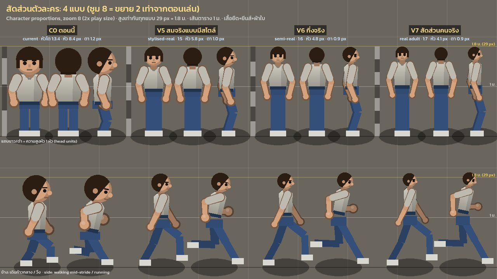

**แผ่นมุมมอง ขนาดเล่นจริง (ซูม 4 พิกเซลต่อพิกเซล)** — 4 คอลัมน์ × 5 แถว (หน้า หลัง ข้าง เดิน วิ่ง) กริด 1 ม. ภาพนี้สำคัญที่สุดสำหรับตัดสินว่า "อ่านออกไหม"

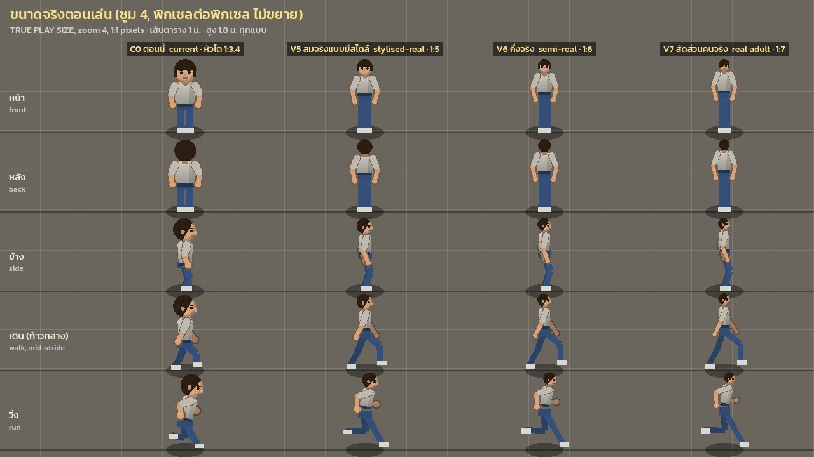

**นับพิกเซลหัวและตา** — ผู้เล่นในฉากถนนที่ซูม 4 ขยายให้ 1 px จอ = บล็อก 6×6 (C0, V5, V6, V7)

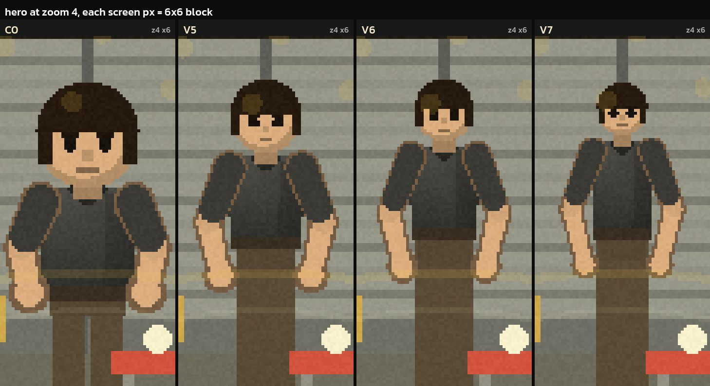

**ชุด 12 ชุด** (หมวก+ฮู้ด+กระเป๋านักเรียน, ไรเดอร์หมวกเต็มใบ, หมวกกันน็อก+เสื้อกันแทง+เป้, เสื้อกันฝน+ผ้าพันคอ, กระโปรง+ส้นสูง+ไฟฉายคาดหัว, ชุดนักเรียน, หมวกนิรภัย+เสื้อสะท้อนแสง+เข็มขัดเครื่องมือ, เสื้อกาวน์+N95, งอบ+ผ้าถุง+ตะกร้า, กล่องส่งของ, ชุดมาสคอตทุเรียน, ชุดไดโนเสาร์) แต่ละชุดมี C0 หน้า (จาง) + แบบใหม่หน้าและข้าง

- V6: 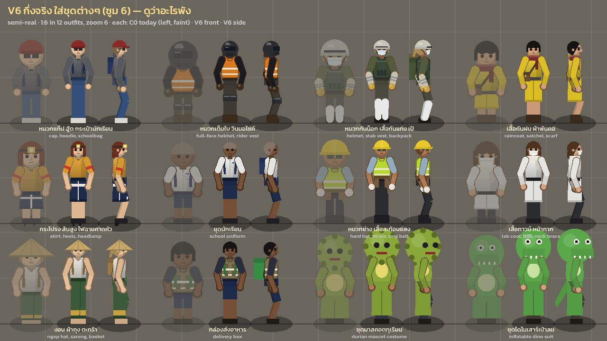
- V5: 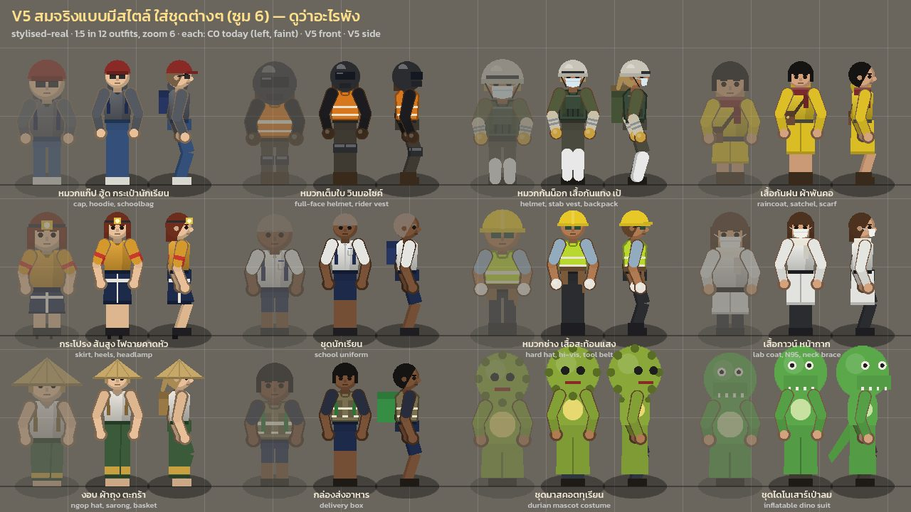
- V7: 

**ซอมบี้ ซูม 6** — normal / runner / fat ใน C0 vs V6 vs V7 เดินหันหน้า + มุมข้าง (runner วิ่ง)

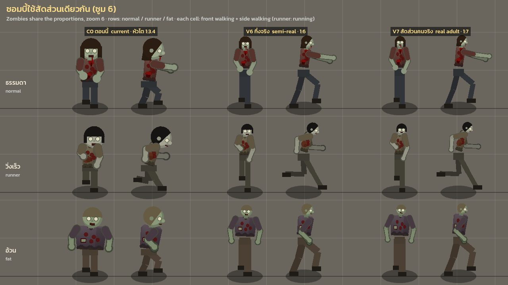

**ฉากถนน โลกปัจจุบัน ซูม 4 ขนาดจริง** — C0, V6, V7 กล้องเดียวกัน ผู้เล่นยืนหน้าประตูม้วนร้านก๋วยเตี๋ยวเรือตึก 3 ชั้น มีสกู๊ตเตอร์ Click จอดอยู่ และซอมบี้ 3 ตัวเดินเข้ามา

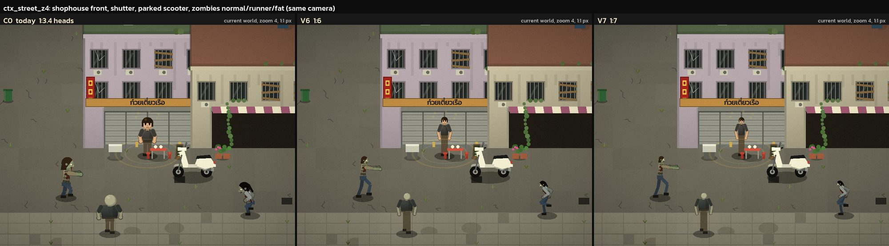

**ฉากเดียวกันในโลกขนาดใหม่** (ประตู 34 ชั้นล่าง 48) — C0, V5, V6, V7

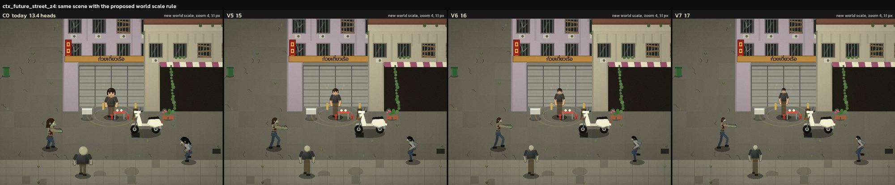

**ต่อสู้ ขยาย 2 เท่า** — แถว: ไม้เบสบอลมุมข้างที่ 30/55/80% ของการเหวี่ยง แล้วมีดพร้าจากด้านหน้าที่ 30/55% · คอลัมน์: C0, V6, V7 (ซอมบี้ห่าง 22 / 20 px)

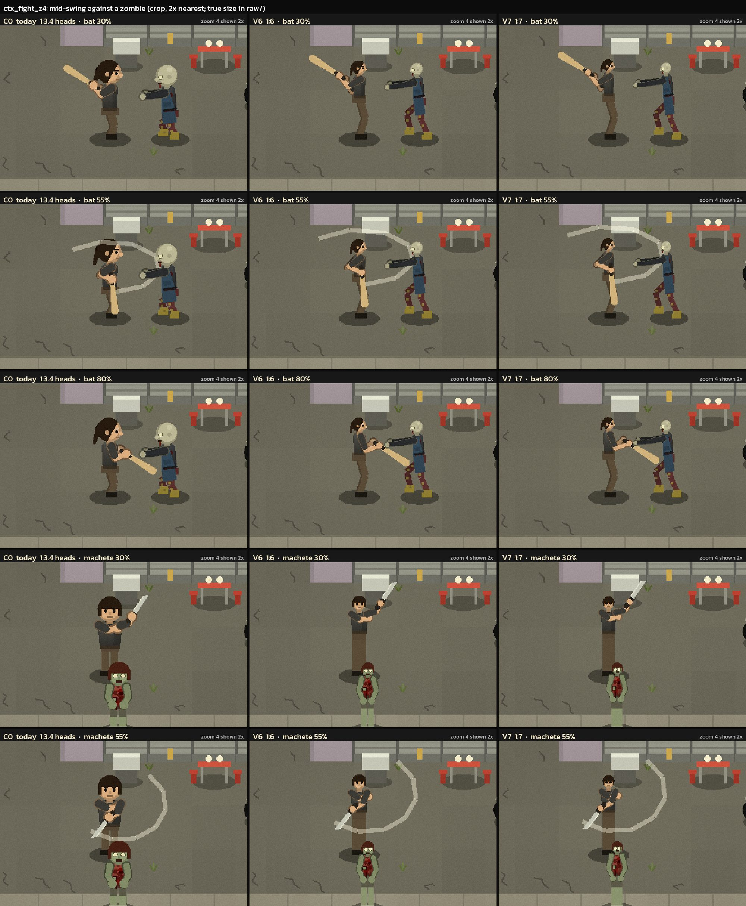

**ต่อสู้ ขนาดเล่นจริง** — ไม้ 55% และมีดพร้า 55% (C0, V6, V7)

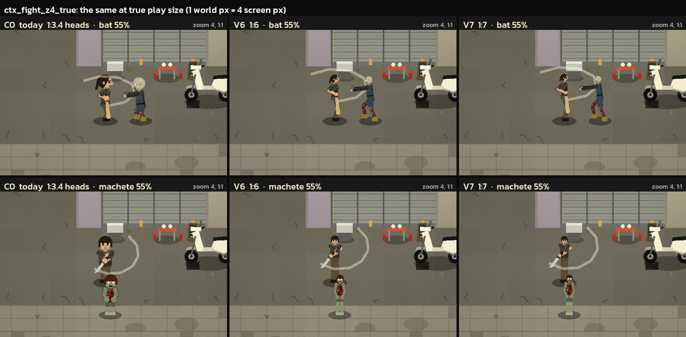

**ขี่สกู๊ตเตอร์ ภาพใกล้** (ซูม 4 ขยาย 3 เท่า) — C0; V6 บนเบาะเดิม; V6 กับการแก้ด่วน `BIKE_SEATS` (เท้าไปข้างหน้า); แล้วแบบเดียวกันของ V7 · แถวบนมุมข้าง แถวล่างมุมหน้า · วงทองในภาพที่แก้แล้วเป็นวงเลเวลอัปจากเควสต์ ไม่เกี่ยวกับการแก้

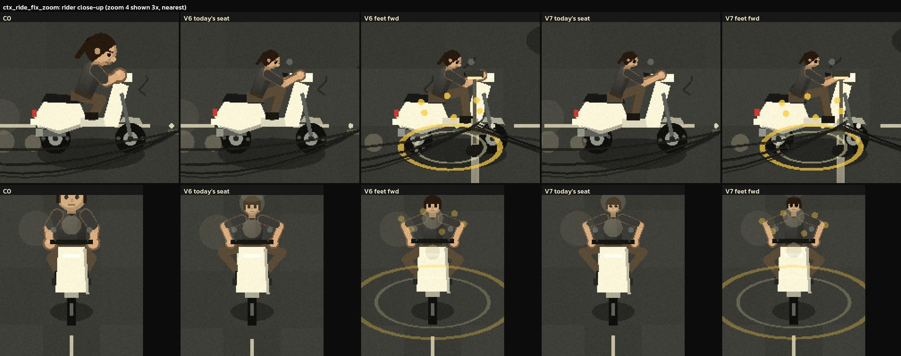

**ในห้อง ซูม 5** (โลกขนาดใหม่ ชั้นล่างตึกแถว) — ประตู ตู้เย็น ตู้ ที่ผนังหลัง และเตียงด้านหน้า ผู้เล่นยืนข้างเตียง ซอมบี้ยื่นมือเข้ามา (C0, V6, V7)

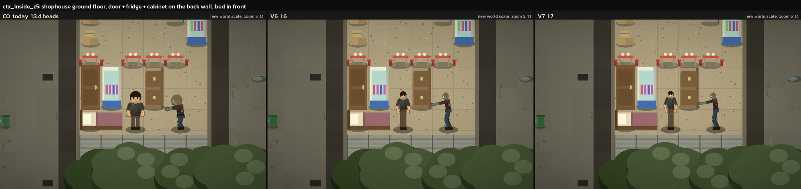

**V6 กับ HUD เต็มจอ** — ซูม 4 เฟรม 1280×720 ถือไม้ มีซอมบี้ 3 ตัวรอบ (ภาพเทียบ C0/V7 อยู่ในโฟลเดอร์ scratch: `ctx_hud_z4_fut_C0.png`, `ctx_hud_z4_fut_V7.png`)

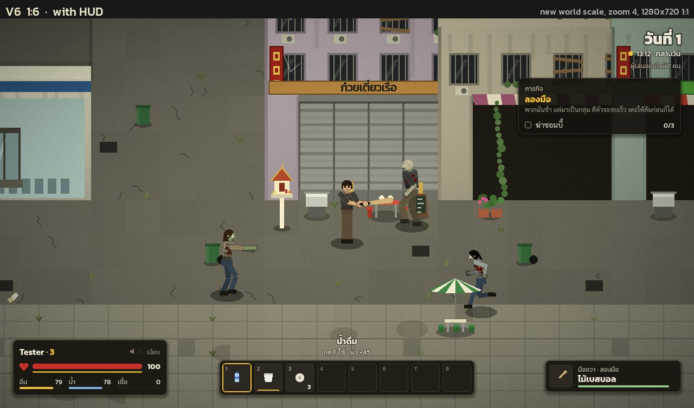

**ฝูงซอมบี้ ภาพใกล้** (ซูม 3 ขยาย 3 เท่า) C0 vs V6 — ใช้ตัดสินหัว แผล และชนิดซอมบี้ ภาพเต็มคือ `ctx_crowd_z3.png` (18 ตัว: normal, runner, fat, screamer, junkie, guard + ไม่มีแขนซ้าย 1 ไม่มีหัว 1 คลาน 1 บาดเจ็บ 2)

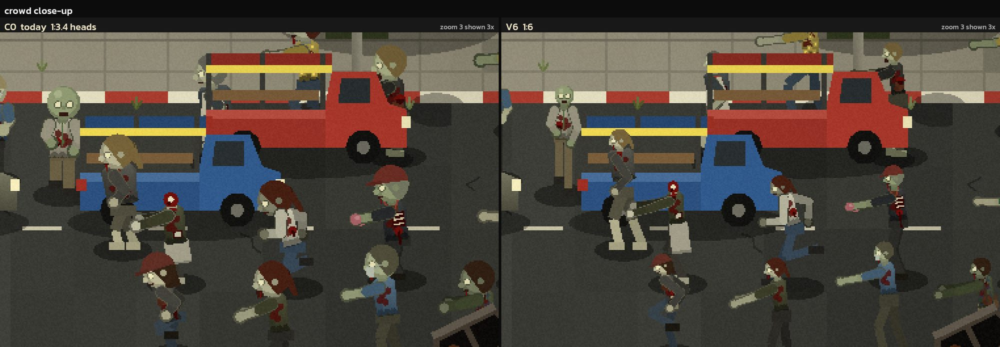

---

## สิ่งที่ดีอยู่แล้ว (ควรเก็บไว้)

- **ความสูงตัวละคร 29 px** ใช้เป็นไม้บรรทัดของโลกได้ (ดู [3-scale.md](3-scale.md)) ทุกแบบในรีวิวนี้คงความสูงเดิม เปลี่ยนแค่การแบ่งหัว/ตัว/ขา
- **ระบบกระดูก + IK ใน `rig.gd`** รับความยาวกระดูกใหม่ได้เลย มือยังจับแฮนด์ ท่าเตะ/ต่อยยังถึงเป้า `tests/test_rig.gd` ผ่าน 43/43 ที่ค่าเดิม
- **โค้ดวาดใช้ช่องทางแคบ:** `Look`, `Clothes`, `TopRig` เรียก canvas แค่ `draw_primitive`, `draw_set_transform`, `draw_set_transform_matrix` (grep ยืนยัน: 5 + 3 + 2 จุดใน look.gd, 2 จุดใน top_rig.gd) จึงดัก/บิดได้ที่จุดเดียว
- **เสื้อผ้าถูกวาดอ้างอิงจุดบนร่าง** จึงตามตัวใหม่ได้เองทั้ง 12/34 ชุด ไม่มีชิ้นไหนหลุดตำแหน่ง
- **ซอมบี้แยกชนิดด้วยท่าทางและบล็อกสี** (แขนยื่น = normal, ท่าวิ่ง = runner, สีเครื่องแบบ/หมวก) ซึ่งยังรอดได้แม้หัวเล็กลง
- **ชุดมาสคอต/ไดโนเสาร์หัวใหญ่** เป็นมุกตลกที่ควรคงขนาดไว้ (ระบบทดลองก็คงไว้โดยตั้งใจ)
- **เครื่องมือทดสอบภาพ:** `tests/lookbook.gd` (34 ชุด × 11 ท่า) ใช้เป็นตัวเทียบ identity ได้ดีมาก

---

## ระบบทดลองที่สร้างไว้ (อ่านก่อนลงมือแก้)

อยู่ในสำเนาโปรเจกต์ scratch เท่านั้น ถ้าจะใช้จริงต้องย้ายเข้า repo บน branch แยก

**วิธีที่ใช้:** ผสมระหว่าง (a) warp ตอนวาด กับส่วนเล็กๆ ของ (b) แก้ตัวเลขในโค้ด

1. **คลาสใหม่ `scripts/proportions.gd` (`Proportions`)** เก็บ knob ทั้งหมด ค่า default = ค่าวันนี้: `hip_y`, `sh_y`, `collar_y`, จุดกลางหัว, `head_s`, `thigh`, `shin`, `upper_arm`, `forearm`, `sh_x`, `wx` / `wx_side`, `limb_w`, `leg_w`, `leg_x`, `eye_k`, `neck_w`, `leg_girth` · `apply()` เขียนค่าลง rig · `Rig.HIP_Y/THIGH/SHIN/UPPER_ARM/FOREARM/ARM` และ `Look.HEAD/CHEST` เปลี่ยนจาก `const` เป็น `static var` · คำนวณตัวคูณ L (ขา), A (แขน), W (ช่วงไหล่), KN (หน้าแข้ง), TH (ต้นขา), T (ความชันลำตัว), CB (ความชัน collar)
2. **โครงกระดูกจริง (`rig.gd`):** ทุกตัวเลขท่าที่เป็นความยาวร่างกายคูณด้วยตัวคูณของมัน — ขาใช้ L (ก้าว ยกเท้า วิ่ง ท่ากะเผลก ล้ม ลุก runner ย่อ เป้าเตะ; เข่าตอนเตะใช้ TH) · แขนใช้ A (มือห้อย การ์ด ระยะต่อย จับอาวุธ `GRIPS` แทง ปืนสั้น/ยาว ระยะเอื้อมของซอมบี้) · x ของมือมุมหน้าใช้ W · ตัวเลขที่เขียนเป็น y สัมบูรณ์ (มือซอมบี้ที่ -10.8, -12.3, -20.4, คาง -19.5) ผ่าน `Proportions.ay(y)`
3. **รูปที่วาดด้วยมือผ่าน warp proxy (`Proportions.Warp`)** ยืนแทน canvas เฉพาะตอน knob เปิด แปลงทุกจุดของทุก primitive ในกรอบพิกัดของชิ้นนั้นก่อน transform (bob, เอียง, กลับด้าน, หมุนตัว จึงยังทำงานหลัง warp) มี 3 โหมด:
   - **BODY:** y เป็นเส้นตรงเป็นท่อนผ่าน เท้า 0 / สะโพก -10 / ไหล่ -18.6 / collar -20 เหนือ collar ใช้ความชันลำตัว · x คูณ `wx` หรือ `wx_side` · ใช้กับลำตัว เข็มขัด สะโพก ลายเสื้อ แผล และชั้นเสื้อผ้า back_side / coat / torso / waist / strap / neck / back_head (ฮู้ด) และเลือดพุ่ง
   - **HEAD:** ย่อ/ขยายเท่ากันทุกทิศด้วย `head_s` รอบจุดกลางหัว · ใช้กับหัว ผม หน้า หมวก หน้ากาก หัวแตก ฮู้ดด้านหลังหัว และฮู้ดของ TopRig
   - **OFF:** ทุกอย่างที่วาดจากข้อต่อ rig (แขน ขา ถุงมือ สนับแขน สนับเข่า สนับแข้ง อาวุธ เตะหน้า ตอแขนขา) และหัวชุดมาสคอต
4. **แก้ตัวเลขเล็กน้อยที่มี knob กำกับ:** คอลัมน์ขามุมหน้า (`_leg_rect`) มาจาก `Rig.HIP_Y` และ KN · สี่เหลี่ยมคอใช้ collar ที่แปลงแล้วและ `neck_w` · รัศมีตา/เบ้าตาคูณ `eye_k` · ความกว้างแขนคูณ `limb_w` ขาคูณ `leg_w` (ตัวอ้วนได้ `leg_girth` เพิ่ม) · `TopRig.supine` ปรับข้อต่อใหม่ (`_fit`) · `player.gd`: `const STAB_KEYS` เป็น `static var` (เพราะ const อ่าน `Rig.HIP_Y` ไม่ได้แล้ว)
5. ทุกนิพจน์ที่เขียนใหม่จัดรูปให้ค่า default ทำการคำนวณ float เหมือนวันนี้ทุกประการ (`x*1.0`, `y + 0.0`, `p + (p - c)*0.0`)

**สร้างแบบใหม่:** `Proportions.design(targets)` รับเป้าเป็นสัดส่วนของ H = 29 px ถึงยอดผม ยอดผมคงที่ -29 เสมอ (จุดกลางหัว = `-29 + 5.0*head_s`)

**การพิสูจน์ identity** (baseline = สำเนา HEAD ที่ไม่แตะ):
- lookbook (`tests/lookbook.gd`: 34 ชุด × 11 ท่า รวมกระโดด คลาน ล้ม TopRig นอนหงาย/คว่ำ) 1512×4782 px: **ต่างกัน 0 พิกเซล** ค่าสีต่างสูงสุด 0 · รัน `tests/lookbook.gd` ของ repo เองใน char_copy ก็ได้ผลเดียวกัน
- แผ่นท่าทางกว้าง (`char/identity_sheet.gd` 3300×1776 px): 10 ชุด × 27 ท่าคน + ซอมบี้ 3 แบบ (gore, ไม่มีแขน, ไม่มีหัว) × 17 ท่า: **0 พิกเซล**
- ทั้งสองแผ่นแบบ `--force` (บังคับ warp ทำงานทุก primitive ด้วยค่าวันนี้): **0 พิกเซล** · รอบแรกที่ force เจอ 15 px (คอ crawler) และ 260 px (ฮู้ดบน crawler) แก้แล้วทั้งคู่
- `tests/test_rig.gd` 43/43 และ `tests/test_clothes.gd` 3/3 ผ่านใน char_copy
- ไฟล์ผลอยู่ที่ `char/identity/` (`lookbook_before/after/after_forced`, `poses_before/after/after_forced`)

**ไฟล์ที่แก้ในสำเนา** (diff รวม `char/char_proportions.patch` เทียบ `scale_before/scripts`; ผู้ตรวจนับได้ 8 ไฟล์ +476/-119):
- `scripts/proportions.gd` ใหม่ (+ `proportions.gd.uid`)
- `scripts/look.gd` +76/-38 · `scripts/rig.gd` +76/-65 · `scripts/clothes.gd` +27/-10 · `scripts/top_rig.gd` +29/-4 · `scripts/player.gd` +1/-1
- `scripts/bike_art.gd` ใน char_copy และ char_future: flag `static var fix := false` สำหรับการแก้ด่วนเบาะ (ปิดเป็นค่าเริ่มต้น ต้นฉบับอยู่ที่ `char/bike_art.orig.gd`)

---

## ข้อค้นพบ

### ก. ภาพรวม: ควรเปลี่ยนสัดส่วนไหม

### CH-01 ตัวละครหัวโต (1:3.45) ดูเป็นของเล่นในเมืองขนาดจริง
- **ผลตรวจค้าน:** keep (ผู้วิจารณ์ 3/3 เห็นตรงกัน) · roadmap: new (ต่อจาก fix 11 ใน [3-scale.md](3-scale.md))
- **ข้อเท็จจริง:** C0 หัว 8.4 px (33.6 px จอ) กว้างเท่าไหล่ ใหญ่กว่าความกว้างลำตัว เป้าอยู่ที่ 0.307H ข้างตึกแถว 3 ชั้น ประตูม้วน 3 ม. สกู๊ตเตอร์ ตู้เย็น C0 อ่านเป็น chibi · ในโลกขนาดใหม่ (ชั้นล่าง 48 px) ยิ่งดูผิดที่ผิดทาง ในห้อง หัว C0 เกือบกว้างเท่าประตูตู้เย็น
- **หลักฐาน:** [ถนน](img/char_ctx_street_z4.jpg) · [ถนนโลกใหม่](img/char_ctx_future_street_z4.jpg) · [ในห้อง](img/char_ctx_inside_z5.jpg) · [มุมมองซูม 8](img/char_sheet_views_z8.jpg)
- **ทำไมสำคัญ:** ทิศทางของโปรเจกต์คือ "สมจริงแบบชีวิตไทยก่อน" ตัวละครหัวโตเป็นสัญญาณ "ของเล่น" ใหญ่ที่สุดที่เหลืออยู่หลังจากแก้สัดส่วนตึก
- **วิธีแก้ที่แนะนำ:** เปลี่ยนเป็น V6 (หรือ ~1:5.5) ทั้งระบบ ตามลำดับงานในหัวข้อ "ทิศทางและลำดับที่แนะนำ"
- **ขนาดงาน / ผลกระทบ / ต้อง bump GEN ไหม:** L รวมทั้งหมด · ผลกระทบสูง (ทุกฉาก) · ไม่ต้อง bump GEN (เป็นงานวาดและตัวเลข gameplay ไม่เกี่ยวกับข้อมูลเมือง/เซฟ)

### CH-02 เลือกแบบไหน: V5 / V6 / V7
- **ผลตรวจค้าน:** revise (build เสนอ 3 แบบ ผู้วิจารณ์ 2 คนเลือก V6 อีกคนเสนอ V55 ใหม่ระหว่าง V5-V6) · roadmap: new
- **ข้อเท็จจริง:**
  - **V5 (1:5):** หน้าอ่านออกที่สุด (หัว 23.2 px จอ) ตัวดูเป็นผู้ใหญ่ แต่ยังดู "หัวหนัก/stylised" เล็กน้อยข้างชั้นล่าง 48 px และลำตัวยังดูสั้นนิดๆ
  - **V6 (1:6):** เข้ากับประตู 34 และชั้นล่าง 48 ที่สุดด้วยตา ดูเป็นหนุ่มสาวสัดส่วนธรรมชาติ หน้ายังเป็น "ตาสองจุด + ผม" ที่หัว 19.3 px จอ ปาก/คิ้วหาย
  - **V7 (1:7):** ถูกกายวิภาคที่สุด ดูเป็นหุ่นแฟชั่นผอมสูง ที่ขนาดจริงแขน ~3 px จอ ลำตัว 9-10 px จอต่อข้าง หัว 16.6 px จอ ตาอยู่ได้เพราะ `eye_k 1.45` (ไม่งั้นเหลือ 2.4 px จอ) ใกล้ "ตัวก้าง"
- **หลักฐาน:** [มุมมองซูม 4](img/char_sheet_views_z4.jpg) · [นับพิกเซล](img/char_ctx_hero_z4_pixels.jpg) · [ถนนโลกใหม่](img/char_ctx_future_street_z4.jpg) · [HUD V6](img/char_ctx_hud_z4_fut_V6.jpg)
- **ทำไมสำคัญ:** ต้องแลกระหว่าง "ดูเป็นผู้ใหญ่ในเมืองจริง" กับ "หน้าและแขนขายังอ่านออกที่ขนาดเล่น โดยเฉพาะบนมือถือ"
- **วิธีแก้ที่แนะนำ:**
  - ฐาน V6 แล้วเอนไปทาง V5 ที่หน้า: `head_s` ~0.62 (ราว 1:5.6) และ `eye_k` ~1.3 หรือสูงกว่า
  - หรือเพิ่ม V55 ลอง: `n=5.5, neck 0.4, drop 0.95, crotch 0.45, knee 0.28, span 0.31, arm 0.36, limb 0.85, leg 0.9, side 0.8, eye 1.35, leg_girth 0.5` เป้า: หัว ≥ 21 px จอ แขน ≥ 3.5 px จอที่ซูม 4 เรนเดอร์ `sheet_views_z4`, `ctx_hero_z4_pixels`, `crowd_z3` เทียบ V5/V6
  - ถ้าทดสอบบนมือถือแล้วหน้า V6 เล็กไป ให้ถอยไป V5
- **ขนาดงาน / ผลกระทบ / ต้อง bump GEN ไหม:** S (แค่เพิ่มบรรทัดใน `Proportions.VARIANTS` แล้วเรนเดอร์) · ผลกระทบสูง (เป็นการตัดสินหลัก) · ไม่ต้อง

### ข. ของที่ยังดีหลังเปลี่ยน (ยืนยันจากภาพ)

### CH-03 การต่อสู้อ่านออกเท่าเดิมหรือดีกว่า
- **ผลตรวจค้าน:** keep · roadmap: new
- **ข้อเท็จจริง:** ไม้ช่วงง้าง (30%) ถูกยกหลังหัว **ชัดกว่าใน V6/V7** เพราะหัวไม่บังแขน · 55% เห็นส่วนโค้งของรอยเหวี่ยงชัด · 80% ไม้ลงที่เอวซอมบี้ · มีดพร้ามุมหน้า 30% ยกข้างตัว 55% โค้งฟันพาดตัวชัด · ที่ขนาดจริง C0 อ่านเร็วที่สุด V6 อ่านได้ V7 เริ่มผอม
- **หลักฐาน:** [ต่อสู้](img/char_ctx_fight_z4.jpg) · [ต่อสู้ขนาดจริง](img/char_ctx_fight_z4_true.jpg)
- **ทำไมสำคัญ:** การต่อสู้เป็นหัวใจของเกม ถ้าอ่านไม่ออกจะเปลี่ยนไม่ได้
- **วิธีแก้ที่แนะนำ:** ไม่ต้องแก้ ยกเว้นข้อที่อ่อนลง: มวลตัวหลังการเหวี่ยง (ดู CH-12) และจุดเริ่มรอยเหวี่ยง (ดู CH-14)
- **ขนาดงาน / ผลกระทบ / ต้อง bump GEN ไหม:** – · – · ไม่ต้อง

### CH-04 เสื้อผ้าทุกชุดสวมพอดีตัวใหม่
- **ผลตรวจค้าน:** keep · roadmap: new
- **ข้อเท็จจริง:** ในแผ่น 12 ชุดและ lookbook 34 ชุด ไม่มีชิ้นไหนเยื้อง: เสื้อกั๊ก เป้ กล่องส่งของ ชายเสื้อโค้ท ชายกระโปรง/ผ้าถุง ผ้าพันคอ ฮู้ด หมวกกันน็อก หน้ากาก ชุดมาสคอต · แก้แม่แบบเสื้อผ้า 0 ชิ้น (ผู้วิจารณ์เทคนิค: ถ้าต้องแก้เองคือ ~119 ค่าใน clothes.gd) · ชุดไทยในชีวิตประจำวันดูน่าเชื่อขึ้นบนตัวยาว
- **หลักฐาน:** [ชุด V6](img/char_sheet_outfits_V6.jpg) · [ชุด V5](img/char_sheet_outfits_V5.jpg) · [ชุด V7](img/char_sheet_outfits_V7.jpg) · scratch: `lookbook_V5/V6/V7.png`
- **ทำไมสำคัญ:** เป็นงานที่ใหญ่และเสี่ยงที่สุดถ้าต้องทำมือ ระบบ warp ประหยัดตรงนี้ได้หลายสัปดาห์
- **วิธีแก้ที่แนะนำ:** ไม่ต้องแก้ (ดูรายละเอียดขนาดที่ไม่ตามตัวใน CH-17)
- **ขนาดงาน / ผลกระทบ / ต้อง bump GEN ไหม:** – · – · ไม่ต้อง

### CH-05 ฝูงซอมบี้อ่านง่ายขึ้น ชนิดส่วนใหญ่ยังแยกได้
- **ผลตรวจค้าน:** keep · roadmap: new
- **ข้อเท็จจริง:** V6 runner (ท่าวิ่ง) กับ normal (แขนยื่น) ยังแยกด้วยท่า · เครื่องแบบ guard หมวกนิรภัย หมวกแก๊ป ยังเห็นเป็นบล็อกสี · หัวยังเป็นจุดสีผิว+ผม (~14 px จอที่ซูม 3) · ตัวไม่มีหัว (ตอแดง) ตัวไม่มีแขน และตัวคลาน ยังอ่านออกทั้ง C0 และ V6 · แผลเห็นแต่เล็กลง แถบ HP ไม่เปลี่ยน · ฝูง V6 สูงผอมกว่า มีช่องว่างระหว่างตัว **นับตัวได้ง่ายกว่า C0** ที่หัวโตซ้อนกัน · ซอมบี้บางตัวทับรถบรรทุก/รถยนต์ที่จอด เป็นเรื่องการวางในฉาก ไม่ใช่บั๊ก
- **หลักฐาน:** [ฝูงซอมบี้](img/char_ctx_crowd_z3_close.jpg) · [ซอมบี้ซูม 6](img/char_sheet_zombies_z6.jpg) · scratch: `ctx_crowd_z3.png`, `ctx_crowd_z3_detail.png`
- **ทำไมสำคัญ:** เกมมีซอมบี้ 40-100 ตัว ฝูงต้องอ่านออก
- **วิธีแก้ที่แนะนำ:** ไม่ต้องแก้ ยกเว้น fat และ screamer (CH-10, CH-11)
- **ขนาดงาน / ผลกระทบ / ต้อง bump GEN ไหม:** – · – · ไม่ต้อง

### CH-06 ในห้องและ HUD
- **ผลตรวจค้าน:** keep · roadmap: new
- **ข้อเท็จจริง:** ซูม 5 V6/V7 ดูเป็นผู้ใหญ่ในห้องจริง: ตู้เย็นสูงระดับไหล่ ประตูพ้นหัวชัด เตียงระดับเข่า ไม่เห็นอะไรพัง (มือซอมบี้ยาวขึ้นและขนาดเตียงไม่ผิดตา) · ทั้งสามแบบสูงเท่ากัน ขนาดประตู/ตู้เย็นเทียบคนจึงไม่เปลี่ยน เปลี่ยนแค่การแบ่งหัว/ตัว · กับ HUD ที่ 1280×720 ผู้เล่น V6 ยังเป็นตัวเอกชัด ชื่อและ hotbar ไม่กระทบ เห็นการจับไม้ ชนิดซอมบี้อ่านได้ · V7 ใกล้ตัวก้าง C0 เป็นการ์ตูน
- **หลักฐาน:** [ในห้อง](img/char_ctx_inside_z5.jpg) · [HUD V6](img/char_ctx_hud_z4_fut_V6.jpg)
- **ทำไมสำคัญ:** ยืนยันว่าเข้ากับลำดับงาน "ภายในตึก → ชั้น 2 → ย่าน" ที่ตกลงกันไว้
- **วิธีแก้ที่แนะนำ:** ไม่ต้องแก้
- **ขนาดงาน / ผลกระทบ / ต้อง bump GEN ไหม:** – · – · ไม่ต้อง

### ค. ท่าที่ตัวเรียกส่งค่าตายตัวมา (anchor)

### CH-07 ท่ากระโดด คลาน นั่ง นอน ยังใช้ตัวเลขของตัวขาสั้น
- **ผลตรวจค้าน:** keep · roadmap: new
- **ข้อเท็จจริง:** ตัวเลขท่าที่ส่งมาจากผู้เรียกยังเป็นค่า canonical: `Player.leap_keys`, `STAB_KEYS` (สร้างครั้งเดียวที่ `HIP_Y` default), `Zombie.crawl_anchors`, ความสูงนั่ง/นอนใน `player.gd` (~906-996, `SEAT_HEIGHT`) และท่าหอบ (winded) · ขายังเอื้อมถึงด้วย IK แต่ขายาวขึ้นทำให้ท่ากระโดดเป็นการม้วนตัวแน่น และท่าคลานยืด · เก้าอี้/เตียงก็เช่นกัน: ขายาวพับแรงขึ้น · lookbook V7 เห็นท่ากระโดดม้วนแน่น TopRig นอนเรนเดอร์ได้
- **หลักฐาน:** `player.gd` ~906-996 · `player.gd` `STAB_KEYS`, `leap_keys` · `zombie.gd` `crawl_anchors` · scratch: `lookbook_V7.png`, `work/poses_V7.png`
- **ทำไมสำคัญ:** ท่าที่เห็นบ่อย (นอน นั่ง กระโดดข้าม) จะดูแปลก
- **วิธีแก้ที่แนะนำ:** คำนวณใหม่เป็นหน่วยโลกจริงหรือจาก landmark (`Proportions.HIP_Y`, ความยาวขา) แทนตัวเลขลอย · แต่ละข้อต้องดูด้วยตา
- **ขนาดงาน / ผลกระทบ / ต้อง bump GEN ไหม:** M (รวมกับ CH-08) · ปานกลาง · ไม่ต้อง

### CH-08 ขี่สกู๊ตเตอร์: เข่าชี้ขึ้นถึงแฮนด์และกางออก
- **ผลตรวจค้าน:** keep (+ ข้อเสนอแก้จริงจากผู้วิจารณ์) · roadmap: new
- **ข้อเท็จจริง:** ไม่ crash และ IK ยังวางมือบนแฮนด์
  - มุมข้าง: จุดยึดเบาะคือสะโพก V6/V7 จึงนั่งต่ำลง ~5 px (สะโพกถึงกระหม่อม 14 px ใน V6 เทียบ 19 px ใน C0) ซึ่งสมจริง (หัวตอนนั่ง ≈ เบาะ + 0.9 ม.) แต่ที่พักเท้าอยู่แค่ 6 px ใต้และ 7 px หลังเบาะ เทียบขา 15-16 px → เข่าพับสูงใกล้แฮนด์ คนขี่ดูค่อม
  - มุมหน้า: เข่ากางเลยตัวถัง (ที่พักเท้า ±3.2 px เทียบสะโพกแคบ) หัวอยู่แค่เหนือแฮนด์
  - **การแก้ด่วนใน scratch:** `static var fix := false` ใน `bike_art.gd` เมื่อเปิดและ `Proportions.on`: pegs `+= (3.5*(L-1)/0.5, +1.0)` และ x เท้ามุมหน้า `*= leg_x` → มุมข้างเท้าไปวางบนพื้นวางเท้าและดูเป็นคนขี่สกู๊ตเตอร์ไทยนั่งตรง มุมหน้าเข่าแคบลงแต่ยังไม่หุบสนิท
- **หลักฐาน:** [ขี่รถ](img/char_ctx_ride_fix_zoom.jpg) · `bike_art.gd:39-53` (`BikeArt.BIKE_SEATS`) · scratch: `ctx_ride_z4.png`, `ctx_ride_z4_true.png`, `ctx_ride_fix_z4.png`
- **ทำไมสำคัญ:** มอเตอร์ไซค์เป็นส่วนสำคัญของชีวิตกรุงเทพในเกม (ดู [2-vehicles-living.md](2-vehicles-living.md))
- **วิธีแก้ที่แนะนำ:** คำนวณ pegs ใน `BIKE_SEATS` ใหม่เป็นหน่วยจริงต่อรุ่น (พื้นวางเท้าสูง ~0.3-0.4 ม. ≈ 5-6 px ลง และอยู่หน้าเบาะ) x เท้ามุมหน้าคูณ `leg_x` · อย่าเก็บ flag `fix` ไว้ถาวร
- **ขนาดงาน / ผลกระทบ / ต้อง bump GEN ไหม:** S-M · ปานกลาง · ไม่ต้อง

### ง. ตัวเลข gameplay

### CH-09 hit zone และจุดอ้างอิงยังเป็นตัวเลขเดิม
- **ผลตรวจค้าน:** revise (ผู้วิจารณ์เทคนิคระบุเป้าใหม่และเจอ `test_hitzones` เพิ่ม) · roadmap: new
- **ข้อเท็จจริง:**
  - `combat.gd:15-16` `HEAD_Y -23` / `LEGS_Y -9` · ที่ V7 หัวอยู่ -24.5..-29 ดังนั้น -23 คือไหล่ · V6 คางที่ -23.7 และเป้าที่ -13.3 ดังนั้น `LEGS_Y -9` ต่ำเกินไป
  - `test_hitzones` ใช้ -28/-15/-4
  - `Look.CHEST` ตาม map แล้ว (V7 ≈ -19.9) ทำให้จุดเริ่มเล็ง `night_eyes` และจุดประกายไฟขยับ
  - ไม่ถูกปรับ: `draw_hp` ที่ -33, รัศมีเงาใต้ตัว 7.5, วงน้ำตอนว่าย (`player.gd` ~1143-1146 ยังอยู่ที่เอวเก่า)
- **หลักฐาน:** `combat.gd:15-16` · `player.gd` ~1143-1146 · `Look.CHEST`
- **ทำไมสำคัญ:** ตีหัวจะโดนไหล่ ตีขาจะโดนหน้าแข้ง = ความรู้สึกการต่อสู้เพี้ยนโดยไม่มีใครเห็นในภาพ
- **วิธีแก้ที่แนะนำ:** ทำตาราง landmark เดียว: `HEAD_Y` = คาง (`head.y + 4.2*head_s` ≈ -23.7 ใน V6) หรือจากจุดกลางหัว · `LEGS_Y` = เป้า (≈ -13.3) หรือจากเข่า · เขียน threshold ของ `test_hitzones` และ `test_rig` เป็น landmark · ตรวจ scaling ของ `Zombie.height`, จุดเล็ง, `night_eyes`, ความสูง `draw_hp`, รัศมีเงา, ระดับน้ำตอนว่าย
- **ขนาดงาน / ผลกระทบ / ต้อง bump GEN ไหม:** S-M · ปานกลาง (ความรู้สึกการต่อสู้) · ไม่ต้อง

### CH-10 ก้าวเดินลื่น (foot slide) และซอมบี้เดินลากเท้าหายไป
- **ผลตรวจค้าน:** keep · roadmap: new
- **ข้อเท็จจริง:** stride, ยกเท้า และ bob คูณด้วย L (1.43-1.53) แต่อัตรา phase เท่าเดิม เท้าจึงลื่นเทียบความเร็ว · ก้าวลากเท้าของซอมบี้ (stride `3*L`) ดูเป็นการลากน้อยลง
- **หลักฐาน:** `player.gd`, `zombie.gd` (อัตรา phase ของการเดิน) · `rig.gd` (ตัวคูณ L)
- **ทำไมสำคัญ:** เท้าลื่นเห็นชัดตอนเคลื่อนที่ และท่าเดินลากเป็นเอกลักษณ์ซอมบี้
- **วิธีแก้ที่แนะนำ:** ปรับอัตรา phase เทียบก้าวที่ยาวขึ้นใน `player.gd`/`zombie.gd` · ซอมบี้ normal คง stride ~3 แทน `3*L`
- **ขนาดงาน / ผลกระทบ / ต้อง bump GEN ไหม:** S-M · ปานกลาง · ไม่ต้อง

### จ. รูปร่างและความอ่านออก

### CH-11 ซอมบี้อ้วนไม่อ่านเป็นอ้วน
- **ผลตรวจค้าน:** keep (ทั้ง 3 คนยืนยันจากภาพ) · roadmap: new
- **ข้อเท็จจริง:** girth 1.5 กับขายาว อ่านเป็น "ผู้ใหญ่ร่างล่ำ" ไม่ใช่อ้วน · `leg_girth 0.5` ทำให้ขาหนาขึ้น ~25% แต่ไม่พอ · ในฝูงซูม 3 V6 หาตัวอ้วนยาก · แถว fat ในแผ่นซอมบี้เป็นขาน้ำตาลยาว ยืนแคบ
- **หลักฐาน:** [ซอมบี้ซูม 6](img/char_sheet_zombies_z6.jpg) (แถวล่าง) · [ฝูงซอมบี้](img/char_ctx_crowd_z3_close.jpg)
- **ทำไมสำคัญ:** ชนิดซอมบี้ต้องแยกออกด้วยตาเพื่อเลือกวิธีรับมือ
- **วิธีแก้ที่แนะนำ:** รูปพุง (มุมข้างยื่นหน้า มุมหน้าเอวกว้างกว่าอก) · ยืนกว้าง `leg_x` ~1.2 · ขาสั้นลงด้วย hip offset ต่อชนิด · ก้าวสั้นแบบเดินเตาะแตะ
- **ขนาดงาน / ผลกระทบ / ต้อง bump GEN ไหม:** M (รวมงานขัดเกลาตัวละคร) · ปานกลาง · ไม่ต้อง

### CH-12 แขนขาบางลงมาก สายเข็มขัด/สายกระเป๋าดูหนัก
- **ผลตรวจค้าน:** keep · roadmap: new
- **ข้อเท็จจริง:** V6 แขนขา ~3-4 px จอที่ซูม 4 การเหวี่ยงดูไม่มีน้ำหนัก การจับอ่านผ่านอาวุธมากกว่าผ่านแขน · V7 เป็นตัวก้าง · เส้นเข็มขัด สาย และชายเสื้อคงความหนา canonical จึงดูหนักเทียบตัวบาง
- **หลักฐาน:** [ต่อสู้ขนาดจริง](img/char_ctx_fight_z4_true.jpg) · [มุมมองซูม 4](img/char_sheet_views_z4.jpg)
- **ทำไมสำคัญ:** น้ำหนักของการตีคือความสะใจของการต่อสู้
- **วิธีแก้ที่แนะนำ:** ความกว้างแขนขาขั้นต่ำ 1 px โลก (4 px จอ) ไม่ให้แขนต่ำกว่า 3.5 px จอ · คงหรือเพิ่มขอบเข้มของแขนขา · ความหนาเส้นเข็มขัด/สาย/ชายเสื้อให้ตามตัว หรือจำกัดที่ 0.8 px
- **ขนาดงาน / ผลกระทบ / ต้อง bump GEN ไหม:** S-M · ปานกลาง · ไม่ต้อง

### CH-13 แขนตอนยืนมุมหน้ากางออก ดูเหมือนยกมือห่างสะโพก
- **ผลตรวจค้าน:** keep · roadmap: new
- **ข้อเท็จจริง:** แขนผ่อนคลายมุมหน้ายังมีข้อศอกโค้งออกเล็กน้อยแบบวันนี้ บนลำตัวแคบของ V6/V7 อ่านชัดว่ามือกางห่างสะโพก
- **หลักฐาน:** [นับพิกเซล](img/char_ctx_hero_z4_pixels.jpg) · [มุมมองซูม 4](img/char_sheet_views_z4.jpg) (แถวหน้า)
- **ทำไมสำคัญ:** เป็นท่าที่เห็นบ่อยที่สุด (ยืนเฉย)
- **วิธีแก้ที่แนะนำ:** ดึงมือมาที่ต้นขา ข้อศอกงอเข้าเล็กน้อย ผูกกับความกว้างลำตัวใหม่
- **ขนาดงาน / ผลกระทบ / ต้อง bump GEN ไหม:** S · ปานกลาง · ไม่ต้อง

### CH-14 หน้าเล็กลง คิ้ว/ปากหาย ผมม้าบังตา เสี่ยงบนมือถือ
- **ผลตรวจค้าน:** keep (+ วิธีแก้เพิ่มจากผู้วิจารณ์) · roadmap: new
- **ข้อเท็จจริง:** คิ้ว V7 (0.45 px × `head_s` ≈ 0.22 px) และปากเล็กกว่า 1 พิกเซล · V6 ปากเป็นรอยเปื้อน 1 px · ตาอ่านได้เพราะ `eye_k` เท่านั้น (V7 3.4 px จอ ถ้าไม่มีเหลือ 2.4) · ผมม้าบังส่วนบนของตาในทุกขนาด · บนมือถือหัว V6 เหลือ ~12-15 px จอ = ความเสี่ยงหลักด้านอ่านออก · หน้ายังเป็น "หน้า" (ตาเข้ม 2 จุด + ผม) แต่ไม่มีสีหน้า
- **หลักฐาน:** [นับพิกเซล](img/char_ctx_hero_z4_pixels.jpg) · [HUD V6](img/char_ctx_hud_z4_fut_V6.jpg)
- **ทำไมสำคัญ:** มือถือเป็นเป้าหมาย และผู้เล่นออนไลน์ต้องจำตัวเองได้
- **วิธีแก้ที่แนะนำ:**
  - ตาขั้นต่ำ 1 px โลก (บล็อก 1×1 ทึบ หรือจุด r0.55 ไม่มี AA จาง) มีช่องสีผิวคั่นระหว่างตา
  - ยกผมม้าไม่ให้บังตาเลย
  - แทนคิ้ว+ปากด้วยบล็อกปากเข้ม 1 px แสดงเฉพาะตอนแสดงอารมณ์ (screamer, กัด, เจ็บ) หรือทำ face LOD
  - หัวหรือขอบผมเข้ม 1 px ให้หัวตัดกับพื้น
  - อาจให้ซอมบี้หัวใหญ่กว่าผู้เล่นเล็กน้อยเพื่อให้ชนิด/สีหน้าอ่านออก
  - ทดสอบที่ zoom มือถือจริง (~2.5-3 px จอต่อ px โลก) ถ้าไม่ผ่าน ให้เพิ่ม `eye_k` และ `head_s` นิดหน่อย ดีกว่าย่อตัว
- **ขนาดงาน / ผลกระทบ / ต้อง bump GEN ไหม:** M · สูง (ถ้าหน้าอ่านไม่ออกบนมือถือ ทั้งการเปลี่ยนอาจต้องถอยไป V5) · ไม่ต้อง

### CH-15 ปากเปิดของ screamer หายที่ซูม 3
- **ผลตรวจค้าน:** keep · roadmap: new (เป็นข้อใหม่จากภาพฉาก ไม่อยู่ในรายการของ build)
- **ข้อเท็จจริง:** ปากเปิดของ screamer อ่านได้ใน C0 แต่หายใน V6 ที่ซูม 3
- **หลักฐาน:** [ฝูงซอมบี้](img/char_ctx_crowd_z3_close.jpg)
- **ทำไมสำคัญ:** screamer เรียกฝูง ผู้เล่นต้องเห็นก่อน
- **วิธีแก้ที่แนะนำ:** วาดปาก screamer อย่างน้อย 1.2 px ไม่ขึ้นกับ `head_s` และ/หรือเอียงหัวมากขึ้นให้อ่านที่ซูม 3
- **ขนาดงาน / ผลกระทบ / ต้อง bump GEN ไหม:** S · ปานกลาง · ไม่ต้อง

### ฉ. เอฟเฟกต์ที่ไม่ตามตัว

### CH-16 รอยเหวี่ยงอาวุธลอยเหนือหัว และฝุ่นท่อไอเสียพาดหน้า
- **ผลตรวจค้าน:** keep · roadmap: new (ข้อใหม่จากภาพฉาก)
- **ข้อเท็จจริง:** เอฟเฟกต์รอยเหวี่ยงมีขนาดตายตัว บน V6/V7 เริ่มสูงเหนือหัว (ที่ 55% โค้งสูงสุดราว 1 หัวเหนือกระหม่อม) ยังอ่านออกแต่ดูแยกจากตัว · ฝุ่นท่อไอเสียของมอเตอร์ไซค์วาดที่ความสูงตายตัว ตอนนี้พาดหน้าคนขี่
- **หลักฐาน:** [ต่อสู้](img/char_ctx_fight_z4.jpg) · [ขี่รถ](img/char_ctx_ride_fix_zoom.jpg) · `bike_art.gd` (dust puffs)
- **ทำไมสำคัญ:** ทำให้เอฟเฟกต์ดูหลุดจากตัวละคร
- **วิธีแก้ที่แนะนำ:** ผูกจุดเริ่มรอยเหวี่ยงกับ `Proportions.sh_y` · ลดความสูงหรือย่อ/ขยายฝุ่นตามตัว
- **ขนาดงาน / ผลกระทบ / ต้อง bump GEN ไหม:** S · ต่ำ-ปานกลาง · ไม่ต้อง

### CH-17 ขนาดที่ไม่ตามตัว: หมวก วิก เส้น และร่างนอน
- **ผลตรวจค้าน:** keep · roadmap: new
- **ข้อเท็จจริง:** หัวชุดมาสคอต/ไดโนเสาร์คงขนาดเต็มโดยตั้งใจ · หมวกและวิกย่อตามหัว: งอบกว้าง ~8 px, ผมแอฟโฟรเล็ก, หมวก shako เตี้ย · ความหนาเส้นเข็มขัด สาย ชายเสื้อคง px canonical ดูหนักขึ้นเล็กน้อย · อาวุธคงความยาวจริง (น่าจะถูกแล้ว) · ร่างนอน (TopRig) ใช้แม่แบบ `Clothes.top` ความกว้าง canonical เสื้อกั๊ก โค้ท เป้ จึงกว้างไปเล็กน้อยบน V7 ที่นอนอยู่ แก้แค่ฮู้ดแล้ว
- **หลักฐาน:** [ชุด V6](img/char_sheet_outfits_V6.jpg) · scratch: `lookbook_V7.png`
- **ทำไมสำคัญ:** รายละเอียดเล็กแต่สะสมเป็นความรู้สึก "ไม่เนียน"
- **วิธีแก้ที่แนะนำ:** ตัดสินรายชิ้นว่าหมวกใดควรคงขนาด (เช่นงอบ) · ความหนาเส้นดู CH-12 · ปรับแม่แบบ `Clothes.top` ให้ใช้ความกว้างตามตัว
- **ขนาดงาน / ผลกระทบ / ต้อง bump GEN ไหม:** S-M · ต่ำ · ไม่ต้อง

### ช. เทคนิคและการทดสอบ

### CH-18 `tests/test_rig.gd` ล้ม 2-3 ข้อภายใต้ V6/V7
- **ผลตรวจค้าน:** keep · roadmap: new
- **ข้อเท็จจริง:** ข้อที่ล้ม: "big build's shoulders +1 px" และ "two-handed weapon held low, y > -17" เป็น threshold สัมบูรณ์แบบ canonical ตัว rig เองไม่ผิด · ข้อ "legs never stretch" ที่เจอก่อนหน้า (เข่าตอนเตะหลังและหน้า) แก้แล้วด้วยตัวคูณต้นขา TH
- **หลักฐาน:** `tests/test_rig.gd` · scratch: `char/test_rig_variant.gd`
- **ทำไมสำคัญ:** ถ้าไม่แก้ test จะเตือนผิดตลอด หรือโดนปิดไปเฉยๆ
- **วิธีแก้ที่แนะนำ:** เขียน threshold เป็น landmark (เทียบ `sh_y`, `HIP_Y` ฯลฯ) แทน px สัมบูรณ์ ทำพร้อม `test_hitzones` (CH-09)
- **ขนาดงาน / ผลกระทบ / ต้อง bump GEN ไหม:** S · ต่ำ (แต่จำเป็น) · ไม่ต้อง

### CH-19 warp proxy ช้าลง ~45% ต่อการวาด ห้ามใช้เป็นวิธีถาวร
- **ผลตรวจค้าน:** revise (build ระบุว่า "ยังไม่ได้วัด" ผู้วิจารณ์เทคนิควัดแล้ว) · roadmap: new
- **ข้อเท็จจริง:**
  - microbench แบบ headless (`char/bench/warp_bench.gd`, 10 เคสรวมชุดเต็มหน้า/ข้าง/วิ่ง และซอมบี้ gore, 300 รอบ × 3): HEAD **262 µs** ต่อการวาด · char_copy C0 ไม่ผ่าน proxy **279 µs** (+6% จากการอ่าน static var และคูณตัวคูณ) · บังคับผ่าน proxy **380-392 µs** · V6 **393-400 µs** · V7 **380-392 µs**
  - ต่อเฟรม (`char/bench/perf_var.gd` แบบมีหน้าต่าง รันครั้งเดียวจึงมีสัญญาณรบกวน): 40 ซอมบี้แต่งตัว 6.20 → 6.44 ms · **100 ซอมบี้ 8.52 → 10.96 ms (+2.4 ms)** · วัดบนเดสก์ท็อปเท่านั้น GDScript บนเว็บช้ากว่า และมือถือเป็นเป้าหมาย
  - FAIL ของ draw-call ที่ซูม 1 และ 80 ร่าง เกิดใน C0 ด้วย (เมืองสุ่ม) ไม่ได้เกิดจาก proxy
- **หลักฐาน:** scratch: `char/bench/warp_bench.gd`, `base_bench.gd`, `perf_var.gd`
- **ทำไมสำคัญ:** ตามแนวทางเรื่องประสิทธิภาพของโปรเจกต์ (ถ้ากระตุก: วัดบนเว็บก่อน) และ 2.4 ms/เฟรมคือ ~15% ของงบ 60 fps
- **วิธีแก้ที่แนะนำ:** ใช้ warp แค่ชั่วคราวเพื่อให้เกมเล่นได้และจูน anchor แล้ว **bake ค่าลงตัวเลขในโค้ด (method b)** ทีละชั้น (ดู "ทิศทางและลำดับที่แนะนำ" ขั้น 7) · ถ้าทดสอบเว็บ 100 ซอมบี้แล้วเกินงบก่อน bake เสร็จ ให้ bake ชั้นที่แพงที่สุดก่อน (ลำตัว และ Clothes torso/coat/back_side มีจุดมากที่สุด)
- **ขนาดงาน / ผลกระทบ / ต้อง bump GEN ไหม:** L (bake ทั้งหมด ~1-3 สัปดาห์ของ session) · สูงด้านประสิทธิภาพ · ไม่ต้อง

---

## ข้อที่ผู้ตรวจค้านเพิ่ม

### CH-20 ชิ้นส่วนที่กระเด็น (gib) ยังวาดขนาดเดิม
- **ผลตรวจค้าน:** เพิ่มโดยผู้วิจารณ์เทคนิค · roadmap: new
- **ข้อเท็จจริง:** `gib.gd` วาดหัว แขน ขาที่ขาดโดยเรียก `Look._head/_arm/_limb` บนตัวเองโดยไม่ผ่าน proxy หัวที่กระเด็นใน V6 จึงยังเป็น 8.4 px (1.7 เท่าของหัวบนตัว ที่ 4.8 px)
- **หลักฐาน:** `gib.gd:66-79`
- **ทำไมสำคัญ:** เห็นทุกครั้งที่ฟันหัวหลุด หัวใหญ่ผิดปกติจะเด่นมาก
- **วิธีแก้ที่แนะนำ:** ครอบการวาดหัว gib ด้วยโหมด HEAD (หรือเรียก `Proportions.canvas` ด้วย head scale) และคูณความยาวแขน/ขาด้วย A/L
- **ขนาดงาน / ผลกระทบ / ต้อง bump GEN ไหม:** S · ปานกลาง · ไม่ต้อง

### CH-21 โครงกระดูกศพเน่ายังเป็นขนาดเดิม
- **ผลตรวจค้าน:** เพิ่มโดยผู้วิจารณ์เทคนิค · roadmap: new
- **ข้อเท็จจริง:** กระดูกและกะโหลกของศพเน่าใน `corpse.gd` ใช้ขนาด canonical · ควันศพที่ y -10 ตายตัว
- **หลักฐาน:** `corpse.gd:278-287`
- **ทำไมสำคัญ:** ศพเก่าจะดูหัวโตขาสั้นต่างจากคนเป็น
- **วิธีแก้ที่แนะนำ:** ย่อ/ขยายโครงกระดูกด้วยค่าเดียวกัน (หัว `head_s`, กระดูก L/A) และผูกความสูงควันกับ landmark
- **ขนาดงาน / ผลกระทบ / ต้อง bump GEN ไหม:** S · ต่ำ-ปานกลาง · ไม่ต้อง

### CH-22 warp สร้าง "ระบบพิกัดสองชุด" ถาวร
- **ผลตรวจค้าน:** เพิ่มโดยผู้วิจารณ์เทคนิค · roadmap: new
- **ข้อเท็จจริง:** ถ้าคง warp ไว้ เสื้อผ้าใหม่ทุกชิ้นต้องวาดด้วยตัวเลขตัว chibi (collar -20, สะโพก -10) แล้วค่อยถูก warp · ทุกชั้นใหม่ใน Clothes/Look ต้องตั้ง `Proportions.mode` ให้ถูก ไม่งั้นจะวาดผิดโดยไม่มี error (mode เป็นสถานะ global) · โหมด BODY ย่อ x กับ y ไม่เท่ากัน (`wx` 0.71 vs ความชันลำตัว T) วงกลมบนตัว (กระดุม จุดแผล) จึงกลายเป็นวงรี
- **หลักฐาน:** `scripts/proportions.gd` (char_copy) · `Look.draw_rig`
- **ทำไมสำคัญ:** สับสนสำหรับมือใหม่และ Claude session ต่อๆ ไป และเป็นบั๊กเงียบ
- **วิธีแก้ที่แนะนำ:** เป็นอีกเหตุผลให้ bake (CH-19) · ระหว่างยังใช้ warp ห้ามเพิ่มเสื้อผ้าใหม่จำนวนมาก · หลัง bake เก็บ `Proportions` เป็นตาราง landmark แบบ const และทำกระดูก `Rig` กลับเป็น const
- **ขนาดงาน / ผลกระทบ / ต้อง bump GEN ไหม:** (รวมใน CH-19) · ปานกลาง · ไม่ต้อง

### CH-23 ทุกคนสูง 1.8 ม. สูงกว่าคนไทยทั่วไป
- **ผลตรวจค้าน:** เพิ่มโดยผู้วิจารณ์ด้านความสมจริง · roadmap: new
- **ข้อเท็จจริง:** ทุกแบบสูง 29 px = 1.8 ม. คนไทยผู้ใหญ่ทั่วไปสูง 1.58-1.70 ม. (~25-27 px ที่ 16 px/m)
- **หลักฐาน:** ตัวเลข H ในตาราง · [3-scale.md](3-scale.md) (คน 29 px เกินจริง ~10%)
- **ทำไมสำคัญ:** ยังไม่ใช่ "ไทยจริง" และถ้าเตี้ยลง ประตู 34 px (2.1 ม.) จะอ่านถูกยิ่งขึ้น
- **วิธีแก้ที่แนะนำ:** พิจารณาผู้ชาย default 27 px ผู้หญิง 25-26 px หรือ knob ความสูงรายตัวละคร แทน 29 px ทุกคน (ซอมบี้สุ่มอยู่แล้ว 0.92-1.08 เท่า)
- **ขนาดงาน / ผลกระทบ / ต้อง bump GEN ไหม:** M (กระทบ hit zone กล้อง และทุก anchor อีกรอบ) · ปานกลาง · ไม่ต้อง (ยกเว้นถ้าเก็บความสูงรายคนในเซฟ ต้องตัดสินตอนนั้น)

---

## มุมมองของผู้วิจารณ์แต่ละคน

| | ศิลป์ / อ่านออก | ความสมจริงแบบไทย | เทคนิค |
|---|---|---|---|
| คำแนะนำ | adjust_fully | adjust_fully | adjust_fully |
| แบบที่เลือก | **V55 ใหม่ (~1:5.5, หัว ~5.3 px ≈ 21 px จอ)** ตัวแบบ V6 หัวใหญ่และแขนขาหนากว่า V6 นิด ถ้าต้องเลือกจากที่มี → V6 + ชดเชย | **V6** เอนไป V5 ที่หน้า (1:5.5-6 หรือ V6 + `head_s` ~0.62) | **V6** ปรับหน้าไปทาง V5 (`eye_k` ≥ 1.3 คิ้ว/ปาก ≥ 1 px) V5 เป็นแผนสำรองถ้ามือถือไม่ผ่าน |
| เน้น | หน้าและแขนขาต้องมีน้ำหนักที่ขนาดเล่นและบนมือถือ | ห้องจริง ตู้เย็นระดับไหล่ ประตูพ้นหัว สกู๊ตเตอร์ระดับเอว · ความสูงคนไทย | warp แพง +45% · bake ทีละชั้นโดยใช้ warp เป็นตัวเทียบ diff · เจอ gib/corpse |
| ขนาดงาน | L | L | L |

**จุดที่เห็นตรงกัน**
- C0 เป็น chibi ในเมืองจริง ต้องเปลี่ยน และเปลี่ยนทั้งระบบ
- V7 บางเกินที่ขนาดเล่นและเสี่ยงบนมือถือ
- ขนาดที่เหมาะอยู่ราว 1:5.5-1:6 ให้หน้าใหญ่กว่า V6 นิดหน่อย
- ต้อง bake ลงตัวเลข (method b) ไม่ปล่อย warp รายเฟรมขึ้นเกมจริง
- รายการสิ่งที่ต้องแก้ตามมาเหมือนกัน: anchor/เบาะ, hit zone, ก้าวเดิน, ซอมบี้อ้วน, แขนกาง, รอยเหวี่ยง, หน้าบนมือถือ, test threshold

**จุดที่ต่างกัน**
- **ตัวเลขเป้า:** ศิลป์อยากได้ V55 เป็นแบบใหม่ที่ต้องเรนเดอร์ดูก่อน อีกสองคนเริ่มจาก V6 แล้วค่อยขยับหัว
- **ความสูงตัวละคร:** มีแค่ผู้วิจารณ์ด้านความสมจริงที่เสนอให้ลดเป็น 25-27 px
- **วิธี bake:** ผู้วิจารณ์เทคนิคเสนอลำดับชัดเจน "ใช้ warp ก่อนให้เล่นได้ แล้ว bake ทีละชั้นด้วย pixel diff" อีกสองคนบอกแค่ว่า "bake ก่อนปล่อย"

---

## ทิศทางและลำดับที่แนะนำ

**ข้อเสนอ:** เปลี่ยนเป็นประมาณ V6 (ปรับหน้าไปทาง V5) ทั้งระบบ ใช้ warp เป็นนั่งร้านชั่วคราว แล้ว bake ลงโค้ด ลำดับนี้ผสมจากผู้วิจารณ์ทั้ง 3 คน (ส่วนใหญ่ตามผู้วิจารณ์เทคนิค)

0. **เลือกตัวเลข (S):** เรนเดอร์ V55 และ V6 + `head_s` 0.62 เทียบ V5/V6 ที่ซูม 4 และที่ zoom มือถือ (~2.5-3 px จอต่อ px โลก) เป้า: หัว ≥ 21 px จอ แขน ≥ 3.5 px จอที่ซูม 4 · ผู้ใช้ดูภาพแล้วตัดสิน
1. **ล็อกแบบและย้ายเข้า repo (S, เสี่ยงต่ำ):** ตั้งค่า knob ของแบบที่เลือกเป็น default ใน `proportions.gd` (ยังผ่าน warp) ย้าย rig/look/clothes/top_rig/proportions จาก char_copy เข้า repo บน branch · รัน lookbook, `test_rig`, `test_clothes`, `test_hitzones`, `perf.gd` · เสี่ยงต่ำเพราะพิสูจน์ identity แล้ว
2. **Landmark gameplay จากตารางเดียว (S-M, เสี่ยงกลาง: ความรู้สึกการต่อสู้):** CH-09 + CH-18
3. **ท่าจากผู้เรียก (M, ต้องดูด้วยตาทีละข้อ):** CH-07 + CH-08 + CH-16 (leap_keys, STAB_KEYS, winded, นั่ง/นอน, SEAT_HEIGHT, วงน้ำ, crawl_anchors, BIKE_SEATS, ฝุ่น, รอยเหวี่ยง)
4. **จุดที่ build พลาด (S):** CH-20 gib + CH-21 corpse
5. **ขัดเกลาตัวละคร (M):** CH-13 แขนกาง · CH-11 ซอมบี้อ้วน · CH-15 screamer · CH-14 หน้า/face LOD · CH-12 แขนขาขั้นต่ำและความหนาเส้น · CH-17 หมวกและร่างนอน · ทดสอบ viewport มือถือ (ถ้าไม่ผ่าน ถอยไป V5)
6. **ก้าวเดิน (S-M):** CH-10
7. **Bake ทีละชั้น (L, ~1-3 สัปดาห์ของ session, เสี่ยงกลาง แต่ทุกขั้นตรวจด้วย diff ได้):** ทำหลังเกมเล่นได้ และควรทำก่อนเพิ่มเสื้อผ้าใหม่เยอะๆ · ทีละชั้น (ลำตัว → เข็มขัด/สะโพก → ลายเสื้อ → แผล → แต่ละชั้น Clothes → หัว): เขียนตัวเลขเป็นค่าของแบบที่เลือก (คำนวณด้วย `Proportions.map_y`/`map_body` ใช้ codemod เล็กๆ ตรงที่เป็นตัวเลขล้วน) ตั้งโหมดชั้นนั้นเป็น OFF แล้ว pixel diff เทียบภาพที่ warp (เป้า: 0 หรือไม่กี่ px จากการปัดเศษ) · เมื่อทุกชั้น OFF แล้ว ลบ `Warp` เก็บ `Proportions` เป็นตาราง landmark แบบ const และทำกระดูก `Rig` กลับเป็น const · รัน lookbook และ identity sheet อีกรอบ
8. **ประตูตรวจประสิทธิภาพ:** ถ้าทดสอบเว็บด้วย 100 ซอมบี้แต่งตัวเต็มแล้วเกินงบก่อนขั้น 7 เสร็จ ให้ bake ชั้นที่แพงที่สุดก่อน (ลำตัว และ Clothes torso/coat/back_side)

**ความเสี่ยงหลัก**
- หน้าอ่านไม่ออกบนมือถือ → แผนสำรองคือ V5
- ความรู้สึกการต่อสู้เพี้ยนจาก hit zone → ขั้น 2 ต้องเล่นทดสอบจริง
- ประสิทธิภาพบนเว็บระหว่างยังใช้ warp → ขั้น 8
- งานเยอะ: ผู้วิจารณ์ศิลป์ประเมิน ~220 ตัวเลขร่างกายที่ hard-code ข้าม look, clothes, rig, top_rig, player, zombie (ผู้วิจารณ์เทคนิคนับ ~184 ตัวเลขร่างกายข้าม 4 มุมมองที่ warp ช่วยประหยัด)

---

## วิธีเรนเดอร์แบบใหม่อีกครั้ง

ไฟล์ทั้งหมดอยู่ใน scratch ของ session นี้ (อาจถูกลบเมื่อ session จบ ถ้าจะเก็บต้องคัดลอกออกมา):

```
G=C:\Users\Miler\Downloads\Godot_v4.7.2-stable_win64.exe\Godot_v4.7.2-stable_win64_console.exe
P=C:\Users\Miler\AppData\Local\Temp\claude\C--Users-Miler-Documents-game-dev-days-later\5212f441-4643-42f7-b0ae-b45a779b2faa\scratchpad
```

รันแบบมีหน้าต่าง ไม่ใช่ headless

- **ทุกแผ่น:** `"%G%" --path %P%\char_copy -s %P%\char\sheets.gd -- [--only=views_z8,views_z4,outfits_V5,outfits_V6,outfits_V7,zombies_z6] [--out=<dir>\]` · พิมพ์บรรทัด `MEASURE` ต่อแบบ: ความสูง หัว ตา landmark
- **lookbook เต็มของแบบเดียว:** `"%G%" --path %P%\char_copy -s %P%\char\lookbook_var.gd -- --variant=V7 --out=<png>` · ใส่ `--force` สำหรับรัน identity ผ่าน warp
- **แผ่นท่าทาง/ซอมบี้:** `-s %P%\char\identity_sheet.gd -- --variant=V6 --out=<png>`
- **test rig ภายใต้แบบหนึ่ง:** `--headless -s %P%\char\test_rig_variant.gd -- --variant=V7`
- **ฉากในเกม:** `char/ctx_shots.gd` (extends `tests/test_base.gd`) รันแบบมีหน้าต่าง หนึ่ง process ต่อสำเนาและต่อแบบ args `--variant`, `--tag=cur|fut`, `--port` (9541 สำหรับ char_copy, 9542 สำหรับ char_future) ตัวเลือก `--only=street,fight,ride,inside,hud,crowd` และ `--bikefix` · ประกอบภาพด้วย `char/ctx_compose.py`
- **เพิ่มแบบใหม่:** เพิ่มบรรทัดใน `Proportions.VARIANTS` ใน `char_copy/scripts/proportions.gd` เช่น
  `V65 = {name = "V65", n = 6.5, neck = 0.5, drop = 0.85, crotch = 0.465, knee = 0.28, span = 0.275, arm = 0.37, limb = 0.72, leg = 0.82, side = 0.7, eye = 1.4}` (key เสริม: `legx`, `neck_w`, `leg_girth`) แล้วส่ง `--variant=V65` · สำหรับแผ่นเทียบ เพิ่ม key ใน `VARS` และ `VNAME` ด้านบนของ `char/sheets.gd` ด้วย
- **ในโค้ด:** `Proportions.use("V7")` หรือ `Proportions.design({...})` ทุกอย่างที่วาดหลังจากนั้น (ผู้เล่น ซอมบี้ ศพ ร่างนอน) ใช้ค่านั้น (เป็นค่า global) · `Proportions.reset()` กลับเป็นวันนี้ · ปรับละเอียด: ตั้ง knob ใดก็ได้แล้วเรียก `Proportions.apply()`

**ไฟล์ scratch อื่น:** `char/sheets.gd`, `char/identity_sheet.gd`, `char/lookbook_var.gd`, `char/test_rig_variant.gd`, `char/imgdiff.py`, `char/edit_look.py`, `char/edit_clothes.py`, `char/edit_toprig.py`, `char/char_proportions.patch`, `char/raw/` (เฟรมดิบและ log), `char/bench/`

---

## เรื่องที่รอผู้ใช้ตัดสินใจ

1. **เปลี่ยนสัดส่วนไหม?** ผู้วิจารณ์ทั้ง 3 แนะนำให้เปลี่ยน แต่เป็นเรื่องสไตล์ของเกม ผู้ใช้ต้องตัดสินเอง
2. **แบบไหน?** V6 · V6 หัวใหญ่ขึ้นนิด (`head_s` ~0.62) · V55 ใหม่ · หรือ V5 (หน้าชัดสุด) · แนะนำให้ดูภาพ V55 ก่อนตัดสิน (ขั้น 0)
3. **ความสูงตัวละคร:** คง 29 px (1.8 ม.) ทุกคน หรือลดเป็น 25-27 px / แยกชาย-หญิง / รายตัวละคร (CH-23)
4. **ซอมบี้หัวใหญ่กว่าผู้เล่นเล็กน้อยไหม** เพื่อให้ชนิดและสีหน้าอ่านออก
5. **หมวกที่เป็นเอกลักษณ์ (เช่นงอบ)** ควรย่อตามหัวหรือคงขนาด
6. **จะทำตอนไหน:** ก่อนหรือหลังงานตึก/ภายในตึกตามลำดับที่ตกลงไว้ (ภายใน → ชั้น 2 → ย่าน) · ผู้วิจารณ์เทคนิคแนะนำให้ bake ก่อนเพิ่มเสื้อผ้าใหม่จำนวนมาก
7. **ยอมรับการใช้ warp ชั่วคราวบน branch ไหม** (ช้ากว่า +45% ต่อการวาดจนกว่าจะ bake เสร็จ)

---

## ภาคผนวก: ข้อที่ตัดทิ้ง

- **ตา C0 "2.4 px จอ" ใน brief:** ตัดทิ้ง เพราะเอารัศมีมาเป็นขนาด ขนาดจริงคือ 4.8 px จอ (1.2 px โลก)
- **ไหล่ V5/V6/V7 ไม่ถึงเป้า 0.78/0.80/0.82:** ไม่ใช่ข้อบกพร่อง ตั้งใจให้ไหล่อยู่ใต้คาง ~1.3 px เหมือนร่างกายจริง
- **FAIL ของ draw-call ที่ซูม 1 และ 80 ร่างใน `perf.gd`:** ไม่เกี่ยวกับการเปลี่ยนสัดส่วน เกิดใน C0 ด้วย (เมืองสุ่ม)
- **ซอมบี้ทับรถบรรทุก/รถยนต์ในภาพฝูง:** เป็นการวางในฉากทดสอบ ไม่ใช่บั๊ก
- **วงทองในภาพขี่รถที่แก้แล้ว:** วงเลเวลอัปจากเควสต์ ไม่เกี่ยวกับการแก้
- **"ความสูงประตู/ตู้เย็นเทียบคนเปลี่ยนตามแบบ":** ไม่เปลี่ยน เพราะทุกแบบสูงเท่ากัน เปลี่ยนแค่การแบ่งหัว/ตัว (บันทึกไว้เพื่อไม่ให้เข้าใจผิด)
- **ข้อ "legs never stretch" ของ test_rig (เข่าตอนเตะ):** แก้แล้วใน build ด้วยตัวคูณ TH
- **diff 15 px (คอ crawler) และ 260 px (ฮู้ด crawler) ตอนรัน force ครั้งแรก:** แก้แล้ว ผล force ปัจจุบัน 0 px
